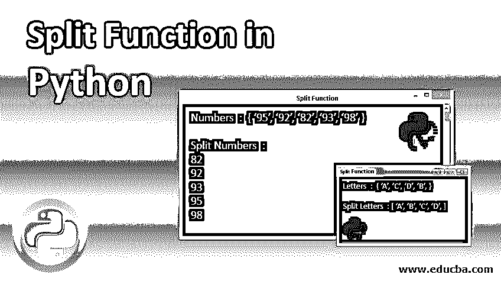
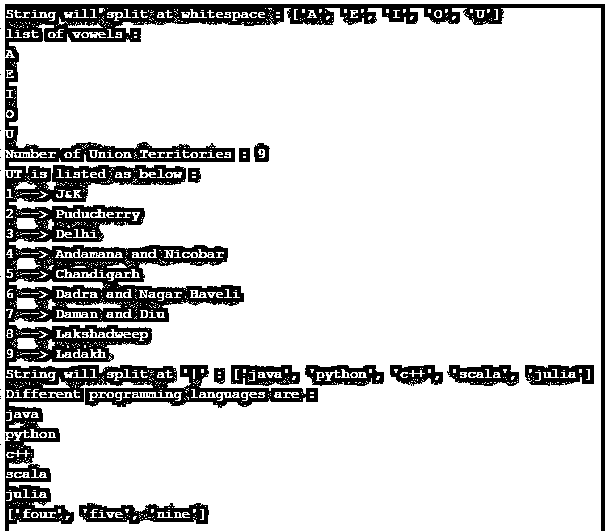

# Python 中的 Split 函数

> 原文：<https://www.educba.com/split-function-in-python/>




## Python 中的 Split 函数简介

字符串是一个字符序列。该字符可以是任何字母、数字、空白字符或任何特殊符号。Python 中的字符串是不可变的，这意味着一旦创建，就不能修改。但是，我们可以复制字符串，并对其执行各种操作。为此，Python 提供了一个单独的类“str ”,用于字符串处理和操作。一种这样的操作是将一个大字符串分割成更小的块或子字符串。Python 类“str”提供了一个内置函数 split()，以便于对字符串进行这种拆分操作。split 函数与串联相反，串联是将小字符串连接成一个大字符串，而 split()用于将一个大字符串分割成更小的子字符串。

**语法:**

<small>网页开发、编程语言、软件测试&其他</small>

```
split(delimiter, max splits)
```

split()函数在 string 对象上被调用，接受两个可选参数，并返回一个子字符串列表作为输出。

**参数:**

*   **分隔符:**发生拆分的可选参数。如果没有给定参数，那么字符串在遇到空白字符(空格、制表符、换行符)时被分割。如果提供了分隔符或分隔符，则将在该分隔符上进行拆分。
*   **最大分割数:**可选参数，指定最大分割数。默认值为-1，这意味着对拆分次数没有限制。

### Split()函数为什么有用？

一个潜在的例子是从 CSV(逗号分隔值)文件中读取数据。当文本文件包含由逗号或其他分隔符分隔的数据时，split()用于将数据分成不同的数据块。

### Python 中的 Split 函数示例

以下是 Python 中 Split 函数的示例:

#### 示例#1

Python 程序演示了 split()函数的功能。

**代码:**

```
# split () taking different delimiters
# 1 --> no delimiter specified
inp1 = 'A E I O U'
print("string will split at whitespace :",inp1.split())
print("list of vowels :")
for i in inp1.split():
    print(i)
print('\n')
# 2 --> delimiter is comma and a space (, )
inp2 = 'J&K, Puducherry, Delhi, Andamana and Nicobar, Chandigarh, Dadra and Nagar Haveli, Daman and Diu, Lakshadweep, Ladakh'
ut = inp2.split(', ')
print("Number of Union Territories :", len(ut))
print("UT is listed as below :")
for u in range(len(ut)):
    print((u+1),'-->', ut[u])
print('\n')
# 3 --> delimiter is |
inp3 = 'java|python|c++|scala|julia'
print("string will split at '|' :", inp3.split('|'))
print("Different programming languages are :")
for lang in inp3.split('|'):
    print(lang)
print('\n')
# 4 --> splitting string at every 4 character
inp4 = 'fourfivenine'
print([inp4[i: i+4] for i in range(0, len(inp4), 4)])
```

**说明:**

在上面的程序中， [split()函数](https://www.educba.com/split-function-in-java/)用不同的分隔符在四个不同的输入字符串上调用，max split 可选参数取其默认值-1。

1.第一个分隔符是默认分隔符，即空格。

**输入字符串:**包含由空格分隔的不同元音的字符串。

**输出**:包含元音的列表，然后使用 for 循环遍历这些元音。

2.第二个分隔符是逗号后面跟一个空格，即'，'

**输入字符串:**包含由逗号和空格分隔的印度所有联邦地区的字符串。

**输出:**包含不同 ut 的列表。然后使用 for 循环打印每个 UT。

3.第三个分隔符是管道，即|

**输入字符串:**包含由分隔符|分隔的不同编程语言的字符串

**输出:**不同语言的列表。

4.最后一个字符串“fourfivenine”每隔 4 个<sup>拆分一次。</sup>这种拆分是使用列表理解来完成的。

Note: In all the cases above, max split = -1, which means there is no limit on the number of splits.

**输出:**




#### 实施例 2

Split()函数带有可选参数“最大拆分数”。

**代码:**

```
# split() function with different values for max splits
print("split() with default max split values i/e -1 :")
inp1 = 'Java@Python@C++@Scala@Julia'
print("input string will split at @ :", inp1.split('@'))
print('\n')
print("number of splits (0):", inp1.split('@', 0))
print("number of splits (1):", inp1.split('@', 1))
print("number of splits (2):", inp1.split('@', 2))
print("number of splits (3):", inp1.split('@', 3))
print("number of splits (4):", inp1.split('@', 4))
print("number of splits (5):", inp1.split('@', 5))
print('\n')
print("split using for loop")
for i in range(6):
    print("number of splits", i, inp1.split('@', i))
```

**输出:**


**说明:**

在上面的程序中，使用了 split(sep='@ '，maxsplits= <different values="">)。</different>

*   首先，输入字符串在“@”处被拆分，最大拆分的默认值为-1。这意味着返回了所有可能的拆分。
*   然后用不同的 max_splits 值，即 0、1、2、3、4、5，在“@”处拆分字符串。
*   使用 for 循环可以用简洁的方式编写相同的程序。

#### 实施例 3

计算学生得分的总和。

**代码:**

```
# calculating sum of marks of a student
# input string containing marks scored  by a student in five different subjects
marks = '95, 92, 82, 92, 98'
sum = 0
# input string will split at ', '
list_marks = marks.split(', ')
print("marks scored by student :", list_marks)
print("student marks:")
for marks in list_marks:
    print(marks)
print('\n')
# calculating total marks
for i in range(len(list_marks)):
    sum += int(list_marks[i])
print("total marks scored by student :", sum)
```

**输出:**


**说明:**

*   输入字符串是学生在五个不同科目中获得的一串分数，由分隔符'，'分隔
*   然后使用 split()函数在“，”[处分割输入字符串。](https://www.educba.com/split-function-in-javascript/)
*   split()的输出是一个列表，其中每个元素代表一个主题标记。
*   使用 for 循环遍历输出列表。
*   然后计算总分数并打印输出。

### 结论

Python split()函数用于根据分隔符将给定的输入字符串分割成不同的子字符串。分隔符可以是任何东西。也可能是短信。如果没有提供分隔符，则空白被视为默认分隔符。我们还可以指定由 split()函数可选参数“最大分割数”控制的分割数。

### 推荐文章

这是 Python 中分割函数的指南。这里我们讨论 Split()函数的基本概念、参数、为什么有用，以及例子。您也可以看看以下文章，了解更多信息–

1.  [Python 正则表达式](https://www.educba.com/python-regex/)
2.  [Python 3 备忘单](https://www.educba.com/python-3-cheat-sheet/)
3.  [Python 中的 strip 函数](https://www.educba.com/strip-function-in-python/)
4.  [Python 格式()函数](https://www.educba.com/python-format-function/)


