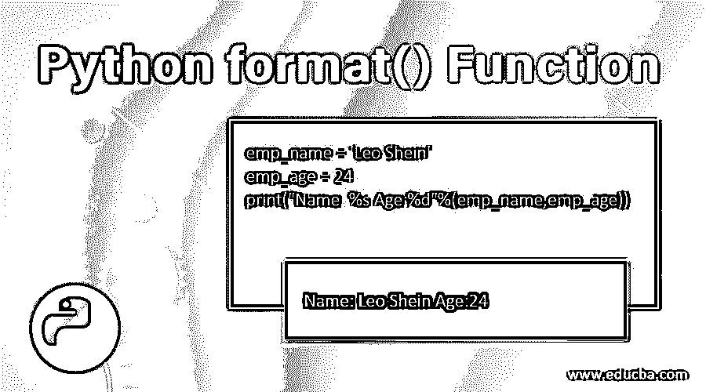
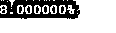
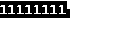
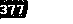
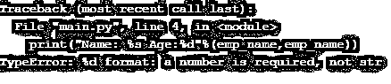
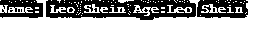
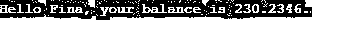
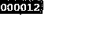
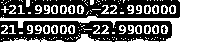

# Python format()函数

> 原文：<https://www.educba.com/python-format-function/>




## Python format()函数简介

Python 在市场上获得了前所未有的广泛和高峰水平，尤其是在人工智能和数据科学领域。了解它的方法有助于 python 开发人员和 python 用户更明智地使用它。让我们讨论一个非常重要的 python-format()函数。要定义特定格式的特定值，可以使用 format()函数。

**语法:**

<small>网页开发、编程语言、软件测试&其他</small>

```
format(value,format)
```

这里 value 指的是一，需要表示。python-format()函数表示值必须呈现的形式。

### Python format()函数示例

让我们通过一些例子来看看 Python format()函数:

#### 示例#1

**代码:**

```
x = format(0.08, '%')
print(x)
```

**输出:**




**代码:**

```
x = format(255, 'b')
print(x)
```

**输出:**




这里格式‘b’表示二进制形式，因此格式化后的 255 显示“11111111”。同样可以格式化为十六进制、八进制、十进制等。

**代码:**

```
x = format(255, 'o')
print(x)
```

**输出:**




#### 实施例 2

格式通常使用%和{}来表示值。%与数据类型相关联，而{}是与数据类型无关的占位符。我们通过一个例子来看:

**代码:**

```
emp_name = 'Leo Shein'
emp_age = 24
print("Name: %s Age:%d"%(emp_name,emp_age))
```

**输出:**


**代码:**

```
emp_name = 'Leo Shein'
emp_age = 24
print("Name: %s Age:%d"%(emp_name,emp_name))
```

**输出:**




可以看出，姓名与字符串相关，年龄与 int 相关。当我们尝试打印 Age(它与带有 emp_name 的 int 相关联)时，它显示了一个格式错误。众所周知:%s 代表字符串，%d 代表 int，%f 代表 float。在打印时，如果格式不匹配，必然会出现 TypeError。

#### 实施例 3

**代码:**

```
emp_name = 'Leo Shein'
emp_age = 24
print("Name: {} Age: {}".format(emp_name,emp_age))
```

**输出:**


**代码:**

```
emp_name = 'Leo Shein'
emp_age = 24
print("Name: {} Age:{}".format(emp_name,emp_name))
```

**输出:**




如上图，年龄也可以用 emp_name 打印。因为{}只是一个占位符，在格式化和打印语句时可以关联任何数据类型。如果索引也放在 empty {}中，就可以更好地理解上面的占位符。这被称为位置论点。

#### 实施例 4

**代码:**

```
emp_name = 'Leo Shein'
emp_age = 24
print("Name: {0} Age: {1}".format(emp_name,emp_age))
```

**输出:**


这里“雇员姓名”的索引是 0，“雇员年龄”的索引是 1。因此，在印刷时也参考了相同的内容。但是，如果索引 0 也为“年龄”复制，那么看看会发生什么。

**代码:**

```
emp_name = 'Leo Shein'
emp_age = 24
print("Name: {0} Age: {0}".format(emp_name,emp_age))
```

**输出:**


因为指数 0 指的是“狮子座”，所以“年龄”也是如此。

#### 实施例 5

下面我们来看看格式函数中混合参数的例子:

**代码:**

```
print("Hello {0}, your balance is {abc}.".format("Fina", abc=230.2346))
```

**输出:**




可以看到，我们使用了位置参数和关键字参数。{0}指的是“Fina”这个名字。{abc}指的是值 abc = 230.2346。

#### 实施例 6

带填充的格式。填充是指在文本/数字的右边或左边添加空格的概念。

**代码:**

```
print("{:6d}".format(12))
```

**输出:**


这里为了印“12”，加了 6d。这意味着 4 个空格，然后显示数字(如上所示)。由于没有指定对齐方式，默认情况下它是向右对齐的。但是，如果您想要显示带零的空格，您可以通过在格式说明符前面放置 0 来实现。

**代码:**

```
print("{:06d}".format(12))
```

**输出:**




#### 实施例 7

有符号数字的格式()。

**代码:**

```
print("{:+f} {:+f}".format(21.99, -22.99)) # This will show the + sign
print("{:-f} {:-f}".format(21.99, -22.99)) # This will show the - sign only
```

**输出:**




#### 实施例 8

用于字符串格式化的 format()

**代码:**

```
print("{:6}".format("dog")) # string-padding with left-alignment
print("{:>6}".format("dog")) # string-padding with right-alignment
print("{:^7}".format("dog")) # string-padding with center-alignment
```

**输出:**


正如人们在这里注意到的:

*   **案例一:** {:6}占了 6 个空格，狗会从左边印。剩余的 3 个空间将被占用。
*   **案例二:** {: > 6}占了 6 个空格，但最后还是把狗印出来了。前三个位置将保持空白。
*   **情况 3:** {:^7}占据 7 个空格，狗会被印上居中对齐。

#### 实施例 9

格式化类成员

**代码:**

```
class Employee:
    id = 41
    name = "Prince"
print("{p.name}'s company ID is: {p.id}".format(p=Employee())) # format name and id
```

**输出:**


注意，{p.name}和{p.id}是与类“Employee”中的类成员相关联的值的占位符。format()函数帮助你访问一个类的类成员各自的值。

#### 实施例#10

使用格式()截断字符串

**代码:**

```
print("{:.5}".format("Singapore"))
print("{:^7.3}".format("Singapore"))# truncating strings to 3 letters, and then padding & center-aligned
```

**输出:**


*   **案例 1:** 这里{:.5}会将一个字符串截断到前五个字符。因此“新加坡”将归结为“新加坡”。
*   **案例二:**其截断和对齐的组合。首先，“新加坡”将被截短为 3 个字符，即“罪恶”，然后^7 将帮助您将“罪恶”居中对齐，占据 7 个空格。

### 结论

正如我们在上面看到的，如何格式化函数和格式化操作符在 Python 中将变量格式化为特定类型的过程中起着重要的作用。有很多方法可以格式化变量；我们应该知道每个场景中的案例，也就是诉讼。

### 推荐文章

这是一个 Python format()函数的指南。这里我们讨论 Python format()函数的介绍，以及不同的例子和代码实现。您也可以阅读以下文章，了解更多信息——

1.  [Python 列表删除()](https://www.educba.com/python-list-remove/)
2.  [Python 子流程](https://www.educba.com/python-subprocess/)
3.  [Python 反串](https://www.educba.com/python-reverse-string/)
4.  [Python 查找字符串](https://www.educba.com/python-find-string/)


