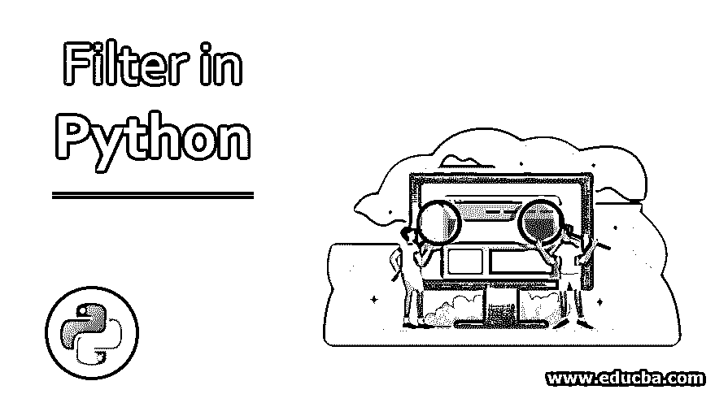
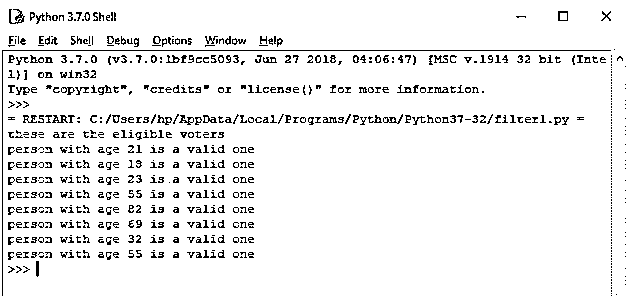
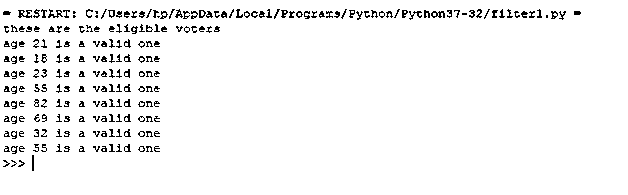
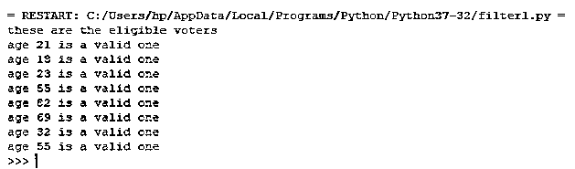
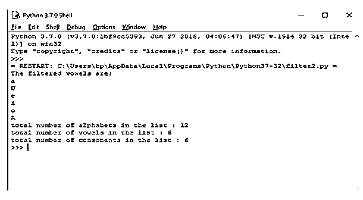
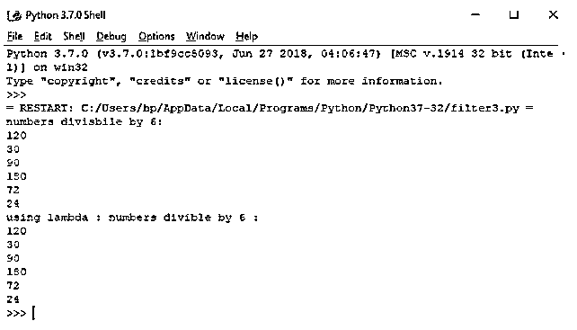
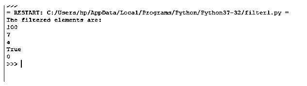

# Python 中的过滤器

> 原文：<https://www.educba.com/filter-in-python/>




## Python 中的过滤器简介

函数式编程便于程序员编写更简单、更短的代码。 [Python 也支持](https://www.educba.com/python-print-table/)函数式编程范式。Map、filter 和 reduce 是一些内置函数，它们使程序员的工作变得简单。这三个函数允许我们将用户定义的函数应用于大量的可迭代对象，如列表、集合、元组等。Python filer()函数用于使用函数从 iterable(如列表、元组或集合)中获取过滤的项目，并返回 iterable 中函数返回 true 的那些元素的序列。

**语法:**

<small>网页开发、编程语言、软件测试&其他</small>

Python filter()函数采用两个强制参数。第一个是函数，第二个是有效的 python iterable(列表、元组、集合等。)

```
filter(function/None, iterable)
```

如果 filter()函数中的第一个参数是一个函数<fun>，那么它将被应用于 iterable 的单个元素，并返回 iterable 中函数<fun>返回 true 的那些元素的序列。</fun></fun>

如果 filter()函数中的第一个参数是 None，那么它将只返回 iterable 中为真的那些元素。

### filter()函数的示例和用法

让我们看一些 filter()函数的例子，以便更好地理解它的功能:

#### 示例 1–检查投票资格的程序

a.使用传统的方法

**代码**:`

```
valid_voters = [] # defining function to test if entered age is above 18 or not
def eligible_vote(i):
    for age in i:
        if age >= 18 :
            valid_voters.append(age)
# Calling function
eligible_vote((12, 21, 18, 23, 9, 55, 82, 69, 14, 32, 10, 55))
# Printing results
print("these are the eligible voters")
for voter in valid_voters:
    print("person with age",voter,"is a valid one")
```

**输出:**




b.使用 filter()方法

**代码**:

```
# Function to test a person age > 18 or not --> first argument for filter()
def eligibility(age):
    if age >= 18:
        return True
    else:
        return False
# List of all voters --> second argument for filter()
all_voters = [12, 21, 18, 23, 9, 55, 82, 69, 14, 32, 10, 55] 
eligible_voters =filter(eligibility , all_voters)
print("these are the eligible voters")
for voter in eligible_voters:
    print("age",voter,"is a valid one")
```

**输出:


** 

在上面的代码中，我们可以使用 lambda 函数来代替用户定义的函数 eligibility()。Lambda 函数是一个匿名函数，意味着它没有任何名字。

上述代码可以修改为:

```
# List of all voters --> second argument for filter()
all_voters = [12, 21, 18, 23, 9, 55, 82, 69, 14, 32, 10, 55] 
eligible_voters =filter(lambda age : age >=18 , all_voters)
print("these are the eligible voters")
for voter in eligible_voters:
    print("age",voter,"is a valid one")
```

**输出:**




Lambda 函数不仅减少了代码长度；它还增强了可读性。

#### 例 2–从字母表的输入列表中过滤元音的程序。

**代码**:

```
count_vowel = 0  # to track no. of vowels
count_consonant = 0 # no. of consonants
alphabets = ['a', 'b', 'U', 'd', 'e', 'i', 'j', 'o', 'x', 'A', 'Z', 't'] # Function to filter out vowels
def filterVowels(alpha):
    vowels = ['a', 'e', 'i', 'o', 'u'] 
    if(alpha.lower() in vowels): 
        return True
    else:
        return False
filter_vowel = filter(filterVowels, alphabets)
print('The filtered vowels are:')
for vowel in filter_vowel:
    count_vowel += 1
print(vowel)
print("total number of alphabets in the list :",len(alphabets))
print("total number of vowels in the list :",count_vowel)
print("total number of consonants in the list :",len(alphabets) - count_vowel)
```

**说明:**

*   全局变量 count _ vowel 和 count _ concern 被声明为分别计算元音和辅音的数量。
*   定义字符输入列表。
*   定义一个函数 filter 元音，该函数将从输入列表中返回元音。
*   调用 filter()函数时，将第一个参数作为 filter 元音()函数，将输入列表“alphabets”作为第二个参数。
*   filter()返回一个序列，该序列只包含从输入列表中过滤出来的元音字母(大写字母和小写字母)。
*   for 循环用于打印输出序列中的项目，如下图所示。

**输出:**




#### 例 3–程序过滤出能被 6 整除的数字。

**代码**:

```
# function to check divisibility by 6
def div_six(x):
    if x % 6 == 0:
        return True
    else :
        return False
num_list = [10, 120, 30, 50, 90, 180, 72, 24, 88, 112] 
result1 = filter(div_six, num_list)
print("numbers divisbile by 6:")
for num in result1:
    print(num)
# using lambda function
result2 = filter(lambda x : x % 6 == 0, num_list)
print("using lambda : numbers divible by 6 :")
for num in result2:
    print(num)
```

**输出:**




**注意:**在上面所有的例子中，filter()函数使用 function/ lambda 函数作为它的第一个参数。它不需要有功能。我们也可以不指定任何参数，而是指定一个函数作为第一个参数。当 filter 函数将 None 作为其参数时，该函数默认为 Identity 函数，并且检查给定输入 iterable 中的每个元素是否为真。它将只返回真值。

#### 示例 4–演示在没有 filter 函数的情况下使用 filter()的程序

**代码**:

```
# a random list
input_list = [(), 100, 7, 'a', 0, False, True, {}, '0', []] 
filtered_list = filter(None, input_list)
print('The filtered elements are:')
for item in filtered_list:
    print(item)
```

在这个程序中，空元组、空列表、False 等假值被过滤器()忽略，只有真值被返回，如下面的输出所示。

**输出:**




### 结论

filter()有助于非常有效地选择和操作 iterable 的单个元素。它通常与 lambda 函数一起使用来过滤掉元素。然而，它没有第一个参数好。正确使用它取决于用户。

### 推荐文章

这是一个在 Python 中过滤的指南。这里我们讨论 python 中 filter()函数的简介、不同的例子和用法。您也可以看看以下文章，了解更多信息–

1.  [Python 开关案例](https://www.educba.com/python-switch-case/)
2.  [Python 类型函数](https://www.educba.com/python-type-function/)
3.  [Python 列表函数](https://www.educba.com/python-list-functions/)
4.  [Python 正则表达式测试器](https://www.educba.com/python-regex-tester/)


