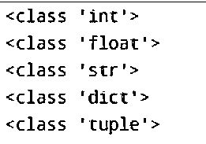
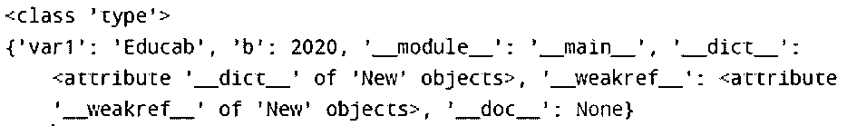
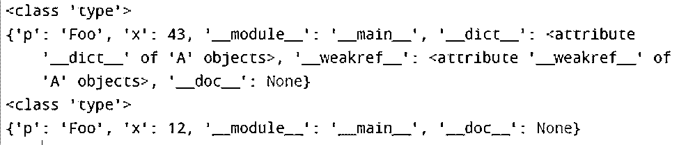

# Python 类型函数

> 原文：<https://www.educba.com/python-type-function/>


## Python 类型函数简介

在 Python 中，Python 程序中的每个值都有一个数据类型，因为程序中的一切都是对象，而数据类型是类，变量是这些类的对象。数据类型的例子有 int、float、string、tuple 等。为了确定程序中声明了什么类型的对象，Python 中有一个内置函数，称为 type()。函数 type()用于任何对象时，返回指定对象的类型。这个 type()方法通常用于程序的调试。传递给这些 type()函数的参数有两种类型，一种是单参数，另一种是三参数。

### Python type()函数是如何工作的？

Python 中有许多内置函数，而我们在声明变量时并没有像在其他语言中那样指定变量的数据类型。所以有一个函数或方法来确定变量或对象的数据类型，使其更容易编程。type()函数有两种类型的参数:单参数和三参数。如果传递一个参数，它给出对象，而如果传递三个参数，它返回一个新的类型对象。

<small>网页开发、编程语言、软件测试&其他</small>

**语法:**

```
type( object)
type( name, bases, dict)
```

### Python 类型函数中的参数

*   **object:**type()函数的单个参数只返回指定的对象类型。
*   **name:** 它具有类的给定名称的 __name__ 属性。
*   **bases:** 它也有 __bases__ 属性，返回驱动当前类的类元组
*   **dict:** 它有返回字典的类的名称空间，并有属性 __dict__。

### Python 类型函数的示例

以下是 Python 类型函数的示例:

#### 示例#1

下面的示例是确定给定变量“n”的类型的代码。

**代码:**

```
n = [1, 2]
print(type(n))
```

**输出:**


#### 实施例 2

以下示例给出了输出的所有数据类型:

**代码:**

```
n = 2
print(type(n))
f = 2.9
print(type(f))
a = 'educab'
print(type(a))
d = {1: 'one', 2: 'two'}
print(type(d))
t = ('apple', 'banana', 'cherry')
print(type(t))
```

**输出:**




*   在上面的例子中，我们取了一个包含值为 2 的数字，作为回报，它打印变量' n '的类型，即' int '。
*   在第二个例子中，我们取了一个包含值 2.9 的浮点数，它通过将变量' f '的类型打印为浮点数来返回类型。
*   在第三个例子中，我们取了一个字符串“educab”，它以字符串“str”的形式返回变量“a”的类型。
*   在第四种情况下，我们采用字典类型，它包含一些值，它通过打印变量' d '的类型返回类型，这是字典类型' dict '。
*   在第五种情况下，我们采用了带有变量“t”的元组类型，变量“t”包含一些值，变量“t”返回元组类型。

#### 实施例 3

现在由于 type()函数有两种不同类型的参数，现在将看到 type()函数有 3 个参数。

**代码:**

```
new = type('New', (object, ), dict(var1 = 'Educab', b = 2020))
print(type(new))
print(vars(new))
```

**输出:**




#### 实施例 4

另一个例子将清楚地向您展示带有三个参数的 use type()函数。

**代码:**

```
t1 = type('A', (object,), dict(p='Foo', x=43))
print(type(t1))
print(vars(t1))
class test:
  p = 'Foo'
  x = 12
  t2 = type('B', (test,), dict(p='Foo', x=12))
print(type(t2))
print(vars(t2))
```

**输出:**




*   在上面的程序中，我们采用了带三个参数的 type()函数。在这个程序中，我们使用了 vars()函数，在 Python 中，vars()函数返回 dictionaries 属性，如 __dict__attribut。这个字典用于在 __dict__ 属性中存储对象的可写属性。
*   type()函数有两种不同类型的声明参数，一种在单个参数中标识对象的类型，另一种有三个参数，将为我们提供带有名称、变量类型和字典形式的元组。因此，使用这个内置函数有助于调试程序，以了解初始化变量的正确数据类型。有时，这个函数可能不用于字符串数据类型，但在极少数情况下会产生一些错误，这将很难处理这样的错误，所以为了避免这样的困难，我们可以使用 type()函数，根据需要，我们可以将给定的字符串转换为所需的字符串，以无错误地执行程序。
*   type()函数的另一个用途是，我们可以使用 SQL 在[数据库中注册表，我们还可以动态初始化类及其属性。](https://www.educba.com/database-in-sql/)

### 结论

在 Python 中，有许多数据类型可以使用 Python 的内置函数 type()来确定。在其他编程语言中，我们在声明或初始化变量之前声明数据类型，但在 Python 中，我们不声明任何数据类型；我们只写变量和它的值，它有自己的数据类型。如果我们想知道变量的数据类型，我们可以使用这个内置函数。当我们对其他程序中声明的数据类型感到困惑时，这个函数非常有用，在调试任何程序时，这个函数也非常有用。

### 推荐文章

这是一个 Python 类型函数的指南。这里我们讨论它是如何工作的，python 类型函数的参数和例子以及代码实现。您也可以浏览我们的其他相关文章，了解更多信息——

1.  [Python 中的类型转换](https://www.educba.com/type-casting-in-python/)
2.  [Python 中的质数](https://www.educba.com/prime-numbers-in-python/)
3.  [Python 全局变量](https://www.educba.com/python-global-variable/)
4.  [Python 格式()函数](https://www.educba.com/python-format-function/)


