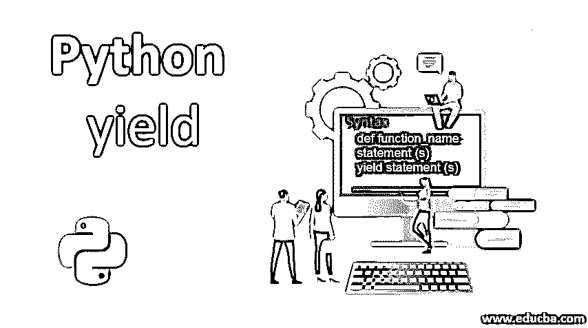
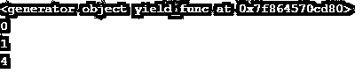
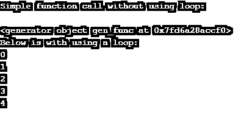
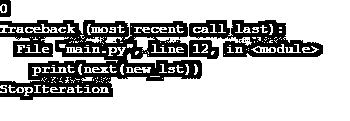

# Python 产量

> 原文：<https://www.educba.com/python-yield/>




## Python yield 语句简介

在 Python 中，yield 是一个关键字，其作用类似于任何程序中的 return 语句，通过返回函数值来实现。在任何编程语言中，如果我们执行一个函数，它需要执行一些任务并给出结果来返回这些结果，我们使用 return 语句。return 语句只返回函数的值，但是 yield 语句也通过返回一个值来返回多个值，然后等待，再通过保存本地状态来恢复。这种使用 yield 语句而不是 return 语句的函数称为生成器函数。这些生成器函数可以有一个或多个 yield 语句。

### 收益表的工作

在 Python 中，像其他编程语言一样，函数使用 return 语句返回函数的结果。yield 语句停止函数的执行，并通过从调用的生成器函数中逐个返回值来继续执行。

<small>网页开发、编程语言、软件测试&其他</small>

**语法:**

```
ddef function_name:
	statement (s)
	yield statement (s)
```

### Python yield 的例子

让我们举一个简单易行的例子来理解 yield 语句:

#### 示例#1

**代码:**

```
def yield_function(): 
    yield 10
    yield 20
    yield 30  
for y in yield_function():  
    print(y)
```

**输出:**


从上面的例子中，我们可以看到 yield_function()，它希望返回多个值，所以在这种情况下，return 语句不能使用，但是要这样做，我们可以使用 yield 语句打印或从函数中返回多个值。所以 yield 语句通常用在被称为生成器函数的函数上，因为 yield 语句用在我们想要迭代由单个函数返回的一系列值的时候，但是你不想将所有这些值保存在内存中，这意味着 yield 语句如何在每次内存被覆盖时生成要返回的值，因为它迭代并返回所有值，而不使用内存返回 yield 语句返回的所有值。

为了打印可迭代的值，我们在普通函数中使用 for 循环。生成器函数也像一个普通函数，但是如果我们使用 yield 语句，那么它生成器函数需要打印函数返回的可迭代值。

#### 实施例 2

**代码:**

```
def yield_func():
    n = range(3)
    for i in n:
        yield i*i
gen = yield_func() 
print(gen) 
for i in gen:
    print(i)
```

**输出:**




在上面的例子中，我们可以看到函数在上面的代码中返回多个值。它生成生成器对象，所以当第一个 for 循环从函数中调用对象时，函数中的代码一直运行，直到它到达 yield 语句，然后函数首先返回第一个值，然后 for 循环再次调用函数，它返回第二个值，依此类推，直到没有找到要返回的值，它继续迭代并返回这些值。

#### 实施例 3

现在让我们看一个代码示例，演示如何使用循环生成生成器对象并打印返回值。

**代码:**

```
def gen_func():
    x = 0
    while x < 5:
        yield x
        x += 1
print("Simple function call without using loop:\n")
print(gen_func())    
print("\n")
print("Below is with using a loop:")
for y in gen_func():
    print(y)
```

**输出:**




在上面的代码中，第一次调用 gen_func()时，它返回值“0”。接下来，当它被调用时，先前返回的值在函数代码中增加 1，然后它返回' 1 '。x 的值再次递增，并返回“2”作为值；这个循环一直持续到小于 5，如上面代码中的 while 循环所述。所以它打印值' 0 '，' 1 '，' 2 '，' 3 '，' 4 '。

为什么 yield 语句可以用来代替 return 语句的要点是:

*   首先，我们可以很容易地使用 yield 创建一个可迭代的函数，也称为生成函数。
*   每当连续调用一个函数时，它都从最后一个 yield 语句本身开始，因此您可以再次节省时间。
*   最后但非常重要的一点是，当您希望从函数中返回多个值时，可以使用 yield 语句。因此来自 yield 语句的返回值将数据存储在本地状态中，从而也节省了内存的分配，以及每次返回不同值的方式。由此，甚至存储器也被保存。

在本主题中，当函数在完成循环后被调用时，我们将会得到一个错误，可以通过使用 next()方法捕获该错误并引发该错误，如下例所示。

#### 实施例 4

**代码:**

```
def yield_func(l):  
     total = 0
     for n in l:
       yield total
       total += n                 
new_lst = yield_func([0])
print(next(new_lst))  
print(next(new_lst))  
print(next(new_lst))
```

**输出:**




所以在上面的例子中，我们得到了 StopIteration 错误，它可以使用 next()方法来完成。这是按如下方式完成的。

#### 实施例 5

**代码:**

```
def yield_func(l):  
     total = 0
     for n in l:
       yield total
       total += n                
new_lst = yield_func([10,20,30]) 
print(next(new_lst))  
print(next(new_lst))  
print(next(new_lst)) 
```

**输出:**


### 结论

像其他编程语言一样，Python 可以返回单个值，但是在这里，我们可以使用 yield 语句为函数返回多个值。使用 yield 关键字的函数称为生成器函数。因此，当您希望返回 iterable 值时，可以使用这个函数。yield 语句不仅有助于返回多个值，还通过使用更多的函数节省了时间和内存，并且它可以节省内存，因为每次调用函数时，它都会将其值存储在本地内存中，并在下一次调用时再次使用它。

### 推荐文章

这是一个 Python yield 的指南。在这里，我们讨论 Python yield 语句及其示例的简要概述，以及它的代码实现。您也可以浏览我们推荐的其他文章，了解更多信息——

1.  [Python 中的递归函数](https://www.educba.com/recursive-function-in-python/)
2.  [Python 范围函数](https://www.educba.com/python-range-function/)
3.  [Python 设置函数](https://www.educba.com/python-set-function/)
4.  [Python 正则表达式测试器](https://www.educba.com/python-regex-tester/)


