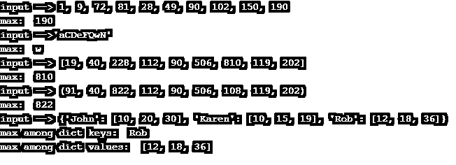
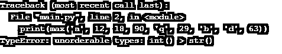
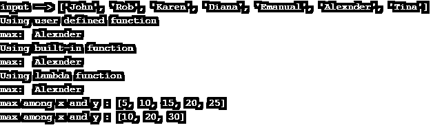
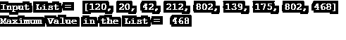
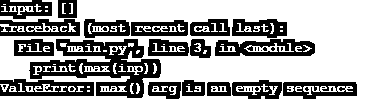
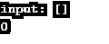

# Python 中的 Max 函数

> 原文：<https://www.educba.com/max-function-in-python/>


## Python 中的 Max 函数简介

Python max()是常用的内置函数之一。max()函数用于查找给定对象的最大项，即返回函数参数中的最大值。如果 iterable 作为参数值传递，则返回 iterable 中最大的项。

**语法:**

<small>网页开发、编程语言、软件测试&其他</small>

基本上，在 python 中实现 max()函数有两种不同的方法。

```
max(num1, num2, *args[,key])
```

*   **num1:** 必选参数，第一个比较对象
*   **num2:** 必需参数，用于比较的第二个对象
*   ***args:** 可选参数，用于比较的任何对象
*   **Key:** 可选参数，保存函数(可以内置，也可以自定义)，根据该 Key 函数的返回值进行比较[。](https://www.educba.com/python-return-value/)

```
max(iterable, *[,key,default])
```

*   **iterable(必选):**列表、元组、字典、字符串等可迭代对象。
*   **键(可选):**自定义排序顺序的键功能。最大值将根据该应用函数的返回值返回
*   **default(可选):**iterable 为空时返回的默认值

### Python 中 Max 函数的示例

下面的代码片段将有助于理解 max()函数的功能。

#### 示例#1

使用 python iterable 演示 max()功能的程序。

**代码:**

```
# Program to illustrate max() functionality
# example 1: Input --> basic integers
print("input --> 1, 9, 72, 81, 28, 49, 90, 102, 150, 190")
print("max: ", max(1, 9, 72, 81, 28, 49, 90, 102, 150, 190))
# Input --> a string
print("input -->'aCDeFQwN'")
print("max: ", max('aCDeFQwN'))
# Input --> list
inp1 = [19, 40, 228, 112, 90, 506, 810, 119, 202]
print("input -->", inp1)
print("max: ", max(inp1))
# Input --> tuple
inp2 = (91, 40, 822, 112, 90, 506, 108, 119, 202)
print("input -->", inp2)
print("max: ", max(inp2))
# Input --> dictionary
inp3 = {
'John': [10, 20, 30],
'Rob': [12, 18, 36],
'Karen': [10, 15, 19]
}
print("input -->", inp3)
print("max among dict keys: ", max(inp3.keys()))
print("max among dict values: ", max(inp3.values()))
```

**输出:**




**代码解释:**

*   max() à参数的第一次调用包括基本整数，在这些整数中返回最大值。
*   max() à参数的第二个调用是一个包含小写和大写字符的字符串。根据 ASCII 值返回最大值。
*   max() à参数的第三次调用是一个整数的*列表*；最大值将从该值列表中返回。
*   max() à参数的第四次调用是一个整数元组；在这个元组中返回最大值。
*   max() à参数的第五次调用是一个*字典*，来自字典键的最大值和字典值被打印。

**Note:** All the parameters must be of the same type; otherwise, max() will throw an error.

```
# Input type should be of same type, otherwise it will raise an error
print(max('a', 12, 18, 90, 'q', 29, 'b', 'd', 63))
```




#### 实施例 2

具有给定关键函数的 max()函数的图示

**代码:**

```
#Program to illustrate max() functionality, when key is set to some function
# Input --> list of strings
inp = ['John', 'Rob', 'Karen', 'Diana', 'Emanual', 'Alexnder', 'Tina']
print("input -->", inp)
def length(item):
    return len(item)
# Key function --> len()
print("Using user defined function")
print("max: ", max(inp, key = length))
# This can be implemented using built-in function len()
print("Using built-in function")
print("max: ", max(inp, key = len))
# Using lambda function
print("Using lambda function")
print("max: ", max(inp, key = lambda item : len(item)))
# Input --> multiple iterables
x = [10, 20, 30]
y = [5, 10, 15, 20, 25]
print("max among x and y :", max(x, y, key = len))
print("max among x and y :", max(x, y))
```

**输出:**




**代码解释:**

*   输入列表已定义，由不同的名称(字符串类型)组成。
*   首先用自定义函数调用 max()；这将从给定的输入列表中返回字符串值，该列表具有最大数量的字符。在本例中，“Alexnder”将被打印为 len(Alexnder)大于列表中的所有其他名称。
*   第二个 max()函数以内置函数 len()作为其关键函数参数。
*   第三个 max()调用是使用 lambda 函数实现的。在所有的例子中，我们得到了相同的输出。只是改变了定义函数的方式。
*   最后一个 max()调用接受多个 iterables(列表)。
    当 key=len à时，具有最大项数的列表将作为输出
    当 key 未设置为任何函数时，列表将按元素进行比较，如上面的输出所示。

#### 实施例 3

程序返回最大数字总和的列表值。

**代码:**

```
"""
Python max Function Example
key function : sum of digits of the list items
"""
def sum_digits(num):
    sum = 0
    while(num > 0):
        rem = num % 10
        sum = sum + rem
        num = num // 10
    return sum
# Input --> list of positive integers
inp = [120, 20, 42, 212, 802, 139, 175, 802, 468]
print("Input List = ", inp)
print("Maximum Value in the List = ", max(inp, key = sum_digits))
```

**输出:**




**代码解释:**

*   定义了一个函数“sum_digits ”,它接受一个数字并返回它的数字之和。
*   创建包含正整数的输入列表。
*   max()是用 key 函数调用的:sum_digits。这将返回列表项，它具有最大数字总和。

**Note:** When iterable is empty, max() will raise an error. To handle this error, the “default” argument is used.

```
inp = []
print("input:", inp)
print(max(inp))
```




上述错误可以通过提供默认参数来处理:

```
inp = []
print("input:", inp)
print(max(inp, default=0))
```




### 推荐文章

这是 Python 中 Max 函数的指南。这里我们讨论一下 python 中实现 max()函数的简介和两种不同的方式以及不同的例子及其代码实现。您也可以阅读以下文章，了解更多信息——

1.  [Python 生成器](https://www.educba.com/python-generators/)
2.  [Python 导入模块](https://www.educba.com/python-import-module/)
3.  [Python 读取 CSV 文件](https://www.educba.com/python-read-csv-file/)
4.  [Python Tkinter 标签](https://www.educba.com/python-tkinter-label/)


