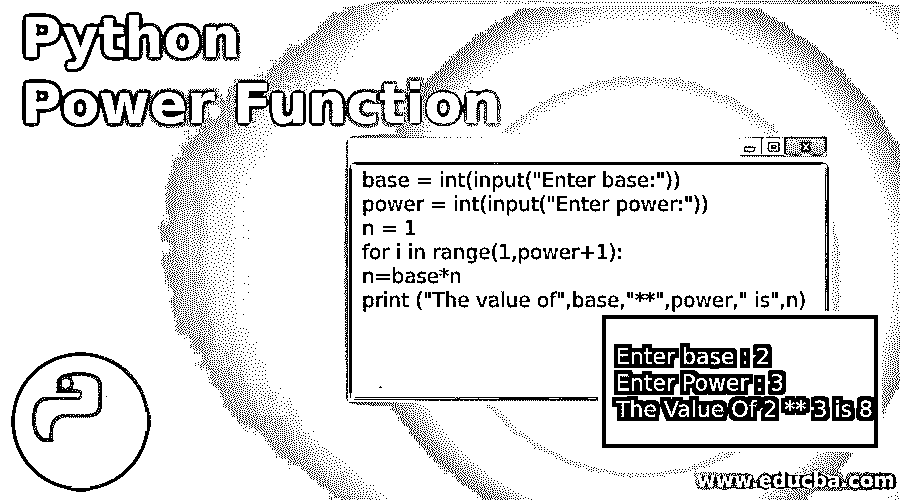
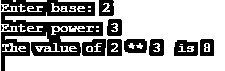
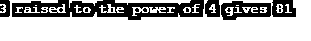
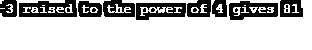
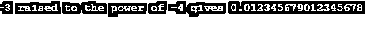

# Python 幂函数

> 原文：<https://www.educba.com/python-power-function/>




## Python 幂函数简介

Python 中的幂函数帮助我们相对容易地执行幂运算。在数学术语中也称为指数方法。我们先来看指数法的数学直觉。

### 指数运算的方法

取幂是一种数学运算，涉及以下格式的两个数字 x <sup>y</sup> ，其中 x 对应于底数，y 代表指数或幂。对于不同的 y 值，我们得到不同的取幂含义:

<small>网页开发、编程语言、软件测试&其他</small>

*   **y > 0:** 当 y 为正数时，则取幂的结果将是底数的重复乘法。例如:–2<sup>4</sup>= 2 * 2 * 2 * 2 = 16(基数即 2 乘以指数即 4 的倍数)
*   **y=0:** 当 y 为 0 时，则取幂的结果将为 1。例如:–2<sup>0</sup>= 1
*   **y < 0:** 当 y 为负时，则取幂的结果将是基数的重复除法。例如:–2<sup>-2</sup>=

既然我们已经讨论了幂函数的数学直觉，让我们来看看它的编程方面。

### Python 中的幂函数

正如我们所知，编程自诞生以来一直在发展。随着时间的推移，编程逻辑变得越来越复杂，因此了解所有的计算方法变得非常关键。我们经常需要在程序中找到一个数的幂，在这种情况下，这个[幂函数](https://www.educba.com/power-function-in-c/)的知识就派上用场了。

让我们看一个 Python 中用户定义的幂函数的例子。

**代码:**

```
base = int(input("Enter base:"))
power = int(input("Enter power:"))
n = 1
for i in range(1,power+1):
    n=base*n
print ("The value of",base,"**",power," is",n)
```

**输出:**




**说明:**

*   第一次迭代，即 n=1: n =基数*n = 2*1 = 2
*   第二次迭代，即 n=2: n =基数* n = 2*2 = 4
*   第三次迭代，即 n=3: N =基数* n = 2*4 = 8

| **X** | **Y** | **Z** | **返回值** |
| **非负整数** | 非负整数 | 不适用的 | **整数** |
| **非负整数** | 负整数 | 不适用的 | **浮动** |
| **负整数** | 非负整数 | 不适用的 | **整数** |
| **负整数** | 负整数 | 不适用的 | **整数** |
| **负/非负整数** | 非负整数 | 负/非负整数 | **整数** |

上面这段代码可以通过使用 Python 中的指数算术运算符来简化。指数算术运算符(**)帮助我们执行指数运算。

**举例:**–2 * * 3 = 8

但是为了给取幂运算更大的灵活性，引入了幂函数。下面是幂函数的语法。

**语法:**

```
pow(x, y[, z])
```

#### 因素

让我们讨论幂函数的参数:

*   x: x 表示基数
*   y: y 表示指数值
*   **z:** z 是可选变量，用于导出 x 和 y 的幂的模。

### 实现幂函数的示例

第三个参数使 pow 函数变得独特和健壮。以下是幂函数中允许的 x、y 和 z 值的不同组合及其各自的返回类型:

#### 示例#1

不含 z 的非负 x 和 y 整数

**代码:**

```
base = 3
power = 4
result = pow(base,power)
print(base,"raised to the power of",power,"gives",result)
```

**输出:**




#### 实施例 2

不含 z 的非负 x 和负 y

**代码:**

```
base = 3
power = -4
result = pow(base,power)
print(base,"raised to the power of",power,"gives",result)
```

**输出:**


#### 实施例 3

负 x 和不含 z 的非负 y

**代码:**

```
base = -3
power = 4
result = pow(base,power)
print(base,"raised to the power of",power,"gives",result)
```

**输出:**




#### 实施例 4

没有 z 的负 x 和负 y

**代码:**

```
base = -3
power = -4
result = pow(base,power)
print(base,"raised to the power of",power,"gives",result)
```

**输出:**




#### 实施例 5

带有 z 的非负 x 和 y

**代码:**

```
base = 5
power = 3
modulus = 10
result = pow(base,power,modulus)
print(base,"raised to the power of",power,"and thereby applying the modulus on",modulus,"gives",result)
```

**输出:**


### Python 中的其他幂函数

除了上面描述的方法，还有三种方法可以帮助我们计算幂函数。

#### 1.利用数学软件包的 pow 功能

**代码:**

```
import math
base = 2
power = 5
print(math.pow(base,power))
```

**输出:**


#### 2.使用 Numpy 包的电源功能

**代码:**

```
import numpy as np
base = 2
power = 5
print(np.power(base,power))
```

**输出:**


#### 3.使用 Scipy 包的电源功能

**代码:**

```
import scipy
base = 2
power = 5
print(scipy.power(base,power))
```

**输出:**


### 结论

我们终于结束了这篇文章。本文讨论了指数函数的数学直觉，这是 Python 中处理幂函数的一种基本方法，使用指数算术运算符求幂。然后，我们详细讨论了 Python 中的 pow 函数及其语法。最后，我们用 Python 中可用的其他函数结束了这篇文章。唷！！现在是时候练习从今天的课程中学到的概念并开始编码了。编码快乐！！！

### 推荐文章

这是一个 Python 幂函数的指南。为了更好地理解，我们在这里讨论幂运算的方法和幂函数的例子。您也可以浏览我们的其他相关文章，了解更多信息——

1.  [蟒蛇泡菜](https://www.educba.com/python-pickle/)
2.  [Python 私有变量](https://www.educba.com/python-private-variables/)
3.  [Python 排序数组](https://www.educba.com/python-sort-array/)
4.  [Python argparse](https://www.educba.com/python-argparse/)


