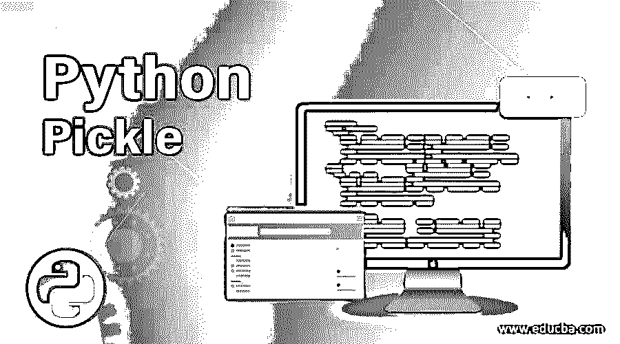
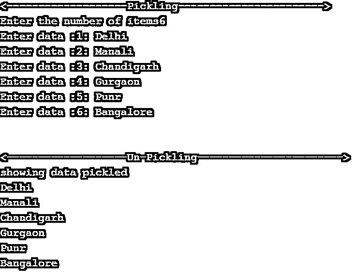
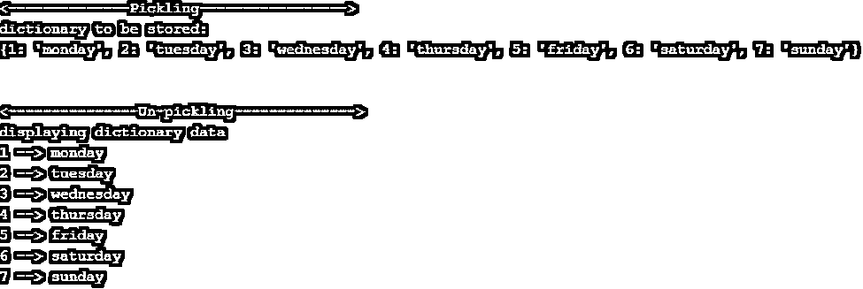
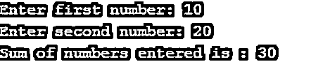

# 蟒蛇泡菜

> 原文：<https://www.educba.com/python-pickle/>




## Python Pickle 简介

Python 为列表、字典、元组等 python 对象的序列化和反序列化提供了 pickle 模块。酸洗在其他语言中也称为封送或展平。Pickling 用于存储 python 对象。

*   **串行化或酸洗:**酸洗或串行化是转换一个 Python 对象(列表、字典、元组等)的过程。)转换成可以保存到磁盘或可以通过网络传输的字节流。
*   **解序列化或解酸洗:**保存在文件上的字节流包含了重建原始 python 对象的必要信息。将字节流转换回 python 对象的过程称为反序列化。

**语法:**

<small>网页开发、编程语言、软件测试&其他</small>

以下是 python 中酸洗的步骤:

1.  导入 pickle 模块。
2.  使用 pickle.dump(object，filename)方法将对象保存到文件<filename>中:这将把对象以字节格式保存在该文件中。</filename>
3.  使用 pickle.load(filename):从之前被转储的文件中加载回 python 对象。

### Python Pickle 的例子

以下是一些例子:

#### 示例#1

说明 python 列表酸洗的程序

**代码:**

```
# Program for pickling python lists
# importing module
print('<-------------------Pickling----------------------->')
import pickle
# number of input data to take
n = int(input("Enter the number of items"))
data = []  # input list
# adding items to the list
for d in range(n):
    item = input("Enter data :" + str(d+1)+': ')
    data.append((item))
# open a file where data need to be stored
file = open('list.pkl', 'wb')
# dump information to the file
pickle.dump(data, file)
# close the file
file.close()
print('\n')
print('<-------------------Un-Pickling----------------------->')
# open the file where data is dumped
fileo = open('list.pkl', 'rb')
# loading data
datao = pickle.load(fileo)
# close the file
fileo.close()
# showing pickled data
print("showing data pickled")
for i in datao:
    print(i)
```

**输出:**




##### 说明

对以上代码的解释:

**腌制**

*   pickle 模块被导入。
*   用户提示要添加到空列表中的项目数(n)。
*   使用 for 循环将“n”个项目添加到列表中。
*   以写字节“wb”模式打开一个新文件。
*   将使用 pickle.dump()方法将列表保存到该文件中。
*   文件已关闭。

**不酸洗**

*   转储列表的文件以读字节“RB”模式打开。
*   使用 pickle.load()从文件中加载数据
*   文件已关闭。
*   通过遍历列表打印加载的数据。

#### 实施例 2

这个程序演示了 python 字典的酸洗

**代码:**

```
# Python program for serialization and de-serialization of dictionary
# importing module
import pickle
# creating python object --> dictionary
dictionary = {1: 'monday', 2: 'tuesday', 3: 'wednesday', 4: 'thursday', 5: 'friday', 6: 'saturday', 7: 'sunday'}
print('<--------------Pickling----------------->')
# open a file where to store dictionary
print("dictionary to be stored:")
print(dictionary)
file = open('dictionary.pkl', 'wb')
pickle.dump(dictionary, file) # storing dictionary into file
# closing file
file.close()
print('\n')
print('<---------------Un-pickling-------------->')
fileo = open('dictionary.pkl', 'rb')
dicto = pickle.load(fileo)
fileo.close()
print("displaying dictionary data")
for key, item in dicto.items():
    print(key, '-->', item)
```

**输出:**




##### 说明

对以上代码的解释:

*   pickle 模块被导入。
*   python 对象，在本例中是 dictionary，被创建。
*   存储字典的文件以写字节“wb”模式打开。
*   使用 pickle.dump()方法转储字典。
*   文件已关闭。
*   以读取字节“RB”模式打开字典文件进行检索。
*   文件已关闭。
*   然后使用 for 循环打印字典项。

#### 实施例 3

说明 python 函数酸洗的程序

**代码:**

```
# Python program for serialization and de-serialization of function
# importing module
import pickle
# creating python object --> function()
# pickling
def add(a, b):
    return (a+b)
# opening file to store the add()
file = open('function.pkl', 'wb')
pickle.dump(add, file)
# closing file
file.close()
# unpickling
fileo = open('function.pkl', 'rb')
addition = pickle.load(fileo)
fileo.close()
# calling function
x = int(input("enter first number"))
y = int(input("enter second number"))
print("sum of numbers entered is :", addition(x, y))
```

**输出:**




##### 说明

对以上代码的解释:

*   pickle 模块被导入。
*   add()函数是通过 Python 对象创建的，该对象将被存储到一个文件中。
*   文件以写字节“wb”模式打开。
*   使用 pickle.dump()，add()函数转储或存储在这个文件中
*   文件已关闭。
*   检索功能文件现在以读字节“RB”模式打开。
*   使用 pickle.load()，加载 add()。
*   然后提示用户输入两个数字，并传递给 add()
*   打印两个数字的总和[。](https://www.educba.com/summation-in-matlab/)

### 酸洗使用的优缺点

*   它用于存储 Python 对象。我们不必一次又一次地构造同一个对象。我们将创建一个对象，然后将其保存到磁盘中(pickling ),稍后，我们从磁盘中加载该对象(unpickling ),而不必再次创建该对象。
*   酸洗在机器学习中最有用。一个[机器学习模型是在一个非常大的数据集上](https://www.educba.com/machine-learning-models/)训练的，训练一个模型需要耗费大量的时间。因此，如果我们不得不训练同一个模型，这将不是一个好的调用一次又一次。为了避免或减少时间和艰苦的工作，酸洗是非常有用的。我们只需要训练我们的模型一次，然后可以保存到本地磁盘，当我们需要测试我们的模型时，我们可以从磁盘加载它，而不必再次训练它。
*   因为它只针对 Python，所以不能保证跨语言的兼容性。
*   甚至不同的 python 版本也互不兼容。这意味着 pickling done is python 版可能无法在 python 3 . x 版中工作
*   应避免从未知来源提取数据，因为它们可能包含恶意或错误的数据。

### 结论

Python pickle 模块是存储 Python 对象的一种很好的方式，比如元组、字典、列表，甚至 python 类和函数都可以序列化和反序列化。但是它可能不支持跨语言、多 python 版本的兼容性。此外，应避免从未知来源中提取数据，因为它们可能包含恶意的错误数据。

### 推荐文章

这是 Python Pickle 的指南。在这里，我们讨论 Python Pickle 的介绍，以及示例和优缺点。您也可以浏览我们的其他相关文章，了解更多信息——

1.  [Python 设置函数](https://www.educba.com/python-set-function/)
2.  [Python 范围函数](https://www.educba.com/python-range-function/)
3.  [Python 倒计时定时器](https://www.educba.com/python-countdown-timer/)
4.  [蟒蛇卷曲](https://www.educba.com/python-curl/)


