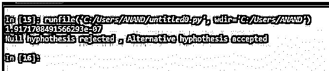
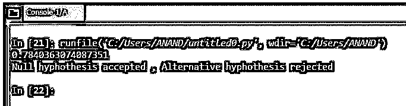

# Python Z 测试

> 原文：<https://www.educba.com/python-z-test/>


## Python Z 测试简介

下面的文章提供了 Python Z 测试的概要。在统计学的广阔领域中，假设检验的过程起着非常重要的作用。假设检验有助于对统计假设做出决策。当一个假设形成时，假设检验用于确认假设与现实的接近程度。这是基于假设的测试的关键特征。在假设检验中，Z 检验是一种方法或检验类型。

Z 检验包括确定 P 值，然后验证所确定的 P 值与所考虑的显著性值有多接近。通常，显著性值在 0.05 左右。P 值代表被识别的概率值的表示。概率值提到所确定的假设是无效假设或替代假设的可能性有多大。因此，基于所确定的 P 值，验证了假设的真实性。这是 Z 测试的关键过程。

<small>网页开发、编程语言、软件测试&其他</small>

**Z 测试语法**

下面给出了提到的语法:

`statsmodels.stats.weightstats.ztest(x1, x2=None, value=0, alternative='two-sided', usevar='pooled', ddof=1.0)`

*   Z 检验模型可以接受两个独立的样本来处理和确定 p 值。在上面的语法中，x1 将是使用的第一个独立样本。因此，x1 需要以一维或二维格式的数组形式键入。
*   在上面的语法中，x2 将是使用的第二个独立样本。x2 需要以一维或二维格式的数组形式键入。
*   该值将保持 X1 的平均值，这形成了替代假设。当使用一个以上的独立变量时，该值将是 X1 和 X2 之差的平均值。
*   用户保存汇集的值，这意味着样本的标准偏差是相同的。
*   H1 提到了另一种假设。
*   ddof 用于平均估计计算。

### Python 中什么时候进行 Z 测试？

*   首先，所用样本的大小决定了何时需要进行 Z 检验。这意味着当样本的大小大于 30 条记录时，Z 检验是首选。因此，样本大小在 Z 检验的确定中起着关键作用。当涉及的样本记录数小于 30 时，t 检验优于 Z 检验。
*   所涉及的每个数据点都需要相互独立。这意味着 Z 测试中涉及的两个数据点都需要自治，那么使用的数据必须适合 Z 测试。这是考虑 python 中 Z 测试的另一个关键功能。
*   预期数据呈正态分布。特别是对于较小的样本量，这需要严格遵循。样本大小的正态分布是 Z 检验选择的一个关键因素。当样本量大于 30 条记录时，可以考虑不采用正态分布。
*   取样方法是使用的另一个关键因素。这决定了假设计算的精确程度。这里，我们需要确保样本中选择的数据分布良好，并且是随机选择的。因此，从一个大的人群集合中，有必要确保数据被很好地混洗并从这个大的集合中选择，以便人群的所有方面都可以包含在样本集中。

### Python Z 测试的例子

以下是 Python Z 测试的示例:

**使用的数据(BP.csv ):**

| **患者姓名** | **患者 _ 性别** | **患者年龄组** | **患者 _ 血压 _ 之前** | **患者 _ 血压 _ 之后** |
| one | 男性的 | 30-45 | One hundred and forty-two | One hundred and fifty-three |
| Two | 男性的 | 30-45 | One hundred and sixty-three | One hundred and seventy |
| three | 男性的 | 30-45 | One hundred and forty-three | One hundred and sixty-eight |
| four | 男性的 | 30-45 | One hundred and fifty-three | One hundred and forty-two |
| five | 男性的 | 30-45 | One hundred and forty-six | One hundred and forty-one |
| six | 男性的 | 30-45 | One hundred and fifty | One hundred and forty-seven |
| seven | 男性的 | 30-45 | One hundred and fifty-eight | One hundred and thirty-three |
| eight | 男性的 | 30-45 | One hundred and fifty-three | One hundred and forty-one |
| nine | 男性的 | 30-45 | One hundred and fifty-three | One hundred and thirty-one |
| Ten | 男性的 | 30-45 | One hundred and fifty-eight | One hundred and twenty-five |
| Eleven | 男性的 | 30-45 | One hundred and sixty-nine | One hundred and sixty-four |
| Twelve | 男性的 | 30-45 | One hundred and seventy-three | One hundred and fifty-nine |
| Thirteen | 男性的 | 30-45 | One hundred and sixty-five | One hundred and thirty-five |
| Fourteen | 男性的 | 30-45 | One hundred and forty-five | One hundred and fifty-nine |
| Fifteen | 男性的 | 30-45 | One hundred and thirty-three | One hundred and fifty-three |
| Sixteen | 男性的 | 30-45 | One hundred and fifty-two | One hundred and twenty-six |
| Seventeen | 男性的 | 30-45 | One hundred and forty-one | One hundred and sixty-two |
| Eighteen | 男性的 | 30-45 | One hundred and seventy-six | One hundred and thirty-four |
| Nineteen | 男性的 | 30-45 | One hundred and forty-three | One hundred and thirty-six |
| Twenty | 男性的 | 30-45 | One hundred and sixty-two | One hundred and fifty |
| Twenty-one | 男性的 | 46-59 | One hundred and forty-nine | One hundred and sixty-eight |
| Twenty-two | 男性的 | 46-59 | One hundred and fifty-six | One hundred and fifty-five |
| Twenty-three | 男性的 | 46-59 | One hundred and fifty-one | One hundred and thirty-six |
| Twenty-four | 男性的 | 46-59 | One hundred and fifty-nine | One hundred and thirty-two |
| Twenty-five | 男性的 | 46-59 | One hundred and sixty-four | One hundred and sixty |
| Twenty-six | 男性的 | 46-59 | One hundred and fifty-four | One hundred and sixty |
| Twenty-seven | 男性的 | 46-59 | One hundred and fifty-two | One hundred and thirty-six |
| Twenty-eight | 男性的 | 46-59 | One hundred and forty-two | One hundred and eighty-three |
| Twenty-nine | 男性的 | 46-59 | One hundred and sixty-two | One hundred and fifty-two |
| Thirty | 男性的 | 46-59 | One hundred and fifty-five | One hundred and sixty-two |
| Thirty-one | 男性的 | 46-59 | One hundred and seventy-five | One hundred and fifty-one |
| Thirty-two | 男性的 | 46-59 | One hundred and eighty-four | One hundred and thirty-nine |
| Thirty-three | 男性的 | 46-59 | One hundred and sixty-seven | One hundred and seventy-five |
| Thirty-four | 男性的 | 46-59 | One hundred and forty-eight | One hundred and eighty-four |

#### 示例#1

**代码:**

```
import pandas as pd
from statsmodels.stats import weightstats as stests
dataframe = pd.read_csv(r"C:\Users\ANAND\Desktop\BP.csv")
dataframe[['patient_bp_before','patient_bp_after']].describe()
ztest ,propability_value = stests.ztest(dataframe['patient_bp_before'], x2=None, value=146)
print(float(propability_value))
if propability_value<0.05:
print("Null hyphothesis rejected , Alternative hyphothesis accepted")
else:
print("Null hyphothesis accepted , Alternative hyphothesis rejected")
```

**输出:**




**说明:**

*   在第一个例子中，进行了以下假设。
*   **替代假设:**以前所有患者的平均血压在 146 左右。
*   **无效假设:**所有患者的平均血压不在给定的平均值范围内。
*   当确定概率值并评估假设时，概率值位于-1.91 附近，小于 0.05 的显著性水平；因此，这被认为是另一种假设。因此假设是成功的。

#### 实施例 2

**代码:**

```
# The Mean value is alone manipulated as 78
ztest ,propability_value = stests.ztest(dataframe['patient_bp_before'], x2=None, value=146)
```

**输出:**




**说明:**

*   在第二个例子中，进行了以下假设。
*   **替代假设:**以前所有患者的平均血压在 78 左右。
    **无效假设:**所有患者的平均血压不在给定值的均值范围内。
*   当确定概率值并评估假设时，概率值位于+0.78 附近，大于 0.05 的显著性水平；因此，这被认为是一个无效假设。因此，这一假设已经失败。

### 结论

在不同的假设检验方法中，Z 检验是最稳定的方法之一。这种方法在确定所涉及的 p 值和识别假设发生的类型方面提供了很大的灵活性。因此，可以灵活地计算零假设或替代假设的存在。

### 推荐文章

这是 Python Z 测试的指南。这里我们讨论一下入门，什么时候用 python 执行 z 测试？以及更好理解的例子。您也可以看看以下文章，了解更多信息–

1.  [Python 中的 Shell 排序](https://www.educba.com/shell-sort-in-python/)
2.  [Python 中的插入排序](https://www.educba.com/insertion-sort-in-python/)
3.  [Python 中的烧瓶](https://www.educba.com/flask-in-python/)
4.  [Python 列表扩展](https://www.educba.com/python-list-extend/)


