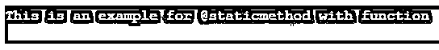

# Python @静态方法

> 原文：<https://www.educba.com/python-staticmethod/>


## Python @staticmethod 简介

以下文章提供了 Python @staticmethod 的概要。staticmethod 是一种基本上绑定到它所代表的类而不是任何类的任何对象的方法。它是一个无权访问或修改类状态的方法。@staticmethod 是一个内置函数，只返回一个静态方法。这些静态方法类似于任何其他类方法，并且绑定到一个类。这些 staticmethod 不需要创建类实例，这就是为什么它们不依赖于对象的状态。当我们必须处理任何与类而不是实例相关的数据时，通常会使用这些静态方法。

**语法:**

<small>网页开发、编程语言、软件测试&其他</small>

@staticmethod decorator 的标准语法如下:

`@staticmethod( function )`

这里，staticmethod 是语法中使用的关键字，函数是正确执行方法所必需的。它不必总是使用函数来执行，我们可以实现没有函数的@staticmethod。

我们在这里传递的参数是一个函数，我们打算通过将该函数作为参数传递来将其转换为静态方法。对于返回值，staticmethod 返回我们传递的函数的静态方法。

### @staticmethod Decorator 在 Python 中是如何工作的？

*   @staticmethod 是一个 Python 描述符。调用时，python 将在必须访问对象时调用 __get__ 方法。这是 python 中翻译的起点。
*   这个 staticmethod 也类似于@classmethod。当我们在代码中启动 staticmethod 时，它会将功能传递给我们传递的函数，然后执行转向该函数。
*   使用 staticmethod 的主要应用之一是创建多个实用函数。

### Python @staticmethod 的示例

下面是提到的例子:

#### 示例#1

对于我们的第一个例子，我们将简单地调用一个包含@staticmethod 的 print 语句。这里，我们不会为 decorator 传递任何函数。

**代码:**

```
class State:
    @staticmethod
    def city():
        print("Pune - Simple Example to Demonstrate working of @staticmethod, without function.")

s=State()
s.city() 
```

**说明:**

首先创建一个名为 State 的类，并在第一个类中调用@staticmethod decorator。然后我们定义了一个名为 city 的简单函数，在这个函数中有一个简单的 print 语句，它将在成功执行时打印一条简单的消息。

然后，我们用一个简单的变量 s 为第一个类赋值。最后，我们有 s.city()，这意味着我们调用 city()函数，它是 state 类的一部分。s.city()可以理解为，调用 city 函数，作为 s 的一部分，其中 s 是 state 类。

**输出:**


如您所见，我们的 print 语句是使用@staticmethod 打印的。

#### 实施例 2

我们将实现@staticmethod 构造函数和函数。所以这里我们将传递一个函数并检查输出。

**代码:**

```
class Sample:
     def Ex():
         print("This is an example for @staticmethod with function")
     Ex = staticmethod(Ex)

Sample.Ex()
```

**说明:**

类似于我们的第一个例子，我们有一个简单的类和一个在类中定义的函数。我们的目标是通过@staticmethod 获得打印语句作为输出。然后我们有另一个变量来调用 staticmethod，并且我们已经传递了我们创建的函数。最后，我们调用了示例函数。Ex()，意味着调用保存 Ex()函数的样本类。输出应该是函数保存的值。

**输出:**




正如所料，输出是“这是带有函数的@staticmethod 的一个例子”,这正是我们想要的。这里我们看到了 staticmethod 在与函数一起传递时是如何工作的。前面我们看到了不传递任何函数的 staticmethod 的工作方式。

#### 实施例 3

我们将度过一个年龄，这个年龄将被检查并确定这个人是否成年。年龄和成人功能程序的代码如下。

**代码:**

```
from datetime import date 

class Ex_Per: 
	def __init__(self, age): 
		self.age = age 

	@staticmethod
	def isAdult(age): 
		return age > 18

n_age=33
sample = Ex_Per(n_age) 

print (sample.age)
print (Ex_Per.isAdult(n_age)) 
```

**说明:**

我们这里的主要目的是打印人的年龄和成人功能的结果。从从 datatime 模块导入日期开始。然后我们有我们的类 exper，它有年龄的定义。然后我们有我们的@staticmethod，它有我们成年人的函数，我们的函数有责任检查给定的年龄是否大于 18 岁。继续，然后声明一个简单的变量来保存年龄，在这个例子中是 33 岁。

然后我们有另一个变量来控制我们的阶级和年龄。最后，在我们的第一个 print 语句中，我们将这个人的年龄打印为 sample.age。这个 sample.age 可以被读取为 sample，它保存了类 Ex_Per，并在其中保存了年龄函数。我们的第二个打印语句是 Ex_Per.isAdult(n_age)。我们的最后一行将根据成人函数的结果简单地输出真或假。这里的 a_age 是保持我们的年龄 33 岁的变量。

**输出:**


正如你所看到的，我们用两个不同的年龄尝试了同一个例子。当我们执行年龄为 11 岁的代码时，它显示为成年人是假的。11 比 18 小，所以 11 岁的人不是成年人。然后我们再次执行年龄为 33 的代码，因为 33 大于 18，所以成年人的结果为真。这个程序是实现@staticmethod 的例子。

### 结论

@staticmethod 只是另一个内置函数，它不接受任何参数。这里使用了@staticmethod 装饰器。静态方法不接受任何类型的参数。它不能访问或修改 state 类。@staticmethod 用于创建实用函数。静态方法不知道类中发生的任何事情。

### 推荐文章

这是 Python @staticmethod 的指南。在这里，我们通过编程示例讨论了@staticmethod decorator 如何在 python 中工作。您也可以看看以下文章，了解更多信息–

1.  [Python 正则表达式测试器](https://www.educba.com/python-regex-tester/)
2.  [蟒蛇卷曲](https://www.educba.com/python-curl/)
3.  [Python 逆向列表](https://www.educba.com/python-reverse-list/)
4.  [Python 字符串操作](https://www.educba.com/python-string-operations/)


