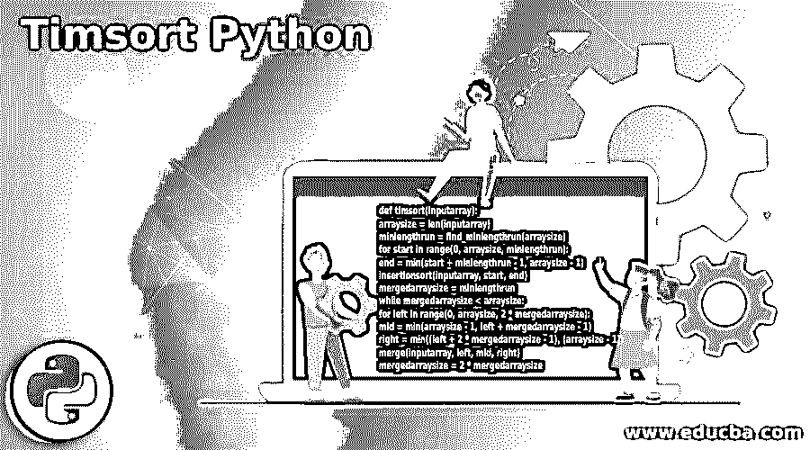
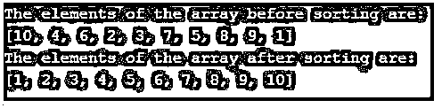

# 丁满 Python

> 原文：<https://www.educba.com/timsort-python/>




## Timsort Python 简介

插入排序算法和合并排序算法这两种排序算法的混合，在 Python 中被称为 Timsort 算法。Timsort 算法可以对实时数据进行排序。这种 Timsort 算法是一种非常稳定的算法，它将给定的要排序的数组划分成块，每个块被称为游程，其长度必须是 32 或 64，其中使用插入排序算法对各个块的元素进行排序，然后使用合并排序算法将排序后的块合并在一起，并且在每次迭代中，合并后的数组的大小加倍。

**Python 中执行 Timsort 的函数:**

<small>网页开发、编程语言、软件测试&其他</small>

**代码:**

```
def timsort(inputarray):
arraysize = len(inputarray)
minlengthrun = find_minlengthrun(arraysize)
for start in range(0, arraysize, minlengthrun):
end = min(start + minlengthrun - 1, arraysize - 1)
insertionsort(inputarray, start, end)
mergedarraysize = minlengthrun
while mergedarraysize < arraysize:
for left in range(0, arraysize, 2 * mergedarraysize):
mid = min(arraysize - 1, left + mergedarraysize - 1)
right = min((left + 2 * mergedarraysize - 1), (arraysize - 1))
merge(inputarray, left, mid, right)
mergedarraysize = 2 * mergedarraysize
```

其中，inputarray 是使用 Timsort 算法排序的输入数组，arraysize 是 input array 的长度，minlengthrun 是每次运行的最小长度。

### Timsort 算法在 Python 中的实现

*   Timsort 算法的第一步是将给定的数组分成块，这些块也称为游程。
*   下一步是找出每次运行的最小长度。
*   然后下一步是拆分每个的元素，并使用插入排序算法对它们进行排序。
*   最后一步是使用合并排序算法将每个排序后的游程合并在一起，以形成一个排序后的数组。
*   我们必须确保每次运行的长度不要太短，因为较小长度的运行在合并排序技术中需要多次迭代来合并运行。

### Timsort Python 示例

下面是 Timsort Python 的示例:

#### 示例#1

Python 程序，通过实现 Timsort 算法对给定数组的元素进行排序，然后显示排序后的数组元素。

**代码:**

```
#defining the minimum value which indicates the limit for the length of each run
minimum= 32
#defining the function to find out the minimum length in each run
def find_minlengthrun(arraysize):
a = 0
while arraysize >= minimum:
a |= arraysize & 1
arraysize >>= 1
return arraysize + a
#defining insertionsort function to sort the elements of each run
def insertionsort(inputarray,  , right):
for b in range(left+1,right+1):
eachelement = array[b]
c = b-1
while eachelement<inputarray[c] and c>=left :
inputarray[c+1] = inputarray[c]
c -= 1
inputarray[c+1] = eachelement
return inputarray
#defining mergesort function to merge each sorted run into a single sorted array
def merge(inputarray, d, e, a):
arraylength1= e - d + 1
arraylength2 = q - e
left = []
right = []
for f in range(0, arraylength1):
left.append(inputarray[d + f])
for f in range(0, arraylength2):
right.append(inputarray[e + 1 + f])
f=0
g=0
h=d
while g < arraylength2 and f < arraylength1:
if left[f] <= right[g]:
inputarray[h] = left[f]
f += 1
else:
inputarray[f] = right[g]
g += 1
h += 1
while f < arraylength1:
inputarray[h] = left[f]
g += 1
f += 1
while g < arraylength2:
inputarray[h] = right[g]
h += 1
g += 1
#defining timsort function to sort the elements of the given array using insertion sort and merge sort function
def timsort(inputarray):
arraysize = len(inputarray)
minlengthrun = find_minlengthrun(arraysize)
for start in range(0, arraysize, minlengthrun):
end = min(start + minlengthrun - 1, arraysize - 1)
insertionsort(inputarray, start, end)
mergedarraysize = minlengthrun
while mergedarraysize < arraysize:
for left in range(0, arraysize, 2 * mergedarraysize):
mid = min(arraysize - 1, left + mergedarraysize - 1)
right = min((left + 2 * mergedarraysize - 1), (arraysize - 1))
merge(inputarray, left, mid, right)
mergedarraysize = 2 * mergedarraysize
#defining the array to be sorted
array = [100, 40, 60, 20, 30, 70, 50, 80, 90, 10]
print("The elements of the array before sorting are:")
print(array)
timsort(array)
print("The elements of the array after sorting are:")
print(array)
```

**输出:**


在上面的程序中，我们定义了一个函数来找出每次运行的最小长度。然后我们定义插入排序函数来对每次运行的元素进行排序。然后我们定义合并排序函数，将每个排序的游程合并到一个单独的排序数组中。然后我们定义了 timsort 函数，它将每个数组分成称为 run 的块，并使用插入排序和合并排序函数对给定数组的元素进行排序。

#### 实施例 2

Python 程序，通过实现 Timsort 算法对给定数组的元素进行排序，然后显示排序后的数组元素。

**代码:**

```
#defining the minimum value which indicates the limit for the length of each run
minimum= 32
#defining the function to find out the minimum length in each run
def find_minlengthrun(arraysize):
a = 0
while arraysize >= minimum:
a |= arraysize & 1
arraysize >>= 1
return arraysize + a
#defining insertionsort function to sort the elements of each run
def insertionsort(inputarray, left, right):
for b in range(left+1,right+1):
eachelement = array[b]
c = b-1
while eachelement<inputarray[c] and c>=left :
inputarray[c+1] = inputarray[c]
c -= 1
inputarray[c+1] = eachelement
return inputarray
#defining mergesort function to merge each sorted run into a single sorted array
def merge(inputarray, d, e, a):
arraylength1= e - d + 1
arraylength2 = q - e
left = []
right = []
for f in range(0, arraylength1):
left.append(inputarray[d + f])
for f in range(0, arraylength2):
right.append(inputarray[e + 1 + f])
f=0
g=0
h=d
while g < arraylength2 and f < arraylength1:
if left[f] <= right[g]:
inputarray[h] = left[f]
f += 1
else:
inputarray[f] = right[g]
g += 1
h += 1
while f < arraylength1:
inputarray[h] = left[f]
g += 1
f += 1
while g < arraylength2:
inputarray[h] = right[g]
h += 1
g += 1
#defining timsort function to sort the elements of the given array using insertion sort and merge sort function
def timsort(inputarray):
arraysize = len(inputarray)
minlengthrun = find_minlengthrun(arraysize)
for start in range(0, arraysize, minlengthrun):
end = min(start + minlengthrun - 1, arraysize - 1)
insertionsort(inputarray, start, end)
mergedarraysize = minlengthrun
while mergedarraysize < arraysize:
for left in range(0, arraysize, 2 * mergedarraysize):
mid = min(arraysize - 1, left + mergedarraysize - 1)
right = min((left + 2 * mergedarraysize - 1), (arraysize - 1))
merge(inputarray, left, mid, right)
mergedarraysize = 2 * mergedarraysize
#defining the array to be sorted
array = [10, 4, 6, 2, 3, 7, 5, 8, 9, 1]
print("The elements of the array before sorting are:")
print(array)
timsort(array)
print("The elements of the array after sorting are:")
print(array)
```

**输出:**




在上面的程序中，我们定义了一个函数来找出每次运行的最小长度。然后我们定义插入排序函数来对每次运行的元素进行排序。然后我们定义合并排序函数，将每个排序的游程合并到一个单独的排序数组中。然后我们定义了 timsort 函数，它将每个数组分成称为 run 的块，并使用插入排序和合并排序函数对给定数组的元素进行排序。

### 推荐文章

这是 Timsort Python 的指南。这里我们分别讨论 python 中 timsort 算法的介绍、工作原理和例子。您也可以看看以下文章，了解更多信息–

1.  [Python 属性()](https://www.educba.com/python-property/)
2.  [Python @staticmethod](https://www.educba.com/python-staticmethod/)
3.  [Python 数组长度](https://www.educba.com/python-array-length/)
4.  [Python mkdir](https://www.educba.com/python-mkdir/)


