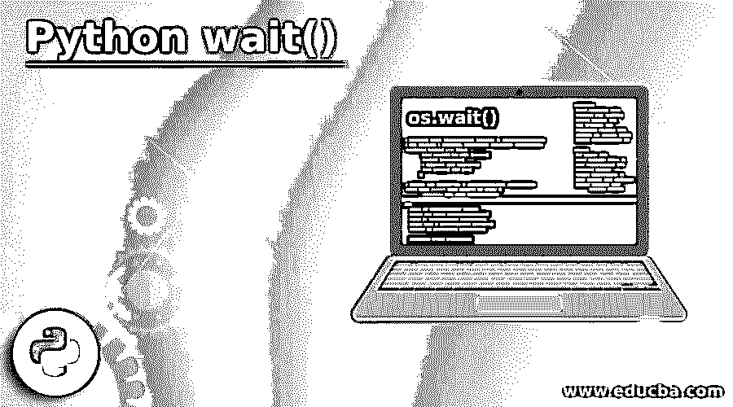
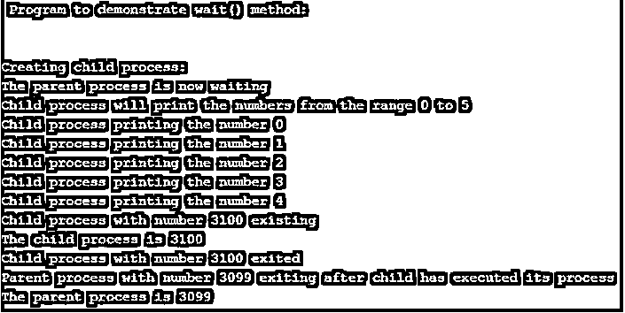

# Python wait()

> 原文：<https://www.educba.com/python-wait/>




## Python wait()简介

Python wait()方法被定义为使正在运行的进程等待其他进程(如子进程)完成执行，然后恢复父类或事件的进程的方法。Python 中的 wait()方法是 os 模块的一种方法，通常使父进程与其子进程同步，这意味着父进程将等待子进程完成其执行(即，等到子进程退出)，然后继续其进程执行。此方法还被定义为 Python 线程模块中事件类的方法，用于在事件的内部标志设置为 false 时暂停事件的执行，这将暂停当前块或事件的执行，直到内部标志设置为 true。

### Python 中 wait()方法的工作原理

在本文中，我们将讨论在 Python 编程语言的 os 模块中获得的 wait()方法，该方法被声明或定义为 os.wait()。这个 os.wait()函数用于暂停或停止父进程，直到子进程被执行。这个 wait()函数通常用于在流程需要发生某些事情时进行等待，它将一直等待，直到函数使用一些指定或声明的条件或模式返回 true。

<small>网页开发、编程语言、软件测试&其他</small>

在 Python 中，wait()函数在两个不同的模块中定义，如操作系统模块和线程模块。在线程模块中，event 类提供了这个 wait()方法来保存当前线程的执行情况，以便执行或完成事件。而 os 模块也具有相同的工作，但是在 os 模块中，它与父进程一起等待，直到子进程完成其执行。在下一节中，让我们用例子详细介绍这两种方法。在 Python 中，os.wait()函数的语法如下:

**语法:**

```
os.wait()
```

该语法以元组的形式返回子进程的 id 以及一个 16 位整数，该整数也出现在元组中以表示退出状态。该方法返回一个 16 位整数，该整数又包括高字节和低字节，其中低字节的信号数为零，这将终止进程，而高字节将具有退出状态通知。这个 os.wait()函数没有任何参数。

### Python wait()的例子

现在让我们来看一个简单的例子:

#### 示例#1

**代码:**

```
import os
print(" Program to demonstrate wait() method:")
print("\n")
print("Creating child process:")
pr = os.fork()
if pr is 0:    
    print("Child process will print the numbers from the range 0 to 5")
    for i in range(0, 5):
        print("Child process printing the number %d"%(i))      
    print("Child process with number %d existing" %os.getpid())
    print("The child process is",(os.getpid()))
else:    
    print("The parent process is now waiting")
    cpe = os.wait()
    print("Child process with number %d exited" % (cpe[0]))
    print("Parent process with number %d exiting after child has executed its process" % (os.getpid()))
    print("The parent process is", (os.getpid()))
```

**输出:**




在上面的程序中，我们可以看到用 Python 来演示 os 模块的 wait()方法。首先，导入操作系统模块。所以当我们希望 wait()方法用于父进程，直到子进程完成它的执行。因此，要调用或创建子流程，我们必须调用 fork()方法。然后，为了获得父 id，我们必须调用 getpid()方法。所以在上面的程序中，它将打印从 0 到 4 的子进程号，直到它打印出子进程，父进程将一直等待。因此，已经完成进程执行的子进程 id 将退出，然后父进程将退出。

现在，我们将看到 Python 中使用 wait()方法的另一个模块是一个线程模块，它主要包括允许线程同步的机制，因此，为了释放锁，然后锁定另一个块，直到线程被执行，我们使用这个 wait()方法，它也需要锁，并以指定的超时返回。这个方法主要存在于 Python 中线程模块的 event 类中。所以语法可以写成如下:

首先，我们需要导入线程模块和事件类，可以这样做:

```
from threading import Event

wait( timeout= None)
```

wait()方法将接受一个参数 timeout，该参数是可选的，用于指定等待的特定时间，超时后，事件或线程将被解除阻塞。此方法返回布尔值，如果线程在超时前被释放，则返回 true，否则将返回 false 值。

因此，让我们看一个 wait()方法如何在线程模块中工作的示例。

#### 实施例 2

```
import threading
import time
def hf(et_obj, timeout,n):
  print("Thread started, for the event to set")
  print("\n") 
  flag = et_obj.wait(timeout)
  if flag:
    print("The Event earlier was true, now moving forward")
  else:
    print("Time has run out , yet the event internal flag is still false.")
    print("Start executing thread without waiting for event to become false")
    print(n)
    print("\n")    
if __name__ == '__main__':  
  print("Start invoking the event")
  et_obj = threading.Event()  
  t1 = threading.Thread(target=hf, args=(et_obj,5,17))
  t1.start()  
  time.sleep(5)    
  print("It will start generating the event")
  print("\n")
  et_obj.set()
  print("So the Event is now set to true.")
  print("Now threads can be released.")
  print()
```

**输出:**


在上面的程序中，我们演示了带有超时参数的 wait()方法，其中我们导入了线程模块。首先，事件将通过将其设置为 true 开始，然后超时将开始，一旦超时发生，则自动标志将被设置为 false，在这种情况下，它将开始执行线程，而不等待事件完成，因为时间用完了，如果我们希望线程等待事件完成，则我们使用 sleep() 方法，我们让线程休眠 5 秒钟，然后恢复，一旦事件完成，它将设置为 true，线程可以被释放以供进一步执行。

### 结论

在本文中，python 提供了一个称为 os(操作系统)的模块，它为父进程提供 wait()函数，以等待其子进程完全执行。在本文中，我们通过一个例子看到了如何使用 wait()函数让父进程等待。在本文中，我们也有另一个模块线程，它也为线程提供了一个 wait()函数，以等待事件被执行。

### 推荐文章

这是 Python wait()的指南。在这里，我们还将讨论 python 中 wait()方法的介绍和工作原理，并举例说明不同的示例及其代码实现。您也可以看看以下文章，了解更多信息–

1.  [Python 导入 CSV](https://www.educba.com/python-import-csv/)
2.  [Python 导入错误](https://www.educba.com/python-importerror/)
3.  [Python 导入错误](https://www.educba.com/python-importerror/)
4.  [Python 输入函数](https://www.educba.com/python-input-function/)


