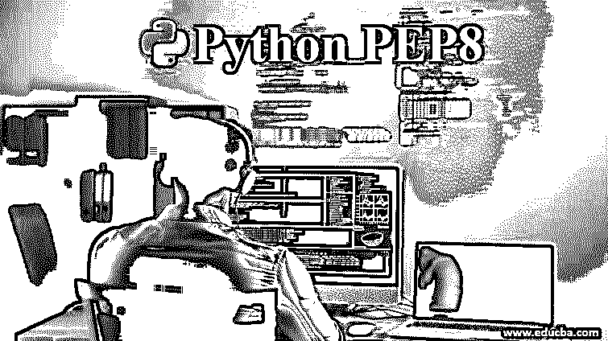
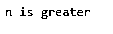
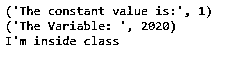

# Python PEP8

> 原文：<https://www.educba.com/python-pep8/>

## Python PEP8 简介

PEP 或 Python 增强提案是一份草案或文档，其中描述了 Python 代码编写指南，这是提高 Python 代码一致性和可读性的最佳实践。本文档包含编写代码时使用的 Python 风格和设计等特性。正如我们所知，Python 有严格的格式或编写脚本的顺序，这使得其他人很容易阅读代码；因此，好的编码风格对开发者或其他阅读代码的人有很大的帮助。开发人员必须遵循这些准则。在 Python 中，我们看到缩进对于代码的语法执行非常重要。

### Python 中 PEP8 的函数

总的来说，Pep8 是一个工具，在这里你可以用 Pep8 文档中的约定来检查你的 Python 代码约定。让我们看看 Pep8 文档的几个特性:

<small>网页开发、编程语言、软件测试&其他</small>

#### 1.刻痕

这是用 Python 编写代码和读取代码的最重要的特性之一。它也被称为 4 空间规则，这个规则并不是强制性的，因为它可以被否决的线的延续。缩进也有助于知道哪个代码属于哪个函数，就像我们在 Python 的其他编程语言中使用大括号一样；这是通过遵循缩进规则来完成的。

在 Pep8 中，规则是使用空格代替制表符，因为规则的名称使用 4 个连续的空格进行缩进。如果同时使用这两个规则，则会导致解释器发出警告的错误。

##### 例子

**代码:**

`n = 10
if n> 5:
print “n is greater”`

**输出:**

在上面的程序中，print 语句跟在 indentation 后面，因为“if”语句为真，所以只执行 print 语句。如果没有保持适当的缩进，那么它将弹出一个错误。没有缩进的上述代码的输出将是:

**代码:**

`n = 10
if n> 5:
print "n is greater"`

**输出:**

#### 2.命名规格

Pep8 中几乎没有 Python 编码的命名规则，使得代码可读性更强，复杂度更低。代码中有很多东西需要命名，比如变量、类、方法、包等等。为变量、函数、类或包选择有意义的名称，或者选择与代码具体功能相关的名称，这一直是一种最佳实践，因为使用一些随机名称进行声明会导致歧义，或者在调试代码时非常困难。让我们看看编写代码时要使用的一些命名风格。

对于变量，可以是一个字母、一个单词或任意数量的单词，用下划线隔开，但所有这些字母都应该是小写的。我们可以使用小写的所有字母来命名函数或方法，可以是一个单词或由下划线分隔的任意数量的单词。For 常量也遵循与变量相同的规则，但是所有的字母都应该大写。对于 class，命名规则是可以使用一个单词或多个单词，但这多个单词之间没有分隔，并且遵循类似 ClassName 的 camel case。For 包也遵循与 class 相同的命名规则，但是包名的字母应该全部用小写，而不是 camel case。这些都可以在下面的代码中演示。

##### 例子

**代码:**

`class ClassName: #Class naming rule
C = 1 #Constat naming rule
the_variable = 2020; # variable naming rule
print("The constant value is:", C)
def the_method(self): # method naming rule
print("I'm inside class ")
def insideclass(self):
print("The Variable: ",ClassName.the_variable)
self.the_method()
n = ClassName()
n.insideclass()`

**输出:**

#### 3.文档字符串

这也称为文档字符串，文档字符串包含在单引号和双引号中，用于定义程序或任何特定的函数或方法。将文档字符串应用于代码的规则是:

首先，用于记录代码块的引号是用三重引号括起来的，比如。

这是一个 docstring“”，其次，它可用于为所有函数、公共模块、类和方法编写 docstring。注意，对于非公共方法，文档字符串不是必需的；相反，您可以使用注释来描述该方法的功能。另外，请注意，对于单行文档字符串，结束三重引号出现在同一行中，但是对于多行文档字符串，结束三重引号出现在文档字符串结束的位置。

##### 例子

**代码:**

`def addition:
a, b = 0
“““ This method is for addition”””
c = a + b
“““ This method is for addition and it is addition of two numbers.
This has a formula as shown above c = a+ b
And the addition of two numbers gives the result which is stored in c”””
return c`

Python 代码的其他一些 Pep8 文档规则是:

*   我们必须使用 UTF-8 或 ASCII 编码进行 Python 编码，这也是一种默认编码，适用于国际环境。
*   还有一个使用空格的规则。空格只能用在运算符前后，不能用在括号内或逗号前。
*   不应使用字符作为标识符，因为它们可能会导致混淆，例如字母“l”可以被视为小写“l”(El)和大写“I”，字母“O”大写 O (oh)和数字零“0”。

Pep8 有许多不同的文档特性用于 Python 代码样式和设计。

### 结论

Pep8 是使用适当的规则和代码样式准确编写 Python 代码的工具之一。这种规则文档对于开发人员编写可读性更强、对其他人来说更简单的代码非常重要。要注意一点，通常用适当的注释和文档编写适当的代码是有帮助的，因为代码只编写一次，但许多人会阅读多次，所以开发人员需要编写可读的代码，并且易于他人理解代码。所以 Pep8 会帮你做到这一点。

### 推荐文章

这是 Python PEP8 的指南。在这里，我们将讨论 python pep8 的介绍和工作原理，以及不同的示例和代码实现。您也可以看看以下文章，了解更多信息–

1.  [Python 字符串操作](https://www.educba.com/python-string-operations/)
2.  [Python Tkinter Button](https://www.educba.com/python-tkinter-button/)
3.  [Python 默认参数](https://www.educba.com/python-default-arguments/)
4.  [蟒蛇泡菜](https://www.educba.com/python-pickle/)

