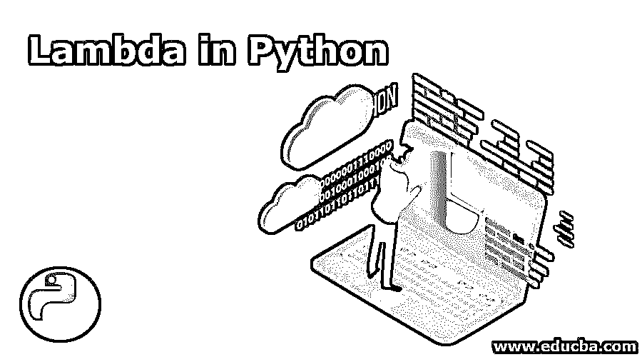
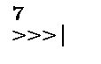
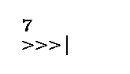
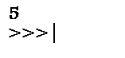
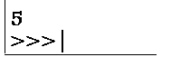
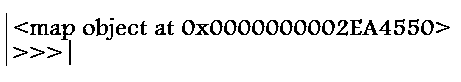
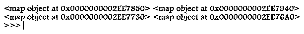
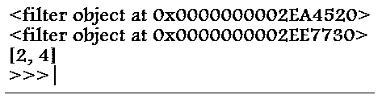

# Python 中的 Lambda

> 原文：<https://www.educba.com/lambda-in-python/>

## Python 中 Lambda 的介绍

匿名函数被标记为 lambda 函数。这并不是 python 中新引入的东西；lambdas 是 Java、C#和 C++等其他语言的一部分。lambda 抽象是这些 lambda 函数的别名

这些λ函数是从λ演算演化而来的；λ演算是一种计算模型。这种演算背后的关键思想是抽象。图灵机和 lambda 演算，两者都可以互相解读。像 Erlang 和 lisp 这样的函数式语言直接采用了 lambda 演算的概念。图灵机带来了 Fortran、C 或 Python 等语言中的基本编程元素。

<small>网页开发、编程语言、软件测试&其他</small>

### λ函数的关键特征

*   lambda 函数可以容纳的表达式数量是一个，而这些匿名函数可以保留多个参数。
*   它可以用来返回函数的对象

### λ函数的元素

下面列出了 lambda 结构的关键元素，

**语法:**

`lambda argument(s): expression`

样本:λx:x

*   关键词:λ
*   一个绑定变量:x
*   一个身体:x

**举例:**

`lambda z:  z + 5`

这里声明了一个 lambda 表达式。这个函数可以通过在 lambda 表达式和参数重要性周围封装括号来注入一个参数，因为 lambda 是一个表达式，所以可以对它进行命名。lambda 函数可以容纳的表达式数量是一个，而这些匿名函数可以保留多个参数。它可以用来返回函数的对象。

`a = (lambda z: z+5)(2)
print(a)`

**输出:**

`Variable_A = lambda z: z+5
print(Variable_A(2)`

**输出:**

下面给出了将正常函数转换成λ函数的例子，

python 中普通函数的声明和用法

`def add_function(x, y):
return x + y
# function call
print(add_function(2, 3))`

**输出:**

将其转换成面向 lambda 的函数

`Anonymous_add_function = lambda x, y : x + y
print(Anonymous_add_function(2, 3))`

**输出:**

### 什么时候使用 lambda 函数？

这些 lambda 函数在以下情况下发挥了重要作用，

1.当某项功能预计只在短期内可用时。

2.当一个函数被承认是一个关于函数阶的高级函数的参数时。这是一个函数选择另一个函数作为参数的场景。

### 带有 python map()函数的 Lambda

python 中的 Map 函数接受一个函数对象和一组 iterables。所以它为其中的每个 iterables 元素执行这个 map 函数对象并产生输出。iterables 可以是列表、元组或任何集合数据类型。map 函数的语法指定如下，

**语法:**

`map(function_object, iterable1, iterable2,...)
Code without Lambda :
def multiply2(x):
return x * 2
a = map(multiply2, [1, 2, 3, 4])
print(a)`

**输出:**

**用λ编码:**

`map(lambda x : x*2, [1, 2, 3, 4])`

**完整的代码片段:**

`dict_a = [{'name': 'python3', 'points': 9}, {'name': 'java', 'points': 7}] list_a = [1, 2, 3] list_b = [11, 21, 31] a=map(lambda x : x['name'], dict_a) # Output: ['python3', 'java'] b=map(lambda x : x['points']*10,  dict_a) # Output: [90, 70] c=map(lambda x : x['name'] == "python3", dict_a) # Output: [True, False] d=map(lambda x, y: x + y, list_a, list_b) # Output: [12, 23, 34] print(a,b,c,d)`

**输出:**

### 带有 python Filter()函数的 Lambda

filter 函数包含两个参数，即函数对象和可迭代值。function 对象总是生成一个布尔值，对于 iterable 段中的每个元素以及 function 对象返回 true 的每个元素，都由 filter 函数生成作为输出。在这里，filter 函数只能保存一个 iterable 作为它的输入。这是 filter()函数与 map()函数的主要区别之一，其中 map 函数可以保存多个 iterables。另一种观点认为，过滤器和映射函数都可以产生多个值作为输出。

*   有了这些过滤器对象，索引级别的访问是不可能的。
*   事实上，索引不能用于过滤器对象中的值，甚至它的长度也不能以任何预定义的方式确定。

**语法:**

`filter(function_object, iterable)`

**完整的代码片段:**

`listing_a = [1, 3, 2, 4, 1] dictionary_a = [{'name': 'python3', 'points': 11}, {'name': 'java', 'points': 9}] a = filter(lambda x : x['name'] == 'python', dictionary_a)
print(a)
b = filter_obj = filter(lambda x: x % 2 == 0, listing_a) # filter object
print(b)
even_num = list(filter_obj) # Converts the filer obj to a list
print(even_num)`

**输出:**

### 结论

这些匿名函数在很大程度上有助于减少代码，并鼓励优化 python 元素的使用；它们在两种必要的情况下特别起着重要的作用，一种是当一个功能预计只在所涉及的程序的整个生命周期中的很短一段时间内可用时。当一个函数被承认是一个高级函数的参数时，就函数的顺序而言，这是一个函数选择另一个函数作为参数的情况。

### 推荐文章

这是 Python 中 Lambda 的指南。在这里，我们讨论 Lambda 函数的介绍以及特征、关键元素和编程示例。您也可以看看以下文章，了解更多信息–

1.  [Python 排序数组](https://www.educba.com/python-sort-array/)
2.  [蟒蛇熊猫加入](https://www.educba.com/python-pandas-join/)
3.  [AWSλ层](https://www.educba.com/aws-lambda-layers/)
4.  [什么是 AWS Lambda？](https://www.educba.com/what-is-aws-lambda/)

