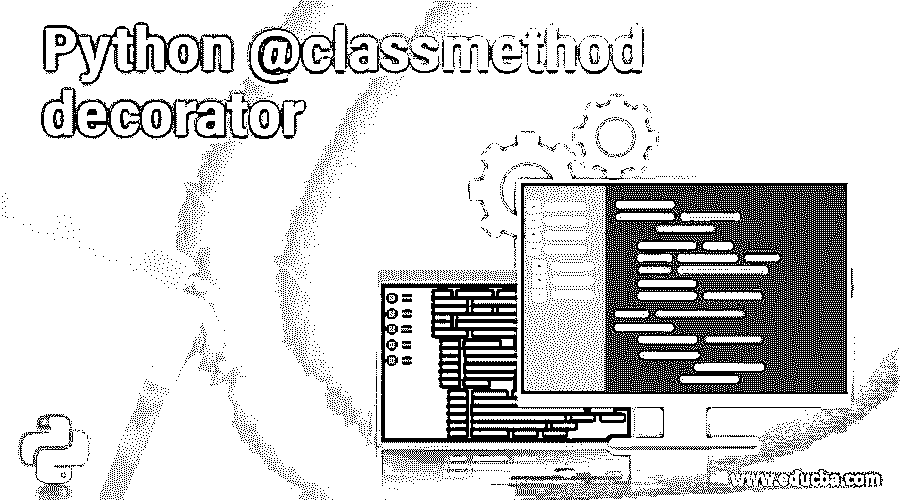
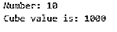
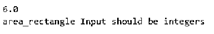
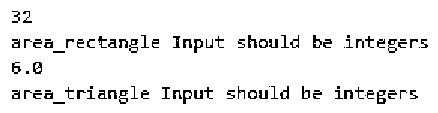
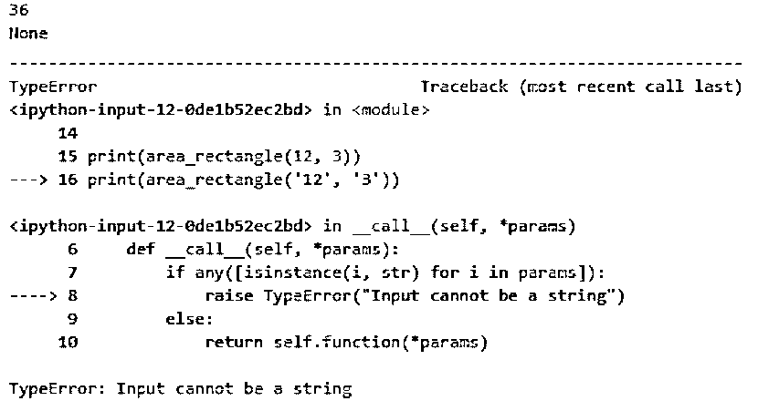

# Python @classmethod 装饰器

> 原文：<https://www.educba.com/python-classmethod-decorator/>




## Python @classmethod decorator 简介

类装饰器可以被定义为 python 中的一个对象，它可以被调用来修改或更改代码中使用的类或函数，该代码具有一个已定义的函数或已定义的类，该函数或已定义的类将被传递到装饰器中，以便返回之前已经定义的已更改或已修改的类或函数，或者换句话说，装饰器允许我们在已定义的函数内覆盖另一个函数，以包括更多的操作，而无需修改或 永久地改变函数和调用可用于改变或修改的函数和类来调用原始的类或函数。

**语法:**

<small>网页开发、编程语言、软件测试&其他</small>

Class method decorator 的基本结构是对 class decorator 的描述，在这里我们可以将用户定义的函数与 self 方法一起使用，然后是 _call_ method，在这里我们可以传递我们的参数，然后在最后的块中提到我们执行操作的函数。

```
class MyDecorator:
    def __init__(self, function):
        self.function = function

    def __call__(self):
        self.function()
@MyDecorator
def function():
    print("Beautiful Day")
function()
```

**输出:**


### @classmethod decorator 在 Python 中是如何工作的？

我们已经使用 _call_ 将装饰器定义为代码中的方法类。当用户创建一个作为函数工作的对象时，使用 _call_ method，装饰器将返回像函数一样工作的对象。在上面的代码中，我们可以在 call 函数之前和 self.function()之后实现我们想要的代码或操作。从对象的角度完全隐藏一个方法是可能的，因为它使用的是 __call__ 方法，在这种情况下，基类不会以多态的方式注意到这个变化。装饰器主要用于将一个函数与另一个函数封装在一起，以扩展已定义函数的动态特性，而无需永久地或显式地修改已定义函数。我们还可以使用 _call_ method 在装饰器中使用 args 和 kwargs 参数。args 和 kwargs 参数将使我们能够在函数中传递任意数量的关键字或参数，这在编写代码时非常有用。

**代码:**

```
class MyDecorator:
    def __init__(self, function):
        self.function = function

    def __call__(self, *args, **kwargs):

        self.function(*args, **kwargs)

# adding a class decorator to the function  
@MyDecorator
def function(name, message ='Hai'):
    print("{}, {}".format(message, name))

function("Its a Beautiful Day", "Hai") 
```

**输出:**


当一个操作需要使用类装饰器来执行时，我们可以使用 return 语句，它将返回已经执行的操作的值。
例如，

**代码:**

```
class cubeDecorator:

    def __init__(self, function):
        self.function = function

    def __call__(self, *args, **kwargs):
        result = self.function(*args, **kwargs)
        return result

# implementing class decorator to the function
@cubeDecorator
def get_cube(n):
    print("Number:", n)
    return n **3

print("Cube value is:", get_cube(10))
```

**输出:**




在这个例子中，我们使用类方法 decorator 执行了一个多维数据集操作，其中我们提到了类方法使用 args 和 kwargs 作为参数。结果已经返回，因此很容易评估函数的输出。在现实场景中，Python 类方法 Decorator 用于错误处理和检查。装饰器使我们能够有效地检查和指出参数中的逻辑错误，并向用户指出错误。我们可以使用 try，except 方法来识别和处理代码中需要传递给每个操作的错误。举个例子，

**代码:**

```
def area_rectangle(l, b):
    try:
        print(l * b)
    except TypeError:
        print("area_rectangle Input should be integers")

area_rectangle(2,4)         
area_rectangle('four','eight')
```

**输出:**


**代码:**

```
def area_triangle(b, h):
    try:
        print(b * h / 2)
    except TypeError:
        print("area_rectangle Input should be integers")

area_triangle(3,4)        
area_triangle('four','eight') 
```

**输出:**




我们使用了两个 try 和 except 方法对上述方法中的两个不同操作进行错误处理。这种方法很耗时，因为我们需要为我们使用的不同操作指定错误处理块。相反，如果我们使用类方法 Decorator，我们可以通过使用单个错误处理参数来执行多个操作。这种方法避免了多行代码，代码可以整齐有序地呈现。

下面的例子解释了使用 class decorator 方法进行错误处理的用法，其中我们给出了一个条件，即我们要执行的函数的输入应该是整数。使用 args 和 kwargs 参数，我们将类型错误消息声明为“Input 应为整数”,以表示用户可以提供字符串值而不是数字。在运行这个类时，我们可以运行多个操作或函数，而不需要担心来自用户的 TypeError，因为我们已经用异常消息通知了用户。

**代码:**

```
def exception_handle(func):    
    def function(*args, **kwargs):
        try:
            func(*args, **kwargs)
        except TypeError:
            print(f"{func.__name__} Input should be integers")
    return function

@exception_handle
def area_rectangle(l, b):
    print(l * b)

area_rectangle(4, 8)
area_rectangle('four','eight')

@exception_handle
def area_triangle(b, h):
    print(b * h / 2)

area_triangle(3,4)        
area_triangle('four','eight')
```

**输出:**




我们还可以使用 _call_ 将 decorator 定义为代码中的方法类，以使用类 decorator 来检查和识别错误及其最广泛使用的方法。在下面的例子中，与前面的例子相似，我们执行了一个矩形的平方操作，其中我们用一个名为 ErrorCheck 的类名来表示，它向用户指示他需要纠正的错误类型。在 _call_ method 中，我们指出了类型错误条件，因为我们执行的是数值运算，所以不允许用户给出字符串值。

**代码:**

```
class ErrorCheck:

    def __init__(self, function):
        self.function = function

    def __call__(self, *params):
        if any([isinstance(i, str) for i in params]):
            raise TypeError("Input cannot be a string")
        else:
            return self.function(*params)
@ErrorCheck  
def area_rectangle(l, b):
    print(l * b)

print(area_rectangle(12, 3))  
print(area_rectangle('12', '3'))
```

**输出:**




### 结论

我们已经详细讨论了 Python 编程平台中最流行的 Python @class 方法装饰器，因为它在编写用户定义的函数和类时用途广泛，用户可以执行多种操作，并可以根据需要改变或修改函数。在各种项目的实现过程中，理解 Class method decorator 非常方便。

### 推荐文章

这是 Python @classmethod decorator 的指南。这里我们也讨论一下简介以及@classmethod decorator 在 python 中是如何工作的？以及不同的示例及其代码实现。您也可以看看以下文章，了解更多信息–

1.  [Python 类型错误](https://www.educba.com/python-typeerror/)
2.  [Python NotImplementedError](https://www.educba.com/python-notimplementederror/)
3.  [Python 事件处理程序](https://www.educba.com/python-event-handler/)
4.  [Python 中的 Lambda](https://www.educba.com/lambda-in-python/)


