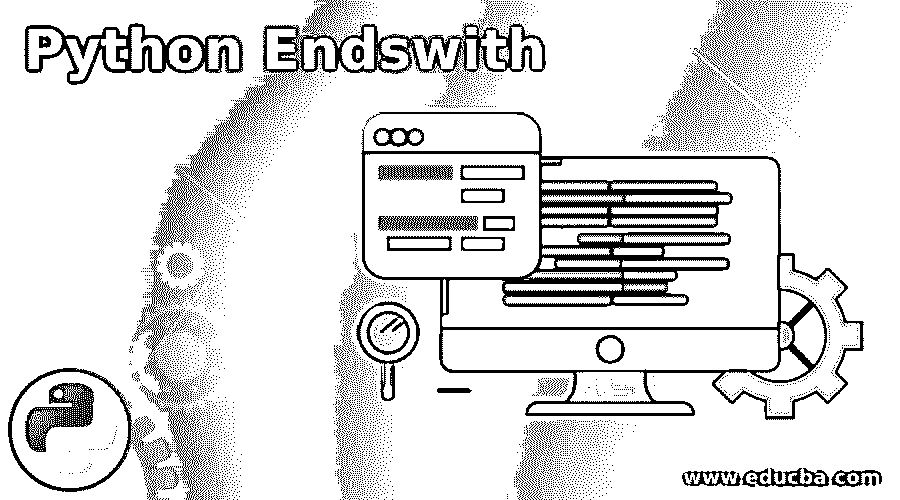
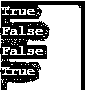
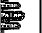
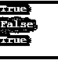

# Python Endswith

> 原文：<https://www.educba.com/python-endswith/>




## Python Endswith 简介

Python Endswith 是一种特殊的条件语句，在检查以字符结尾的语句或值(通常是字符串或任何其他值，我们希望检查该语句的结尾是否包含这些值)时，可以调用该语句。如果我们的条件得到满足，Endswith 语句返回 True，如果我们的条件未能得到满足，则返回 false，Endswith 语句的基本结构有一个用户必须给出的要检查的值，此外还有可选的起始值和结束值，由用户希望在该条件中检查的整数组成。

**语法**

<small>网页开发、编程语言、软件测试&其他</small>

Endswith 语句的基本语法是一个字符串或文本，后跟 Endswith 语句和圆括号，在括号内，我们可以指定要检查的值或字符串。

```
string/text.endswith(value, start, end)
```

**解释:** Start 和 end 是可选值，我们可以通过指定具体的 Start 和 End 值来缩小条件的范围。

**示例语法:**

**代码:**

```
statement = "Hello, Have a great day."
x = statement.endswith("day.")
print(x)
```

**输出:**


### Endswith 是如何工作的？

在 Endswith 语句中，我们表示为条件的后缀非常重要，因为 Endswith 语句读取整个语句，只有当用户表示的后缀与条件完全匹配时，它才返回 True，否则它将无法检查条件并返回 False。在给出条件时，我们不应该忘记特殊字符、逗号和句号，因为 Endswith 语句也在后缀中读取这样的字符，如果我们的原始语句或字符串有这样的字符，而我们未能在条件中给出这些字符，则 Endswith 条件会给出布尔输出 False。

### 实现 Python Endswith 的示例

下面是提到的例子:

#### 示例#1

**代码:**

```
statement = "Hello, Have a great day."
a = statement.endswith("day.")
b=statement.endswith("day")
c=statement.endswith("great day")
d=statement.endswith("Hello, Have a great day.")
print(a)
print(b)
print(c)
print(d)
```

**输出:**




**解释:**在上面的例子中，我们可以看到 Python Endswith 是如何工作的，我们声明了一个名为“Hello，Have a great day”的语句并用四种条件检查了 Endswith 语句。在条件中，我们已经准确地表示了语句中的最后一个单词“day”以及我们在语句中使用的句号，因此 Endswith 语句按照预期返回 True。

在第二个条件 b 中，我们在单词“day”上做了标记，但没有在条件中键入句号，因此语句检查结束并返回 False。在第三个条件 c 中，我们已经表示了一个附加单词“great ”,后跟“day ”,这两个单词都是语句中的最后一个单词，但是我们仍然没有表示条件中的句号，因此我们的 Endswith 语句返回 False。在最后一个条件 d 中，我们已经键入了整个语句，因为它带有句号，因此 Endswith 语句识别它并返回 True。

#### 实施例 2

让我们进一步讨论带有开始和结束参数的 Endswith 函数，这些参数是表示 Endswith 语句返回 False 时字符串位置的整数。标有起点和终点的条件。

**代码:**

```
statement = "This is a sample string"
a = statement.endswith("g",22)
b=statement.endswith("g",23)
c=statement.endswith("g",14)
print(a)
print(b)
print(c)
```

**输出:**




**解释:**在这个例子中，我们用字符串条件“g”来表示开始参数。在我们的语句“这是一个样本字符串”中，我们表示为条件的“g”位于最后一个位置，即语句的第 22 个<sup>和</sup>位置，当我们在起点传递整数 22 时，我们满足了条件，Endswith 函数返回 True。

在下一个条件 b 中，我们传递了一个整数 23，它大于语句中字母“g”的起点，从 0 开始的字符总数在整个语句中只有 22，因此在位置 23 没有字符，因此 Endswith 函数返回 False。在最后一个条件 c 中，我们已经指定了一个位置 14，它位于字母“g”的起点之下，以及任何小于或低于我们的条件值的位置，Endswith 函数返回 True。

#### 实施例 3

使用 start 和 end 参数，这将使我们更好地理解 Endswith 函数。

**代码:**

```
statement = "This is a sample string"
a = statement.endswith("s",0,7)
b=statement.endswith("s",0,8)
c=statement.endswith("a",5,9)
print(a)
print(b)
print(c)
```

**输出:**




**说明:**在上面的例子中，我们已经使用了相同的语句，并通过 start 和 end 参数传递了不同的条件。在第一个条件中，我们传递了字符串 s 和整数 0 和 7 作为起点和终点。字符串“s”在语句中的位置 6，当我们给定起点为 0，终点为字符串“s”的起点和终点时，我们的条件得到满足，因此我们得到的输出为 True。在下一个条件 b 中，我们将起点作为 0 传递，将终点作为 8 传递，这在字符串“s”的位置之外，因此 Endswith 函数给我们的输出为 False。

在第三个<sup>第三个</sup>条件 c 中，字符串“a”位于语句中的第九个<sup>第</sup>位置，起点可以是从 0 到 8 的任何位置，其中字符串“a”存在，如果我们通过大于 8 的起点，这违反了条件，因为“a”的起点在第八个端点，函数将输出返回 False。

### 结论

我们已经详细讨论了 Python 中的 Endswith 函数的定义以及它的工作方式，为了更好地理解，我们举了一些简单的例子。我们还用清晰的例子讨论了 Endswith 函数中使用的开始和结束参数，这样我们就可以使用 Endswith 函数缩小或指定我们想要检查的条件。当我们想通过 Endswith 函数传递我们的条件来检查字符串的位置时，Endswith 函数在 python 编程中非常有用。

### 推荐文章

这是 Python Endswith 的指南。在这里，我们讨论 Python Endswith 的介绍、语法、工作原理以及编程示例。您也可以浏览我们的其他相关文章，了解更多信息——

1.  [Python 字符串操作](https://www.educba.com/python-string-operations/)
2.  [Python 中的循环](https://www.educba.com/loops-in-python/)
3.  [Python 字符串函数](https://www.educba.com/python-string-functions/)
4.  [Python 中的序列](https://www.educba.com/sequences-in-python/)


