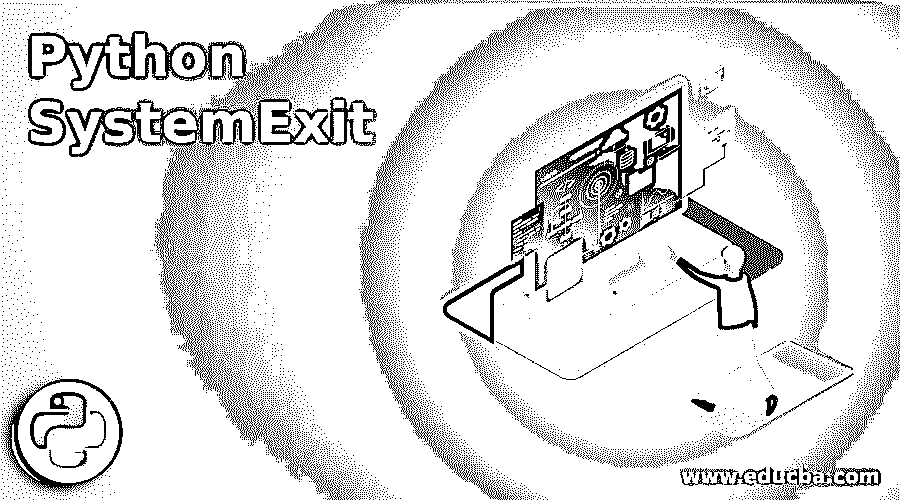
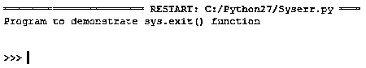
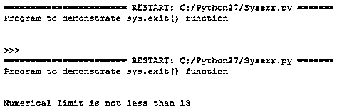

# Python 系统退出

> [https://www . educba . com/python 系统退出](https://www.educba.com/python-systemexit/)




## Python 系统简介 Exit

在 Python 中，SystemExit 是由 sys.exit()方法引发的异常。通常，所有异常都必须从 BaseException 派生，base exception 是一个类的实例。SystemExit 异常继承自 Baseexception，而不是 Exception 或 StandardError，因为它不是任何技术错误，所以它可以被捕获异常的代码捕获。所以当这个异常出现时，如果它不能被处理，Python 解释器就会退出。此异常接受传递给构造函数的参数，该参数与传递给 sys.exit()函数的参数相同，它返回值，如果是整数值，则指定系统退出状态，当指定值为 none 时，退出状态为零，当具有另一种类型的值时，退出状态为 1。

### Python SystemExit 是如何工作的？

让我们研究一下 SystemExit 的工作原理:

<small>网页开发、编程语言、软件测试&其他</small>

在 Python 中，我们看到 SystemExit 不是 exception 类的子类，而 BaseException 类是 SystemExit 的基类。此异常继承自 BaseException，因此它不会被捕获该异常的代码捕获。

在本文中，SystemExit 是一个异常，它是在我们想要停止程序执行并引发错误时发生的异常，为了在 Python 中执行此过程，有一个内置函数来引发此类异常，它被称为 sys.exit()，可用于从 Python 程序中退出，并向系统提供返回代码。此 sys.exit()函数接受一个给出退出状态的参数(建议使用整数),零或无被视为程序成功终止。

### 实现 Python SystemExit 的示例

让我们用下面的例子来详细说明这一点:

#### 示例#1

**代码:**

```
print("Program that uses BaseException as base class.")
try:
    raise SystemExit  
except BaseException:
    print("Specifying BaseException in this block works.") 
```

**输出:**


**解释:**所以上面的代码在 except 块中使用 BaseException 来捕获 SystemExit 异常，但是我们可以直接指定这个异常，如下所示。

#### 实施例 2

**代码:**

```
print("Program that uses SystemExit as Exception instead of BaseException.")
try:
    raise SystemExit

except SystemExit:
    print("Specifying SystemError exception in this block works.") 
```

**输出:**


**解释:**所以在上面，我们可以看到在 except 块中我们声明了 SystemExit，而不是 except 块中的 BaseException。因此，我们可以得出结论，这两种代码都可以用来处理这种异常。在 Python 中，调用 sys.exit()函数时会引发 SystemExit 异常，因为对此函数的调用会转换为 SystemError 异常，以执行处理程序和调试脚本，而不会有失去控制的风险。在 python 程序中执行此函数时，会引发此异常，这意味着如果不处理此异常，Python 解释器将退出 Python 程序，输出中不会显示任何错误追溯消息。让我们在下面的节目中看到这一点

#### 实施例 3

**代码:**

```
import sys 
print("Program to demonstrate sys.exit() function")
limit = 15
if limit < 18: 	 
	sys.exit("Numerical limit less than 18")	
else: 
	print("Numerical limit is not less than 18")
```

**输出:**




**说明:**在上面的程序中，我们可以看到当程序中声明的极限变量小于 18 时，程序使用 sys.exit()函数退出，它不会打印任何 SystemError 异常的消息或回溯错误，而是直接退出程序。并且如果限制高于 18，则打印消息被打印在输出屏幕中。这可以在下面的截图中看到。




在上面的截图中，我们可以看到限制在 18 以上，因此打印消息如上所示。

这个 SystemExit 异常不是由 sys.exit()函数引发的，而是由 Python 中的其他两个函数引发的。Python 中的另外两个函数是 os。_exit()函数会立即退出，但不会清除，这需要一个 int 参数。

引发此异常的另一个退出函数由 site.py 程序定义，该程序是 Quitter 类的一个实例，它还在引发此异常之前关闭 sys.stdin 作为 SystemExit，因此此退出函数主要在 REPL 中使用。

在引发 SystemExit 异常的所有上述三个退出函数中，只有 sys.exit()函数被推荐，因为它比其他两个函数更快，因为 SystemExit 在被调用时产生更小的字节码，并且当我们使用 os 时。_exit()函数这也可以快速退出，但它不能像 sys.exit()函数那样进行清理。

### 结论

在本文中，我们得出结论，SystemExit 是由 Python 中的 Exit 函数引发的异常。在本文中，我们看到终止或停止 Python 程序执行最常用的函数是 sys.exit()。在这里，我们还看到了如何使用 sys.exit()函数来引发 SystemExit 异常，而不在输出屏幕上显示任何回溯消息。

在 Python 中，有很多退出函数可以用来停止程序的执行，比如 quit()、sys.exit()、os。_exit()等，但在这些 sys.exit()和 quit()退出函数中，会引发 SystemExit 异常来退出程序。

### 推荐文章

这是一个 Python SystemExit 的指南。这里我们讨论 Python SystemExit 的介绍，它是如何与编程实例一起工作的。您也可以浏览我们的其他相关文章，了解更多信息——

1.  [Python 异常处理](https://www.educba.com/python-exception-handling/)
2.  [Python 正则表达式测试器](https://www.educba.com/python-regex-tester/)
3.  [蟒蛇卷曲](https://www.educba.com/python-curl/)
4.  [Python 输入字符串](https://www.educba.com/python-input-string/)


