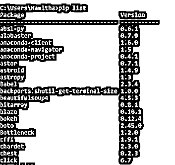
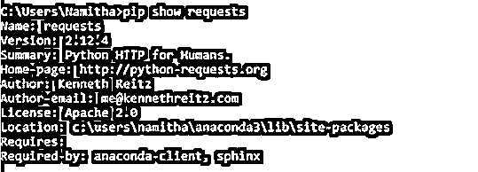
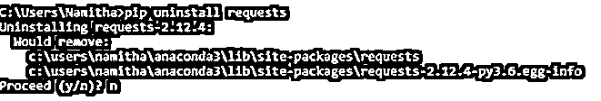

# Python pip

> 原文：<https://www.educba.com/python-pip/>


## Python pip 简介

在本文中，我们讨论 Python 中 pip 的概念。在 Python 中，pip 是一个标准的包管理系统，用于安装和管理其他软件模块。一般来说，pip 是许多 Python 包或模块的包管理器，用于在需要时安装它以在代码中使用。在 Python 中，pip 通常用于安装和管理所需的任何额外的包或模块，这些包或模块在 Python 标准库中是不可用的，或者如果我们想要安装的模块不是 Python 内置的。Pip 通常预装在 Python 版本 3.4 及更高版本中。这可以通过下载软件包安装在以下版本中。

### Python 中 pip 的工作原理及示例

在本节中，我们将详细了解 Python 中的 pip。在 Python 中，pip 是用于安装和管理附加软件模块或软件包的包。下面让我们用例子详细看看。

<small>网页开发、编程语言、软件测试&其他</small>

如果 pip 不在已安装的 Python IDE 中，我们可以安装它。我们可以通过在控制台中运行以下语句或命令来检查 pip 是否存在。

```
pip - -version
```

如果 pip 不存在，那么它将给出以下错误。


如果 pip 已经存在，那么上面的命令将返回各自的 Python pip 版本。下面让我们举例说明

```
$pip - -version
pip 19.0.3 from C:\users\namitha\anaconda3\lib\site-packages\pip (python 3.6)
```


在上面的截图中，我们可以看到显示 Python pip 版本的 pip 版本的输出。

如果没有安装 pip，我们可以通过链接[https://pypi.org/project/pip/](https://pypi.org/project/pip/)下载并安装它。通过这个链接，我们必须下载 pip.py

要安装，请使用 curl 命令并运行以下语句:

```
curl https://bootstrap.pypa.io/get-pip.py -o get-pip.py
```

然后运行下面的语句

```
python get –pip.py
```

### Python 中如何使用 pip？

我们知道 pip 是一个命令行程序，下面是 pip 的基本语法:

`pip <pip arguments>`

现在我们将看到如何使用 pip 来安装带有 pip 的软件包。在 Python 中，它贡献了大量用于开发框架、工具和库的包或模块。因此，通过使用 pip，我们可以下载并安装这些软件包或模块。

要安装其他 Python 库或模块，我们需要“install”命令和“pip”命令来安装包。在安装软件包“requests”之前，让我们看下面的例子。

```
pip install requests
```


在上面的截图中，我们可以看到 requests 包已经安装，因此它显示了该包的路径。

可以在控制台中看到输出。在上面的语句中，我们可以看到 pip 与 install 命令一起使用，后跟我们要安装的软件包或模块的名称。通过这样做，pip 将尝试下载 pip 语句中指定的包或模块的最新版本。但是对于一些程序来说，需要定制一个特定版本的包。安装软件包的特定版本或所需的模块版本。这可以按照下面的语句来完成。

```
pip install requests = = version
```

在上面的语句中，我们必须通过使用赋值操作符(= =)指定版本号来指定“请求”包或模块的版本。这样我们就可以使用 pip 和 install 命令安装任何版本的软件包或模块。

现在让我们看看 pip 的另一个特点。pip 可用于列出已安装的软件包或模块。为此，我们必须在 pip 中使用另一个命令“list”。让我们看看下面的语句，它列出了当前 Python 环境中的包。让我们在下面的陈述中证明这一点。

```
pip list
```




在上面的截图中，我们可以看到 pip 标准包中的包列表及其版本。我们可以在上面的截图中看到输出。上述语句将显示已安装的软件包列表以及已安装软件包的版本。我们可以看到在控制台中执行上述语句时的输出。在输出中，我们可以看到，当 list 命令和 pip 命令一起使用时，我们可以看到已经安装在当前 Python 环境中的包的列表，以及它们各自的包。现在让我们看看可以与 pip 一起使用的另一个命令，例如“show”命令。此命令可用于显示关于任何指定包或模块的信息，这些包或模块已经是 Python 环境中安装的包。让我们在下面的语句中演示如何使用 pip 中的“show”命令

```
pip show requests
```




在上面的屏幕截图中，我们可以看到上面命令的输出，它显示了请求包的详细信息，比如名称、版本、摘要、作者等。执行上述语句时，可以在控制台中看到输出。在输出中，我们可以看到 python 环境中安装的请求包或模块的详细信息。最后，我们将查看是否不再需要任何包或模块，然后我们可以使用“uninstall”命令卸载 Python 中的包或模块。让我们在下面的语句中演示一下。假设我们想要卸载“requests”库，那么我们可以这样做:

```
pip uninstall requests
```




上面的屏幕截图显示了 uninstall 命令如何与 pip 一起工作。上面的语句在控制台中执行时。因此，我们可以在控制台的输出中看到，最后一句显示库“requests”及其版本被成功卸载。

### 结论

在本文中，我们得出结论，Python 中的 pip 被用作安装和管理额外的 Python 库的标准包。在本文中，我们看到了如何安装 pip，如何检查 pip 是否已经存在于 python 环境中。在本文中，我们还看到了如何使用 pip 安装任何 Python 库。我们还了解了如何列出当前 python 环境中安装的包，以及如何显示已安装包的信息和如何卸载 Python 库。

### 推荐文章

这是 Python pip 的指南。在这里，我们讨论了介绍，如何使用 Python 中的 pip，Python pip 的工作原理，以及相应的例子。您也可以看看以下文章，了解更多信息–

1.  [Python 结束于](https://www.educba.com/python-endswith/)
2.  [Python 异步](https://www.educba.com/python-async/)
3.  [Python 解析器](https://www.educba.com/python-parser/)
4.  [Python 多行字符串](https://www.educba.com/python-multiline-string/)


