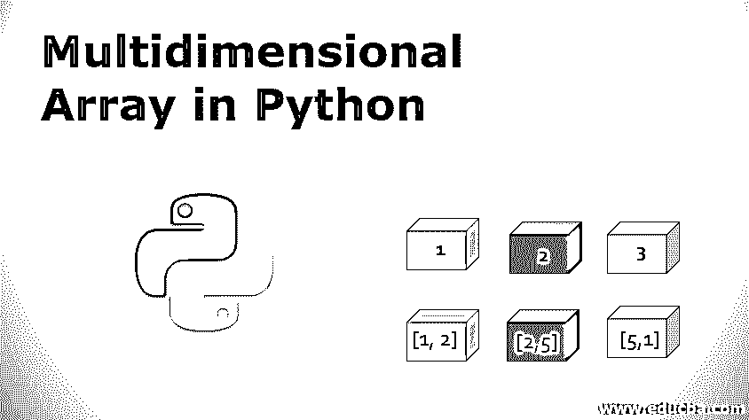

# Python 中的多维数组

> 原文：<https://www.educba.com/multidimensional-array-in-python/>




## Python 中的多维数组简介

多维数组的概念可以解释为一种定义和存储二维以上格式的数据的技术(2D)。在 Python 中，多维数组可以通过将一个列表函数放入另一个列表函数中来实现，这基本上是对列表函数的嵌套操作。在这里，一个列表可以包含许多任意数据类型的值，这些值由逗号之类的分隔符分隔。嵌套列表可以导致创建用于创建多维数组的值的组合。

### 目录

该列表可用于在 python 中以以下格式表示数据:

<small>网页开发、编程语言、软件测试&其他</small>

List = [1，2，3]

列表可以用逗号分隔的值来书写。该列表可以包含整数、浮点、字符串等数据。并且也可以在创建后进行修改。列表中的索引非常简单，索引从 0 开始，一直延伸到 list-1 的整个长度。

当一个列表中有其他列表作为元素时，它就形成了一个多维列表或数组。例如:

List = [ [1，2]、[2，5]、[5，1] ]

在这里，列表中的每个值都可以通过写列表名后跟方括号来检索外部列表值来访问，如下所示:

打印(列表[1])

# [2, 5]

如果您想深入内部列表，请再添加一个方括号来访问它的元素，如下所示:

打印(列表[1][0])

# 2

类似地，如果我们在一个列表中有多个列表，比如:

List = [ [1，3，5]，[8，5，6]，[7，1，6]]#也可以看作

| 1, 3, 5 |

| 8, 5, 6 |

| 7, 1, 6 |

列表中的所有元素都可以通过以下索引进行访问:

[0][0], [0][1], [0][2] [1][0], [1][1], [1][2] [2][0], [2][1], [2][2]

### 创建多维列表或数组

假设我们有两个变量:行数“r”和列数“c”。因此，为了制作大小为 m*n 的矩阵，可以将其制作为:

```
Array = [ [0] * c ] * r ] # with each element value as 0
```

这种类型的声明不会在内存中创建 m*n 个空格；相反，只创建一个整数，由内部列表的每个元素引用，而内部列表作为元素放在外部列表中。因此，在这种情况下，如果我们将任何元素更改为 5，则整个数组在同一列的每个元素位置都将有 5 个值，如下所示:

数组[0][0] = 5

| 5, 0, 0 |

| 5, 0, 0 |

| 5, 0, 0 |

另一种声明数组的方法是使用一个生成器，它包含一系列重复“r”次的“c”元素。可以按如下方式进行声明:

```
c = 4
r = 3
Array = [ [0] * c for i in range(r) ]
```

在这里，每个元素都完全独立于列表中的其他元素。列表[0] * c 作为一个新列表被构造了 r 次，这里没有发生引用的复制。

### 如何在多维数组中输入值？

这里我们假设一个有 r 行 c 列的 2D 数组，我们将从用户那里获取元素的值。

```
# User will enter the number of rows in the first line
r = int(input()) 
arr = []
for i in range(r):
    arr.append([int(j) for j in input().split()])
```

### 迭代多维数组的值

为了迭代[多维数组](https://www.educba.com/powershell-multidimensional-array/)的所有元素，我们需要使用如下的嵌套 for 循环概念:

```
# at first we will create an array of c columns and r rows
c = 4
r = 3
arr = [[0] * c for i in range(r)]
# loop will run for the length of the outer list
for i in range(r):
# loop will run for the length of the inner lists
    for j in range(c):
        if i < j: arr[i][j] = 8 elif i > j:
            arr[i][j] = 4
        else:
            arr[i][j] = 7
for r in arr:
    print( ' '.join([str(x) for x in r] ) )
```

### Numpy 多维数组

让我们看看 python 中的 numpy 多媒体数组:

 是 python 中预定义的包，用于执行强大的数学运算，支持 N 维数组对象。Numpy 的数组类被称为“ndarray”，它是这个框架的关键。这个类中的对象被称为 numpy 数组。多维数组和 numpy 数组的区别在于 Numpy 数组是同构的，即它只能包含整数、字符串、浮点数等。，值及其大小是固定的。多维列表可以很容易地转换成 Numpy 数组，如下所示:

```
import numpy as nmp
arr = nmp.array( [ [1, 0], [6, 4] ] )
print(arr)
```

这里，给定的多维列表被转换为 Numpy 数组 arr。

### 创建 Numpy 数组

```
import numpy as nmp
X = nmp.array( [ [ 1, 6, 7], [ 5, 9, 2] ] )
print(X)                                                  #Array of integers
X = nmp.array( [ [ 1, 6.2, 7], [ 5, 9, 2] ] )
print(X)                                                  #Array of floats
X = nmp.array( [ [ 1, 6, 7], [ 5, 9, 2] ], dtype = complex )
print(X)                                                  #Array of complex numbers
```

**输出:**

[[1 6 7] [5 9 2]] [[ 1.   6.2  7\. ] [ 5.   9.   2\. ]] [[ 1.+0.j  6.+0.j  7.+0.j] [ 5.+0.j  9.+0.j  2.+0.j]]

### 访问 Numpy 矩阵元素、行和列

Numpy 数组的每个元素都可以像访问多维列表一样访问，即数组名后跟两个方括号，这将告诉行和列索引选择一个特定的元素。

**举例:**

```
import numpy as nmp
X = nmp.array( [ [ 1, 6, 7],
                 [ 5, 9, 2],
                 [ 3, 8, 4] ] )
print(X[1][2]) # element at the given index i.e. 2
print(X[0])     # first row
print(X[1])      # second row
print(X[-1])     # last row
print(X[:, 0])  # first column
print(X[:, 2])  # third column
print(X[:, -1]) # last column
```

**输出:**

Two

[1 6 7] [5 9 2] [3 8 4] [1 5 3] [7 2 4] [7 2 4]

### Numpy 数组的一些性质

下面的程序中使用了 Numpy 数组的一些基本属性:

```
import numpy as nmp
zero_array = nmp.zeros( (3, 2) )
print('zero_array = ',zero_array)
one_array = nmp.ones( (3, 2) )
print('one_array = ',one_array)
X = nmp.arange(9).reshape(3, 3)
print('X= ', X)
print('Transpose of X= ', X.transpose())
```

**输出:**
zero_array = [[0。0.] [0.0.] [0.0.]] one_array = [[1。1.] [1.1.] [1.1.]]X =[[0 1 2][3 4 5][6 7 8]]X =[[0 3 6][1 4 7][2 5 8]]的转置

### 结论

Python 中的多维数组提供了将不同类型的数据存储到单个数组中的功能(即，在多维列表的情况下),其中每个元素内部数组能够存储来自数组其余部分的独立数据，其长度也称为交错数组，这在 Java、C 和其他语言中是无法实现的。

### 推荐文章

这是 Python 中多维数组的指南。这里我们讨论 Python 中多维数组的介绍，创建多维列表或数组等。您也可以浏览我们推荐的其他文章，了解更多信息——

1.  [C#交错数组](https://www.educba.com/c-sharp-jagged-arrays/)
2.  [Java 中的 3D 数组](https://www.educba.com/3d-arrays-in-java/)
3.  PHP 中的[数组](https://www.educba.com/arrays-in-php/)
4.  [C#多维数组](https://www.educba.com/c-sharp-multidimensional-arrays/)


