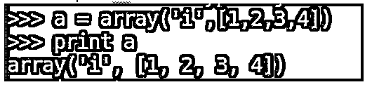
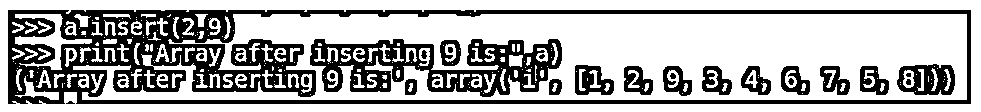
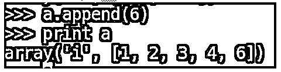
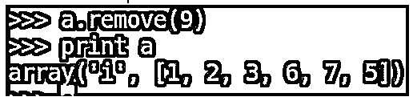
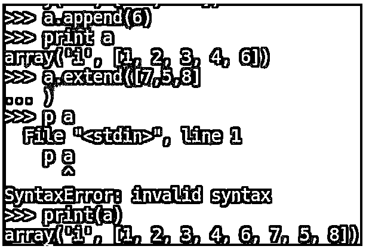
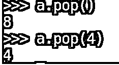
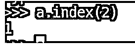
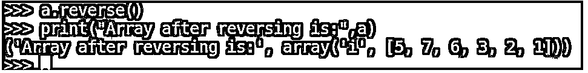
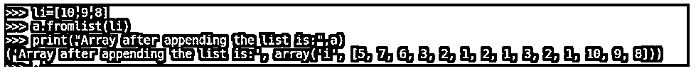
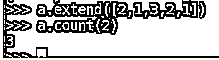

# Python 数组函数

> 原文：<https://www.educba.com/python-array-functions/>

## Python 数组函数简介

python 中的数组函数被定义为将数组作为函数参数并执行一组指令来对输入参数执行特定任务以实现特定任务的函数，在 python 中称为数组函数。数组函数将接受一个数组作为参数，它的实现方式是对不同数量的对象进行操作。

例如，我们可以定义一个函数来计算整数或浮点数据类型数组的平均值。Python 默认情况下会将传递给程序的参数存储在 sys.argv[]中，这是一个作为参数的字符串数组。

<small>网页开发、编程语言、软件测试&其他</small>

### Python 数组函数的方法

下面给出了 python 中的不同方法，这些方法将用于对数组函数执行不同类型的操作:

#### 1.数组(数据类型，值列表)

上面的函数，一个数组用于在 python 中创建一个数组，该数组接受参数作为数据类型和值列表，其中数据类型是值列表的类型，如整数、小数、浮点等。值列表是特定数据类型的值的列表。

**举例:**

**代码:**

`a = array(‘i’,[1,2,3,4])
print(a)`

上面的示例将创建一个“整数”数据类型的数组，元素为值 1、2、3、4。

**输出:**

#### 2.插入(位置，值)

上面的函数 insert()用于在数组的特定索引或位置插入一个元素。它将 pos，和 value 作为它的参数，其中 pos 变量告诉位置，而 value 是需要插入到数组中的值。

**举例:**

**代码:**

`a.insert(2, 9)
print(“Array after inserting 9 is”, a)`

上面的例子将把值 9 加到数组 ar 的索引位置 2，其余的元素将被适当地排列。

**输出:**

#### 3.追加(值)

上面的函数，append()是用来给已有的数组添加值或者追加一个值到最后。它会把我们想要添加的值作为参数。

**举例:**

**代码:**

`a.append(6)
print(ar)`

上面的例子将把值 6 加到前面例子中创建的数组 ar 的末尾。

**输出:**

#### 4.移除(值)

上面的函数 remove()也将从数组中删除给定的元素。它会把要移除的值作为参数，从数组中移除元素，但不会显示元素。

**举例:**

**代码:**

`a.remove(9)
print(a)`

上面的例子从数组 ar 中删除了元素 9，我们将看到数组中所有可用元素的列表。

**输出:**

#### 5.延长(arr)

上面的函数 extend()用于在已创建的数组末尾添加一个数组值。它将接受一个值数组或一个数组作为它的输入参数。

**举例:**

**代码:**

`a.extend([7,5,8])
print(a)`

在上面的例子中，我们将在现有数组 ar 的末尾添加一个值为 7，5，8 的数组。

**输出:**

#### 6.流行()

上面的函数，pop()用于从数组中移除一个元素。它可以将参数作为我们想要移除的元素的位置，或者默认情况下，它移除最后一个索引处的元素。

**举例:**

**代码:**

`ar.pop()`

它移除数组中的最后一个元素并显示元素。

**代码:**

`ar.pop(4)`

删除数组中第 4 个索引位置的元素并显示元素

**输出:**

#### 7.指数(值)

上面的函数 index()将返回值在数组中的第一个位置，它将值作为参数，并将值在数组中的第一个出现位置作为输出返回。

**举例:**

**代码:**

`ar.index(2)`

上面的例子将返回数组 ar 中元素 2 的位置作为输出。

**输出:**

#### 8.反向()

上面的函数 reverse()将反转数组并将反转后的数组作为其输出返回。这不需要任何争论。

**举例:**

**代码:**

`a.reverse()
print(“Array after reverse is:”,a)`

上面的例子将反转数组 ar 并将结果存储在 ar 中。print 语句将显示反转的数组。

**输出:**

#### 9\. fromlist(list)

上面的函数，fromlist()用于将一个列表添加到数组的末尾。它将把一个列表作为它的输入参数，这个函数的输出是一个数组，列表附加在数组的末尾。

**举例:**

**代码:**

`li = [10,9,8] a.fromlist(li)
print(“Array after appending the list is:”,a)`

在上面的示例中，我们创建了一个列表，其中包含与数组具有相同数据类型的值的列表，我们调用函数 fromlist()将列表添加到数组中，输出是一个在数组末尾添加了列表元素的数组。

**输出:**

#### 10.计数(值)

上面的函数 count()将给出数组中给定值出现的总次数。它将接受一个值作为参数，以了解出现的总次数。

**举例:**

**代码:**

`a.extend([2,1,3,2,1])
a.count(2)`

在上面的例子中，我们用值 2，1，3，2，1 扩展了数组“a ”,并且我们试图在扩展操作后找到数组中值 2 的计数。它将给出数组中值 2 出现的次数。

**输出:**

### 结论

最后，它概述了 python 中的数组函数。到目前为止，我们已经了解了什么是 python 中的数组函数，如何在 python 中声明数组，python 中不同类型的内置数组函数，以及详细的示例解释和相应的输出。

### 推荐文章

这是 Python 数组函数的指南。这里我们结合实例分别讨论 Python 数组函数和方法数组函数的介绍。您也可以看看以下文章，了解更多信息–

1.  [Python 并发](https://www.educba.com/python-concurrency/)
2.  [Python argparse](https://www.educba.com/python-argparse/)
3.  [Python 排序数组](https://www.educba.com/python-sort-array/)
4.  [Python 唯一列表](https://www.educba.com/python-unique-list/)

