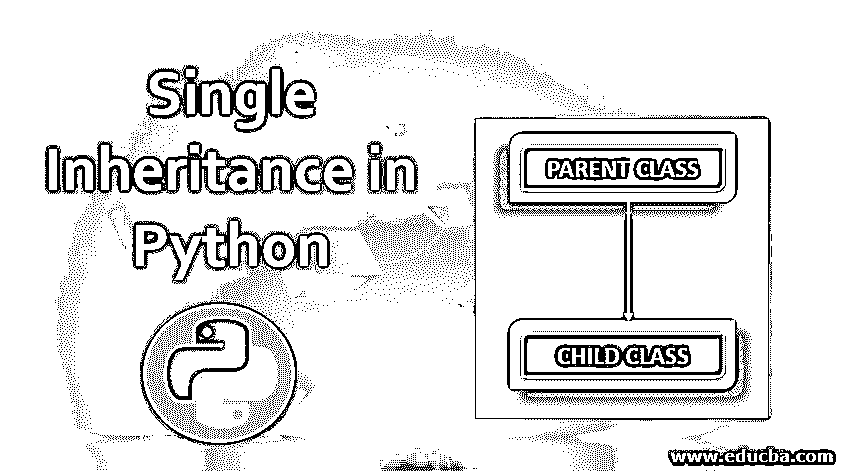
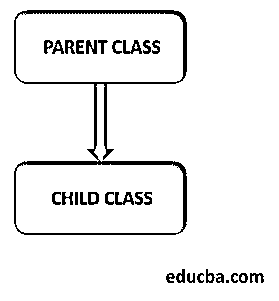
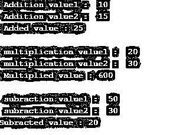

# Python 中的单一继承

> 原文：<https://www.educba.com/single-inheritance-in-python/>




## Python 中的单一继承简介

在 python 单一继承中，派生类仅从单个父类派生，并允许该类从单个基类派生行为和属性。这使得父类的代码具有可重用性，并且向类中添加新的特性使得代码更具可读性、更优雅并且更少冗余。因此，[单一继承](https://www.educba.com/single-inheritance-in-java/)比多重继承安全得多，如果它以正确的方式完成，并使派生类能够调用父类方法，也能覆盖父类的现有方法。




<small>网页开发、编程语言、软件测试&其他</small>

****语法:****

```
class Parent_class_Name:

      #Parent_class code block

class Child_class_Name(Parent_class_name):

      #Child_class code block 
```

上面的语法由两个声明的类组成。一个是基类，或者通过其他方式，父类，另一个是子类，作为派生类。

### Python 中的单一继承是如何工作的？

每个类都有自己的代码块。因此，按照单一继承，父类代码块中的每个元素都可以在子类中明智地使用。为了获得单一的继承语法联盟，父类的名字在子类的参数中被提及。

#### 示例#1

**代码:**

```
# Single inheritance in python
#Base class
class Parent_class(object): 

    # Constructor 
    def __init__(self, name, id): 
        self.name = name 
        self.id = id

    # To fetch employee details 
    def Employee_Details(self): 
        return self.id , self.name

    # To check if this  is a valid employee 
    def Employee_check(self): 
        if self.id > 500000:
           return " Valid Employee "
        else:
           return " Invalid Employee "

# derived class or the sub class
class Child_class(Parent_class): 

    def End(self):
        print( " END OF PROGRAM " ) 

# Driver code 
Employee1 = Parent_class( "Employee1" , 600445)  # parent class object
print( Employee1.Employee_Details() , Employee1.Employee_check() ) 
Employee2 = Child_class( "Employee2" , 198754) # child class object 
print( Employee2.Employee_Details() , Employee2.Employee_check() ) 
Employee2.End() 
```

****输出:****


****解释:**** 在这里，就像每一个单独的继承过程一样，两个不同的类被声明。父类是基类，父类包含三个主要部分。

*   ****构造函数段:**** 构造函数用于将声明对象的参数值赋给相应的类。
*   ****获取雇员详细信息的方法:**** 雇员详细信息部分将雇员姓名返回到控制台输出。
*   ****员工合法性检查方法:**** 这是单继承概念应用的关键区域。该方法在操作上用于验证给定的雇员是否有效。一种抽样检查条件，如果生成的员工 id 大于 50 万卢比，则该 id 被视为有效，并应用于相应的员工。

父类下面声明了子类；子类只持有表示程序结束的活动显示方法。所以在程序驱动区域，声明了两个不同的对象，一个用于父类，另一个用于子类。我们可以注意到子类的对象使用继承的父类的元素来确定雇员细节和雇员有效性。由此，单一继承的概念被很好地应用于给定示例的执行中。

#### 实施例 2

**代码:**

```
# Hello World program in Python

#Base class
class Parent_class(object): 

    # Constructor 
    def __init__(self, value1,value2): 
        self.value1 = value1 
        self.value2 = value2

    # To perform addition
    def Addition(self) : 
        print(" Addition value1 : " , self.value1)
        print(" Addition value2 : " , self.value2)
        return self.value1 + self.value2

    def multiplication(self) :
        print(" multiplication value1 : " , self.value1)
        print(" multiplication value2 : " , self.value2)
        return self.value1 * self.value2

    def subraction(self) :
        print(" subraction value1 : " , self.value1)
        print(" subraction value2 : " , self.value2)
        return self.value1 - self.value2

# derived class or the sub class
class Child_class(Parent_class): 

    pass

# Driver code 
Object1 = Child_class(10,15)  # parent class object
print(" Added value :" , Object1.Addition() ) 
print( " " )
Object2 = Child_class(20,30)  # parent class object
print(" Multiplied value :" , Object2.multiplication() ) 
print( " " )
Object3 = Child_class(50,30)  # parent class object
print("Subracted value :" , Object3.subraction() ) 
```

**输出:**




****说明:**** 这里再次声明两个不同的类。这里的基类，换句话说，父类，父类有四个主要的代码块。

*   ****构造函数段:**** 所有赋值都在构造函数段中进行。
*   ****加法方法:**** 这里进行键入的输入值的加法。
*   ****乘法方法:**** 这里，对键入的输入值进行乘法运算。
*   ****减法:**** 这里，对键入的输入值进行减法运算。

同样，这个例子非常类似于上面的程序，我们使用父类和子类继承设置。这里，父类方法被子类对象很好地使用，即使它不是类本身的物理段。这清楚地解释了父类内容如何被精确地继承到子类中，并根据需要保持程序流。在执行流程中，键入的值和方法的结果都打印在控制台中。在子类中使用 pass 语句只是为了让执行暂停几毫秒。

在这个程序中，为每个被声明的方法声明一个新的对象。然后，实例化的对象用于调用这些方法。这些方法的结果被打印到控制台。这意味着程序从键入的三个输入值对中打印出三个结果。它们就像一个是加法，一个是乘法，最后一个是减法。

### 结论

面向对象编程是高级编程发展的主要原因之一。它以更好的方式引入了代码的可重用性和灵活性。继承是面向对象编程技术中的重要概念之一，python 在编程范例中提供了大量的灵活性。

### 推荐文章

这是 Python 中单一继承的指南。在这里，我们将讨论 python 中单一继承的工作原理，以及示例和代码实现。您也可以阅读以下文章，了解更多信息——

1.  [Python 中的造型](https://www.educba.com/type-casting-in-python/)
2.  [Python 中的字符串运算符](https://www.educba.com/string-operators-in-python/)
3.  [Python 迭代器字典](https://www.educba.com/python-iterator-dictionary/)
4.  [Python 空列表](https://www.educba.com/python-empty-list/)


