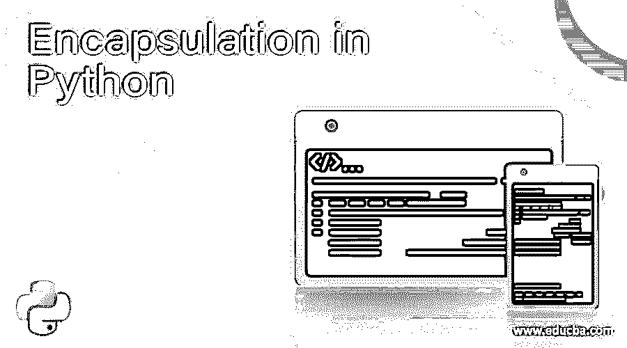
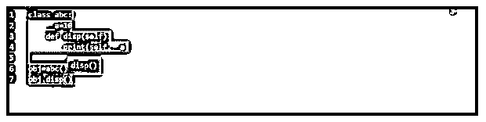
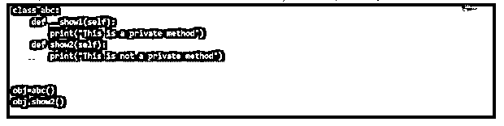
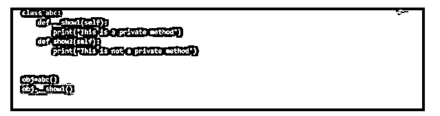
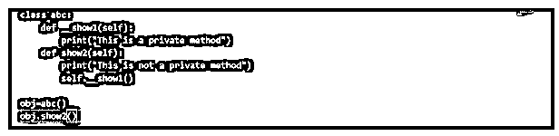
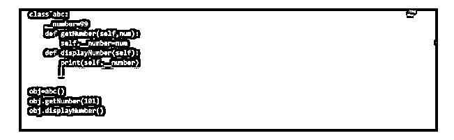

# Python 中的封装

> 原文：<https://www.educba.com/encapsulation-in-python/>

## Python 中封装的概述

Python 编程语言提供的一种安全机制，很像其他面向对象的编程语言，它对变量和方法进行必要和充分的限制，使它们不会受到有意或无意的错误使用，这种变量和方法是程序中表示程序敏感和重要部分的单元，这种机制在 Python 编程语言中称为封装。 **T2】**

### 用 Python 命名 Mangling

Python 意味着对数据访问的限制。没有显式的访问修饰符，但是可以通过 Python 中的名称管理来控制访问。默认情况下，Python 中的所有方法和变量都是公共的。因此，如果任何标识符有两个前导下划线，它就会成为 Python 中的非公共实例。为了更好地理解封装，我们将在这里指定非公共的实例变量和方法。非公共实例方法的作用域只在它自己的类中，并且它以一个下划线或两个下划线开始，即在变量或方法前有单个“_”或“__”双下划线。非公共实例变量的作用域也在它自己的类中，或者由定义它的方法确定，并且它也以两个下划线开头。如果我们碰巧漏掉了两个下划线，那么这个方法就被认为是一个公共方法。在我们理解 Python 中的封装之前，我们需要理解公共和非公共实例变量和方法是如何工作的。

<small>网页开发、编程语言、软件测试&其他</small>

### 非公共实例变量

Python 中没有“私有”一词，因为 Python 中没有真正私有的属性(我们将在本文后面讨论底层的替代方法)。相反，我们称它们为非公共实例变量。这就是我们在此引用私有变量和私有方法的方式。

以下是非公共实例变量的一小段 python 代码:

我们使用 self 关键字，因为我们正在访问类变量。输出是:

为了获取对非公共实例变量范围的确认，我们添加了 print(abc。__a)到代码:

返回的输出是:

因此，我们看到我们不能在类外使用非公共的实例变量。

### 非公共实例方法

非公共实例函数不能直接在对象上调用，而只能在类内调用。

在这个代码片段中，我们有两个方法，一个非公共实例和另一个公共方法。通过创建一个 abc 类的对象，可以很容易地调用 public 方法，然后输出结果。

当对非公共实例方法尝试类似的方法时，我们会遇到以下错误:

该程序将产生以下输出:

因此，不可能通过对象创建来访问非公共实例方法。要访问非公共实例方法，我们可以从同一个类的 show2()方法中调用 __show1()方法。下面是我们如何从同一个类的公共方法中显示非公共实例方法。

**输出:**

因此，非公共实例方法不能在其类之外调用。

### 访问非公共实例变量的间接方式

出于合法的原因，非公共实例变量不能在类之外被访问，但是有一种间接的方法来修改非公共实例变量的值并使用对象进行访问。我们应该看看下面的代码片段:

**输出:**

在上面的程序中，我们有公共方法 getNumber(self，num)和 displayNumber()以及一个非公共实例变量。在调用第一个方法时，我们将值赋给非公共实例变量，该变量在 displayNumber()方法中调用。

setter 方法用于设置非公共实例变量的值。在为特定变量创建对象后，如果您希望更改非公共实例变量的值，这将很有帮助。

### 优势

封装有助于建立更好的数据流和数据保护。封装的概念使得代码能够自给自足。封装在实现级别提供了很大的帮助，因为它主要关注“如何”离开复杂的“何时/何地”及其复杂性的问题。将数据隐藏到一个单元中使得封装更容易，并且还保护了数据。

### 为什么我们需要 Python 中的封装？

下面是开发人员会发现封装概念很方便的几个原因，以及为什么面向对象的概念在当今的大多数编程语言中占主导地位。

*   在每个应用程序中都需要定义明确的交互；封装有助于实现这一目标。
*   python 中面向对象编程的概念侧重于制作可重用的代码。这个也简写为干(不要重复自己)。
*   应用程序的维护更容易，并且有安全保证。
*   清晰的编码过程，因为开发人员关心的是类的目标，并且复杂性得到系统的处理。
*   代码的适当组织有助于代码的灵活性，也有助于单元测试。
*   用户发现使用该系统很容易，因为他们避开了后端复杂的设计。
*   将所有相似的数据放在一个地方并封装起来，增加了模块内部的内聚性。
*   提高代码的可读性，并且代码某一部分的更改不会破坏代码的其他部分。
*   封装可以防止部分代码被意外访问，但不是故意的，因为对象保存着应用程序的关键数据，并且应该在代码中的任何地方进行更改。

### 结论

更简单地说，Python 中的封装意味着对象的内部表示通常隐藏在对象定义之外。这有助于开发人员为最终用户开发用户友好的体验，并且由于代码是安全的，因此可以防止安全漏洞。

### 推荐文章

这是用 Python 封装的指南。这里我们讨论 python 中封装的需求，以及它的非公共实例变量和实例方法。您也可以阅读以下文章，了解更多信息——

1.  [c++中的封装](https://www.educba.com/encapsulation-in-c-plus-plus/)
2.  [Java 中的封装](https://www.educba.com/encapsulation-in-java/)
3.  [C 语言中的封装](https://www.educba.com/encapsulation-in-c/)
4.  [JavaScript 封装](https://www.educba.com/encapsulation-in-javascript/)

