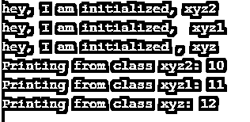

# Python 中的多级继承

> 原文：<https://www.educba.com/multilevel-inheritance-in-python/>


## Python 中的多级继承简介

在 python 中，多级继承是一种继承类型，当我们从基类继承一个派生类，并且从以前的派生类继承另一个派生类，直到 python 中任何深度的类时，这种继承用于将基类和派生类的功能都继承到新的派生类，在 python 中称为多级继承。继承时，基类和派生类的方法和成员都将被继承到新的派生类中。通过使用继承，我们可以实现代码的可重用性，类之间的关系。如果我们有三个类 A、B 和 C，其中 A 是超类(父类)，B 是子类(子类)，C 是 B 的子类(孙类)。

### 多级继承的语法

假设我们有三个以名字为基础的类，derived1 和 derived2。基类的成员和函数如下:

<small>网页开发、编程语言、软件测试&其他</small>

```
class base:
    //member of base class
   // functions of base class
    Pass
class derived1(base):
   // members of derived1 class + base class
  // functions of derived1 class + base class
   pass
class derived2(derived1):
   // members of derived2 class + derived1 class + base class
  // functions of derived2 class + derived1 class + base class
   Pass 
```

在上面的类示例中，我们可以看到基类是基类，派生类是从基类继承的，派生类 2 是从派生类 1 继承的。

### Python 中多级继承是如何工作的？

在 python 中，多级继承的工作方式如下。让我们用下面的例子来解释多级继承:

```
class Parent:
   def __init__(self,name):
     self.name = name
   def getName(self):
     return self.name
class Child(Parent):
   def __init__(self,name,age):
     Parent.__init__(self,name)
     self.age = age
   def getAge(self):
     return self.age
class Grandchild(Child):
   def __init__(self,name,age,location):
     Child.__init__(self,name,age)
     self.location=location
   def getLocation(self):
     return self.location
gc = Grandchild("Srinivas",24,"Hyderabad")
print(gc.getName(), gc.getAge(), gc.getLocation()) 
```

在上面的多级继承示例中，我们有三个名为 Parent、Child 和 sun 的类。父类是一个基类，它有一个分配名称的构造函数和一个 getName()函数。我们可以用这个函数得到孙子的名字。派生类 Child 继承自基类 Parent，其成员作为构造函数，使用基类构造函数在此指定名称和年龄。它有一个函数 getAge()来获取给定孩子的年龄。现在这个类有成员有 getName()，getAge()函数和它的构造函数。新的派生类孙是从以前的派生类子继承而来的。新的派生类具有基类父类和派生类子函数和成员的功能。新的派生类有一个构造函数，它使用以前的类构造函数和函数 getLocation()来获取给定子级的位置。

在 python 中，多级继承，如果它需要搜索一个特定的函数，它首先在当前类中搜索一个成员变量，然后在当前类的父类中搜索，最后，像这样的基类将基于类的深度被遵循。这种解析类搜索顺序的方式在 python 中被称为 MRO(方法解析顺序)。它将保持局部优先顺序，并保持类成员的解析顺序。多级继承用于实现代码的可重用性，维护类之间的关系，实现面向对象编程。

在上面的程序中，我们创建了一个孙类的对象 gc，参数为 name、age 和 location，上面程序的输出如下:

**输出:**


### Python 中多级继承的示例

让我们看看下面提到不同例子:

我们可以使用 python 中的 super()函数实现多级继承。super()函数允许显式引用当前类的父类，因为继承子类是从超类继承的。super()函数使我们能够轻松地实现单个、多个、多级继承。

让我们看一个使用 super()的多级继承的例子。

```
class xyz:
    def__init__(self):
      print("hey, I am initialized , xyz")
    def sub_xyz(self,b):
      print("Printing from class xyz:",b)
class xyz1(xyz):
   def __init__(self):
     print("hey, I am initialized, xyz1")
     super().__init__()
   def sub_xyz(self,b):
     print("Printing from class xyz1:", b)
     super().sub_xyz(b+1)
class xyz2(xyz1):
   def __init__(self):
     print("hey, I am initialized, xyz2")
     super().__init__()
   def sub_xyz(self,b):
     print("Printing from class xyz2:",b)
     super().sub_xyz(b+1)
if __name__ == '__main__':
   ob =xyz2()
   ob.sub_xyz(10) 
```

在上面使用 super()函数的多级继承示例中，我们创建了一个衍生类 xyz2()的对象 ob，并从继承了两个类 xyz、xyz1 的类 xyz2 调用函数 sub_xyz()。在上面示例的输出中，您可以清楚地看到 python 调用类的顺序以及它如何解决类之间的关系。

在上面的例子中，我们有三个类 xyz、xyz1 和 xyz2。xyz 类有一个带 print 语句的构造函数和一个带 print 函数的函数 sub_xyz()。类似地，从类 xyz 继承的类 xyz1 具有构造函数，其中 print 语句和 super 函数具有初始化构造函数，函数 sub_xyz()具有参数 b，具有 print 语句，super()调用子函数 sub_xyz，具有参数。类似地，类 xyz2 是从类 xyz1 派生的，其所有成员函数类似于前面派生的类 xyz1，具有构造函数、具有构造函数的 super function 和具有带参数调用 sub_xyz()的 super() function 的函数 sub_xyz()。

我们已经创建了最后一个派生类 ab2 的对象 ob，并使用参数 10 调用函数 sub_xyz()，该函数以自底向上的顺序从派生类到基类调用函数。

上述程序的输出是:




### 结论

最后，这都是关于 python 中的多级继承。我们已经讨论了什么是多级继承，它的语法，多级继承在 python 中是如何工作的，以及使用超级函数的多级继承的例子。我希望读完这篇文章后，你将获得更多的知识，并对多级继承和何时使用场景有更好的理解。

### 推荐文章

这是 Python 中多级继承的指南。在这里，我们讨论了 Python 中多级继承的介绍，以及工作和相应的例子。您也可以看看以下文章，了解更多信息–

1.  [Python 中的 pass 关键字](https://www.educba.com/pass-keyword-in-python/)
2.  [Python 扩展](https://www.educba.com/python-extend/)
3.  [Python 单元测试](https://www.educba.com/python-unit-test/)
4.  [Python 类属性](https://www.educba.com/python-class-attributes/)


