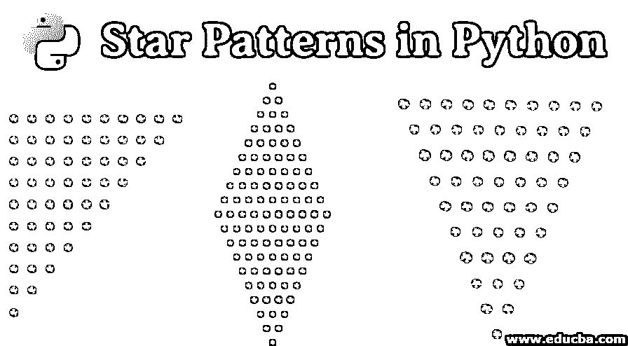
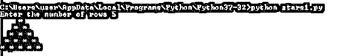
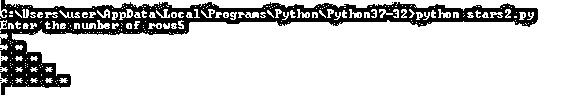
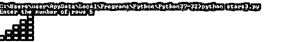
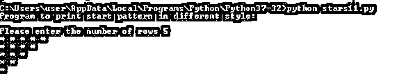
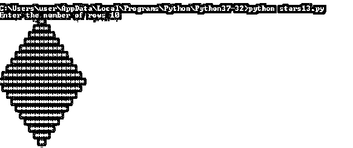

# Python 中的星形模式

> 原文：<https://www.educba.com/star-patterns-in-python/>




## Python 中星形模式的介绍

在 python 文章的这些星形图案中，我们将看到以简单的方式打印不同的星形图案。你将学习各种类型的图案，如金字塔、数字、字母、星号图案等。要打印这些星形模式，您只需要了解 python 编程的基础知识，如 for 循环、if 循环、输入和打印函数的使用。即使您是 python 的新手，我们也保证您会轻松地学习这个主题。这里，通过编写不同的代码行将会创建不同的模式，但是基本程序由两个 for 循环组成，在模式中，第一个外部 for 循环用于行，另一个内部 for 循环用于列。当然，还有打印输出的打印函数和获取用户输入的输入函数。此外，range 函数的使用将在起始范围(主要从 0 开始)和结束范围(无论用户输入什么)之间循环。首先，我们将看到印刷星星图案背后的逻辑。

### Python 中的星型模式是什么？

在星型模式程序中，我们将要求用户输入表示为 5 的行数，然后使用变量 I，外部 for 循环使用 range 函数从 0 开始迭代，以 5 结束。此外，使用变量 j，内部 for 循环再次使用 range 函数进行迭代，以打印空格。接下来，再次使用变量 j，打印星星的最里面的 for 循环，然后控制将转到下一行，这是程序的最后一步，打印函数。这将适用于 i= 0 行、i=1 行、i=2 行、i= 3 行和 i=4 行，并且根据这些 I 值，将处理接下来的两个 for 循环。

<small>网页开发、编程语言、软件测试&其他</small>

#### 要记住的点

你会发现每个程序背后都有相同的语法，只是有一点不同(比如使用变量 k 在循环中增加值并打印出来)；其余都一样。

### Python 中星形模式的类型

在这里，我们将看到 python 中不同类型的星形模式

#### 程序一

```
# Program to print full pyramid 
num_rows = int(input("Enter the number of rows"));
for i in range(0, num_rows):
	for j in range(0, num_rows-i-1):
		print(end=" ")
	for j in  range(0, i+1):
		print("*", end=" ")
	print() 
```

**输出**




#### 程序二

在这个程序中，星星从第一列开始打印。这里，我们只使用了一个循环来打印星星。不会有任何其他循环来打印星星。同样，下面程序中的 print("* "，end= ")函数只打印带有空格的星号。下面是程序和输出，以便进一步理解。

```
#Program to print Left Half Pyramid
num_rows = int(input("Enter the number of rows"));
k = 1
for i in range(0, num_rows):
    for j in range(0, k):
        print("* ", end="")
    k = k + 1
    print() 
```

**输出**




#### 程序三

```
#Program to print Right Half Pyramid
num_rows = int(input("Enter the number of rows"));
k = 8
for i in range(0, num_rows):
    for j in range(0, k):
        print(end=" ")
    k = k - 2
    for j in range(0, i+1):
        print("* ", end="")
    print() 
```

**输出**




#### 程序四

```
# Program to print One More Star Pattern Pyramid

print("Program to print star pattern: \n");
rows = input("Enter maximum stars you want display on a single line")
rows = int (rows)
for i in range (0, num_rows):
    for j in range(0, i + 1):
        print("* ", end='')
    print("\r")
for i in range (num_rows, 0, -1):
    for j in range(0, i -1):
        print("* ", end='')
    print("\r") 
```

**输出**


#### 程序五

```
print("Program to print star pattern in different style: \n");
num_rows = int(input('Please enter the number of rows'));
for i in range (0,num_rows):  
    for j in range (num_rows,i,-1):  
        print("* ", end="")
    print() 
```

**输出**




#### 程序六

```
num_rows = int(input("Please enter the number of rows"));
for i in range(num_rows,0,-1):
    for j in range(0, num_rows-i):
        print(end=" ")
    for j in range(0,i):
        print("* ", end=" ")
    print() 
```

**输出**


#### 节目七

这个程序将打印完整的钻石星形图案，它使用两个循环，第一个上半部分和第二个下半部分。在第一个上半部分，我们将有一个 for 循环和一个 while 循环，第二个下半部分也是如此。在每一半中，for 循环用于打印空格， [while 循环用于](https://www.educba.com/while-loop-in-python/)打印星号。

```
num_rows = int(input("Enter the number of rows"))
k = 0
for i in range(1, num_rows + 1): 
    for j in range (1, (num_rows - i) + 1): 
        print(end = " ")          
    while k != (2 * i - 1):
        print("*", end = "")
        k = k + 1
    k = 0   
    print()  

k = 2
m = 1
for i in range(1, num_rows): 
    for j in range (1, k):
        print(end = " ") 
    k = k + 1	  
    while m <= (2 * (num_rows - i) - 1): 
        print("*", end = "") 
        m = m + 1
    m = 1	
    print() 
```

**输出**




### 结论

希望这篇文章对你有帮助；我们已经尽了最大的努力让所有的程序更容易理解。如果你理解其中的逻辑并加以运用，这些星形模式是很容易学会的。然后你所要做的就是多次练习这些程序，以达到这个主题的专业水平。

### 推荐文章

这是 Python 中星型模式的指南。在这里，我们讨论 Python 中星形模式的介绍和不同类型，以及相应的程序及其输出。您也可以浏览我们推荐的其他文章，了解更多信息——

1.  [Python 中的模式](https://www.educba.com/patterns-in-python/)
2.  [Java 中的星型模式](https://www.educba.com/star-patterns-in-java/)
3.  [PHP 中的星形模式](https://www.educba.com/star-patterns-in-php/)
4.  [c#中的模式](https://www.educba.com/patterns-in-c-sharp/)


