# Python 中的反向数字

> 原文：<https://www.educba.com/reverse-number-in-python/>

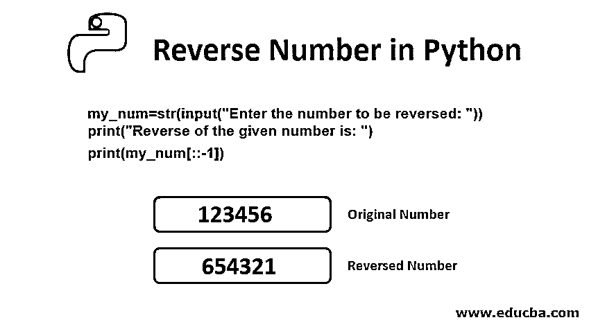


## Python 中反数的介绍

python 中的逆向操作可以定义为将分配给变量的输入顺序从后向前或从前向后翻转的过程。这个操作可以通过任何一种涉及 python 的条件语句的逻辑来实现，比如 for 循环，while 条件语句，if 条件等。python 中有多种预定义的方法可以和条件语句一起创建反向逻辑函数，它们是列表法、切片法、递归法等。Reverse()方法是对用户提供的任何类型的输入执行该操作的直接方法。

### Python 中反向数的逻辑

下面简要介绍如何在 python 中反转给定的数字:

<small>网页开发、编程语言、软件测试&其他</small>

*   可以使用 input()或 raw_input()方法读取输入的数字。
*   接下来，检查输入的值是否为整数。
*   现在检查给定的整数是否大于 0。
*   创建一个名为 reverse 的变量，并用 0 初始化变量值。
*   现在，使用 mod (%)运算符，找出给定输入数的余数。
*   将变量 reverse 乘以 10，并将余数加到上面。
*   现在 floor (floor division 正在执行除法运算，结果值为该值提供较低的整数)将给定的输入数除以 10。
*   给定的输入数在某个时候会变成 0。
*   现在重复步骤 5、6、7，直到你得到的输入数不大于零。
*   在最后一步中，反向显示变量。

### 在 Python 中使用不同的方法反转数字

以下是 Python 中的不同方式:

#### 1.使用切片方法

**代码:**

```
def reverse_slicing(s):
    return s[::-1]
my_number = '123456'
if __name__ == "__main__":
    print('Reversing the given number using slicing =', reverse_slicing(my_number))
```

**执行步骤:**

*   将 python 代码保存在您的驱动器中。(这里，我们使用 D 驱动器来执行程序)
*   现在打开命令提示符并找到您的驱动器。
*   使用 python program_name.py 命令执行程序
*   python 程序将保存为。py 扩展名。

**输出:**

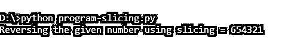


**Note**: Follow the above steps for executing the python programs for reversing which are going to be discussed below.

#### 2.使用 For 循环方法

**代码:**

```
def reverse_for_loop(s):
s1 = ''
for c in s:
s1 = c + s1
return s1
my_number = '123456'
if __name__ == "__main__":
print('Reversing the given number using for loop =', reverse_for_loop(my_number))
```

**输出:**

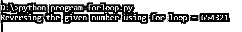


#### 3.While 循环方法

**代码:**

```
def reverse_while_loop(s):
    s1 = ''
    length = len(s) - 1
    while length >= 0:
        s1 = s1 + s[length]
        length = length - 1
    return s1
my_number = '123456'
if __name__ == "__main__":
    print('Reversing the given number using while loop =', reverse_while_loop(my_number)) 
```

**输出:**


#### 4.使用反向方法

**代码:**

```
def reverse(string): 
	string = "".join(reversed(string)) 
	return string 
my_number = "123456"
print ("The given number is : ",end="") 
print (my_number) 
print ("Reversing the given number using reversed is : ",end="") 
print (reverse(my_number)) 
```

**输出:**

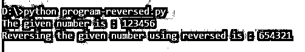


#### 5.使用用户输入的数字，然后将其反转

**代码:**

```
My_Number = int(input("Please provide the number to be reversed: "))
Reverse_Number = 0
while(My_Number > 0):
 Reminder = My_Number %10
 Reverse_Number = (Reverse_Number *10) + Reminder
 My_Number = My_Number //10
print("Reverse of the provided number is = %d" %Reverse_Number)
```

**输出:**

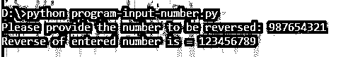


#### 6.两位数反向法

**代码:**

```
My_Number = int(input("Please provide the number to be reversed: "))
Reverse_Number = 0
temp = Reverse_Number
Reminder = 1
for i in range (Reminder+1):
 Reminder = My_Number %10
 Reverse_Number = (Reverse_Number *10) + Reminder
 My_Number = My_Number //10
print("Reverse of the provided number is = %d" %Reverse_Number)
```

**输出:**

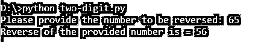


#### 7.三位数反转法

**代码:**

```
My_Number = int(input("Please provide the number to be reversed: "))
Reverse_Number = 0
temp = Reverse_Number
Reminder = 1
for i in range (Reminder+2):
 Reminder = My_Number %10
 Reverse_Number = (Reverse_Number *10) + Reminder
 My_Number = My_Number //10
print("Reverse of the provided number is = %d" %Reverse_Number)
```

**输出:**

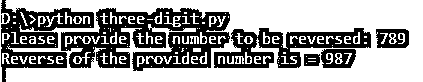


#### 8.如果没有递归方法

**代码:**

```
my_num=str(input("Enter the number to be reversed: "))
print("Reverse of the given number is: ")
print(my_num[::-1])
```

**输出:**

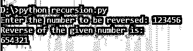


#### 9.用递归方法

**代码:**

```
def reverse(s): 
	if len(s) == 0: 
		return s 
	else: 
		return reverse(s[1:]) + s[0] 
my_number = "123456789"
print ("The given number is : ",end="") 
print (my_number) 
print ("Reversing the given number using recursion is : ",end="") 
print (reverse(my_number))
```

**输出:**

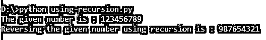


#### 10.使用函数方法

**代码:**

```
def rev_number(My_Number) :    
    reverse_num = 0
    while(My_Number) :
        Reminder = My_Number % 10
        reverse_num = reverse_num* 10 + Reminder
        My_Number //= 10
    return reverse_num
if __name__ == "__main__" :
    My_Number = int(input('Please provide the number to be reversed:: '))
    print('Reverse of the provided number is: ', rev_number(My_Number))
```

**输出:**

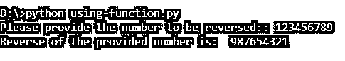


#### 11.使用列表方法

**代码:**

```
number = "123456789"
print ("The given number is : " + number)
#converting number into list
list1 = list(number)
#applying reverse method of list
list1.reverse()
#converting list into number
number = ''.join(list1)
print ("Reverse of the provided number is : " + number)
```

**输出:**

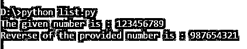


#### 12.使用堆栈方法

**代码:**

```
def create_stack():
  #creating a list as stack and return it
  stack = []
  return stack
def push(stack,element):
  #adding new element to list
  stack.append(element)
def pop(stack):
  #deleting the last element from the list
  if len(stack) == 0:
    return
  return stack.pop()
def reverse(number):
  #reversing the number by using stack's functions
  num = len(number)  
  #creating empty list (stack)
  stack = create_stack()
  #inserting number into list
  for i in range(0,num):
    push(stack,number[i])
  number = ""
  #getting last element of the stack list
  for i in range(0,num):
    number = number + pop(stack)
  return number
number1 = "123456789"
number2 = reverse(number1)
print ("The given number is : " + number1)
print ("Reverse of the given number is : " + number2)
```

**输出:**

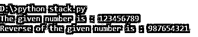


### 结论

到目前为止，在本教程中，我们已经学会了在 python 中寻找给定数字的倒数。这个程序只运行一次，即它要求用户输入一个数字，找到相反的值，打印并退出。我们也可以将它插入到一个无限循环中，从用户那里连续读取一个新数字。把它放在一个无限循环中，检查发生了什么。

### 推荐文章

这是一个在 Python 中反转数字的指南。在这里，我们讨论 Python 中倒数的逻辑和 Python 中倒数的 12 种方法。您也可以浏览我们的其他相关文章，了解更多信息——

1.  [Python 中的随机数生成器](https://www.educba.com/random-number-generator-in-python/)
2.  [Python 中的数学函数](https://www.educba.com/math-functions-in-python/)
3.  [Python 集](https://www.educba.com/python-sets/)
4.  [Python 特性](https://www.educba.com/python-features/)


