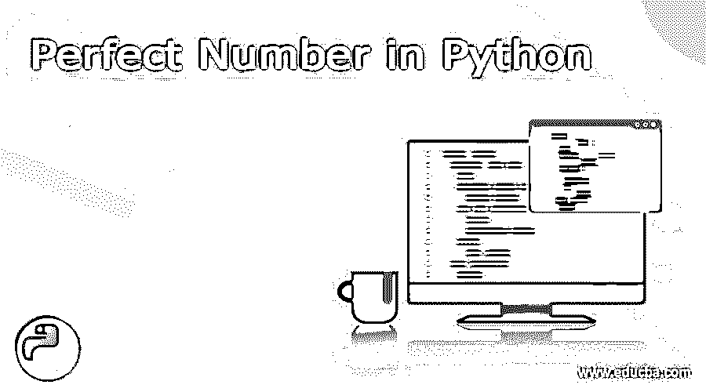
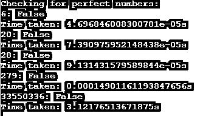
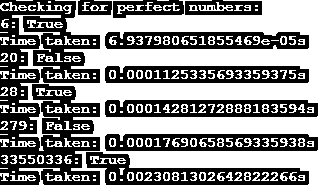

# Python 中的完全数

> 原文：<https://www.educba.com/perfect-number-in-python/>




## Python 完全数的定义

python 中的完全数被定义为在 python 中构建的实现，其中搜索完全数所需的数被分解成因子，然后这些因子被求和，不包括实际数本身，然后检查所获得的因子之和是否等于原始数本身。如果总和等于实际数，这个数称为完全数。完全数的概念最早可以追溯到公元前 300 年欧几里德时代，这个概念来自希腊命理学。在本文中，我们将理解完全数在 python 中的实现，并且理解完全数的逻辑背后的数学原理。在我们继续完全数的编码风格之前，我们还将理解 python 中的伪代码。

**完全数背后的逻辑**

<small>网页开发、编程语言、软件测试&其他</small>

在这一节中，我们将试图从数学上理解一个数被判定为完全数背后的逻辑，并查看将一个数判定为完全数的伪代码。所以，让我们先从数学上来看。

欧几里得在公元前 300 年证明，如果因子(2P 1)是质数，则 2P 1(2P 1)形式的任何数都称为完全数。在数轴上，6 是最小的完全数。让我们看看如何。对于 P = 2，2P 1(2P 1)的值是 6，而 2P 1 的值是 3。让我们从逻辑上看同样的事情。6 的约数是 1、2、3 和 6。现在，根据规则，如果我们忽略数字本身，我们就剩下约数 1、2 和 3。现在，让我们找出三个约数的和。1 + 2 + 3 = 6.总和等于原始数本身，因此 6 是一个完全数。正如琐事，如果约数之和小于原数，则称为亏数，如果和大于数本身，则该数命名为丰数。例如，8 的除数是 1、2、4 和 8，1、2 和 4 的和是 7。因此，8 是一个不足的数字。例如，40 的除数是 1、2、4、5、8、10、20 和 40。除了数本身之外，所有约数的和是 50，因此 40 是足够的。从琐事回到主题，有人会说，对于 P = 4，我们有一个 2P 1(2P 1)= 120 的值，但 120 不是完美的，这只是因为(2P 1)= 15 不是一个质数，因此 120 不是一个完美的数字。

在我们继续理解完全数的代码逻辑之前，我们想知道是否有无限个完全数。实事求是地说，可能有也可能没有像这样的问题在数学问题的世界里仍然是一个未解之谜。现在，任何问题的解决都可以通过多种方式来完成，在这里，我们将看到两种类型的解决方案，一种是简单的，另一种是高效的。所以，让我们从一个简单的解决方案开始。直观地，人们可以指定一个计数器，它将从 1 变到比该数本身小 1，并检查该数是否能被该计数器整除。如果是，那么我们把它加到总数上，如果不是，我们什么也不做。最后，我们检查总和是否等于数字，如果是，那么我们返回数字是完美的；否则，我们返回它不是。这看起来是一种低效的方法，因为如果数量很大，花费的时间也会增加。

对于一个有效的解决方案，我们可以通过去数的平方根而不是数来减少 For 循环必须遍历的长度，如果从 1 到数的平方根的计数器成为一个因子，我们将数和数相加，数是数除以计数器的商。这样，我们就不必遍历数组的整个长度，只停留在等于数字平方根的长度上。

### 如何在 Python 中检查完全数？

在这一节中，我们将看看寻找完全数的算法的流程，然后通过一个例子来看看这个流程在 python 中的实现。

**对于简单的解决方案:**

1.从用户处获取输入号码。
2。声明 sum = 0；
3。使用从 1 到输入–1 的临时变量计数器运行 for 循环。
4。检查这个数是否能被计数器整除。
5。如果它除了，把计数器加到总数上。
6。如果没有，那就什么都不做。
7。最后，在 for 循环之外，检查 number = sum 是否是前面循环的结果，如果相等，则返回完全数，否则返回非完全数。

**对于有效的解决方案:**

1.从用户处获取输入号码。
2。声明 sum = 1；
3。从 2 开始使用临时变量计数器运行 while 循环，并运行该循环直到 counter*counter < =n.
4。检查这个数是否能被计数器整除。
5。如果它除了，把计数器和数字/计数器加到总数上。
6。如果没有，那就什么都不做。
7。将计数器加 1。
8。最后，在 for 循环之外，检查 number = sum 是否是因为前面的循环而得到的，如果相等，则返回完全数，否则返回非完全数。

### 例子

让我们讨论 Python 中完全数的例子。

#### 示例 1:简单的解决方案

**语法**

```
import time
def perfNumFunc(num):
sumPerf = 0
for counter in range(1, num):
if num % counter == 0:
sumPerf += counter
if(sum == num):
return "True"
else:
return "False"
begin = time.time()
print("Checking for perfect numbers:")
print("6: " + str(perfNumFunc(6)))
print("Time taken: " + str(time.time()-begin) + "s")
print("20: " + str(perfNumFunc(20)))
print("Time taken: " + str(time.time()-begin) + "s")
print("28: " + str(perfNumFunc(28)))
print("Time taken: " + str(time.time()-begin) + "s")
print("279: " + str(perfNumFunc(279)))
print("Time taken: " + str(time.time()-begin) + "s")
print("33550336: " + str(perfNumFunc(33550336)))
print("Time taken: " + str(time.time()-begin) + "s")
```

**输出:**




#### 示例 2:高效的解决方案

**语法:**

```
import time
def perfNumFunc (num):
sumPerf = 1
counter = 2;
while counter * counter <= num:
if num % counter == 0:
sumPerf = sumPerf + counter + num/counter
counter += 1
if(sumPerf == num):
return "True"
else:
return "False"
begin = time.time()
print("Checking for perfect numbers:")
print("6: " + str(perfNumFunc(6)))
print("Time taken: " + str(time.time()-begin) + "s")
print("20: " + str(perfNumFunc(20)))
print("Time taken: " + str(time.time()-begin) + "s")
print("28: " + str(perfNumFunc(28)))
print("Time taken: " + str(time.time()-begin) + "s")
print("279: " + str(perfNumFunc(279)))
print("Time taken: " + str(time.time()-begin) + "s")
print("33550336: " + str(perfNumFunc(33550336)))
print("Time taken: " + str(time.time()-begin) + "s")
```

**输出:**




### 结论

在本文中，我们介绍了如何在 python 中实现完全数算法的方法，并查看了所有情况下的运行时差异，以及最后一种情况下当完全数等于 33550336 时的可见运行时差异，这清楚地表明我们提到的高效算法执行起来非常高效！

### 推荐文章

这是 Python 中完全数的指南。这里我们讨论一下定义，如何在 Python 中检查完全数？代码实现示例。您也可以看看以下文章，了解更多信息–

1.  [Python 中的线性搜索](https://www.educba.com/linear-search-in-python/)
2.  [桶排序 Python](https://www.educba.com/bucket-sort-python/)
3.  [Python 中的 Shell 排序](https://www.educba.com/shell-sort-in-python/)
4.  [Python 中的插入排序](https://www.educba.com/insertion-sort-in-python/)


