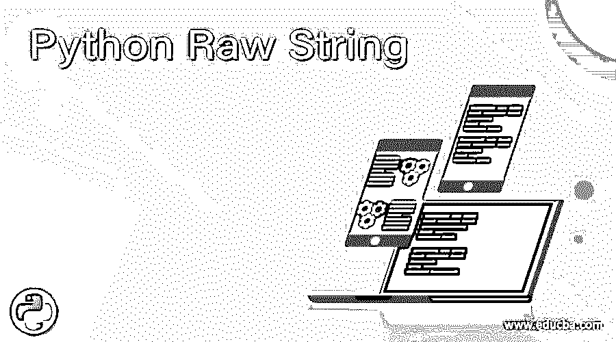
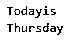
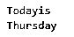
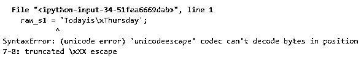
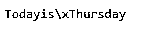
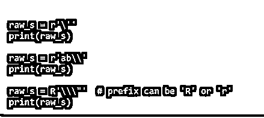
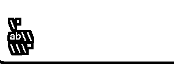
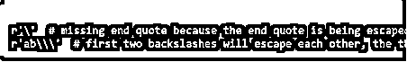
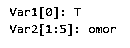
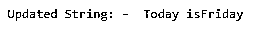

# Python Raw String

> 原文：<https://www.educba.com/python-raw-string/>




## Python 原始字符串介绍

字符串是我们在使用 Python 时要学习的重要函数之一。字符串在编写单词代码时起着关键作用。字符串通常是用于在 Python 中编写函数的数据类型。它用于整型和浮点型。我们也可以将它用于字符类型。字符串通常由数字和单词组成。例如，如果我们想从特定的单词中获取字母，我们使用 String 函数。字符串函数一般用引号括起来。这个词被括在引文中。Python 一般把双引号当成单引号。就像我们给变量赋值一样，我们也可以给变量赋值一个字符串。我们通常可以使用索引来访问字符串。索引意味着只获取特定范围的字符。使用称为切片操作符的操作符对字符串进行切片。在本主题中，我们将学习 Python 原始字符串。

通常，Python 原始字符串是用字符串字母‘R’或‘R’编写的。这个“r”作为字符串的前缀。Python 原始字符串将反斜杠(/)视为单个字符。

<small>网页开发、编程语言、软件测试&其他</small>

**语法:**

Python 原始字符串的语法是:

```
Print (r ‘word’)
```

### Python 中如何使用原始字符串？

这里我们注意到变量中使用的反斜杠将单词分成两部分。一个词是今天，另一个词是周四。反斜杠在下一行打印它旁边的单词。但是我们希望将整个单词打印在一行中。为此，我们使用 Python 原始字符串，也就是说，我们使用 r 作为单词的前缀。字母“r”将反斜杠视为正常字符。当我们使用原始字符串时，输出如下例所示。

**举例:**

*   假设我们想打印一个字符串('今天是\n 星期四')。首先，将字符串赋给一个变量。然后使用 print 命令打印变量。

```
s = 'Todayis\nThursday';
print(s);
```

*   输出将如下所示。




*   当我们使用原始字符串时，代码如下。

```
raw_s = 'Todayis\nThursday';
print(s)
```

*   输出将如下所示。




*   如果我们用其他字母代替 r，python simple 会抛出如下所示的错误。

```
raw_s1 = 'Todayis\xThursday';
print(raw_s1)
```

*   输出将如下所示。




*   字母\x 确实有任何预定义的功能。发生错误是因为我们没有使用前缀 r，它通常被用作原始字符串。如果我们使用原始字符串，那么输出将如下所示。

```
raw_s2 = r'Todayis\xThursday';
print(raw_s2)
```

*   输出将如下所示。




*   当我们将唯一的反斜杠作为原始字符串变量的输入时，输出将是




*   在这里，我们观察到 python 只将原始字符串中的单词放在一个变量中，并显示输出。




*   如果没有正确地终止它们，它只会给出一个错误。




### 在这里我们可以使用 Python 的原始字符串。

当我们想要在同一行中打印给定的字符串时，通常使用原始字符串。如果它包含无效字符' \x '，它只会抛出一个错误。当时为了打印给定的输入而不抛出错误，我们使用原始字符串来打印给定的语句。我们通常在正则表达式中使用原始字符串。通常，正则表达式被写成字符串。这个正则表达式包含带反斜杠的单词。为了打印这些正则表达式而不抛出错误，我们将使用原始字符串打印给定的语句而不抛出错误。

**带反斜杠**的不可打印字符

| 不可打印字符 | 描述 |
| \a | 它是用来报警的 |
| \b | 它用于退格 |
| \n | 它用于转到新的行 |
| \s | 它用于在语句中留出空间 |
| \t | 它用于选择选项卡 |
| \e | 它是用来逃跑的 |

**程序:**

```
s = 'Todayis\nThursday';
print(s);
raw_s = r'Today is Thursday';
print(raw_s)
raw_s1 ='Today is Thursday';
print(raw_s1)
raw_s2 = r'Today is Thursday';
print(raw_s2)
```

**输出:**


### 为字符串赋值

字符串通常用单引号或双引号括起来。现在要使用给定字符串中的子字符串，我们将使用方括号，它用于切片。这可以用下面的例子很容易地解释。在下面的例子中，我们可以看到，首先，值被分配给两个变量 Var1 和 Var2。现在我们只想打印子字符串。为了得到子串，我们必须在括号中提到它们的范围。在下面的例子中，我们想要范围为 1:5 的子字符串，这意味着它打印索引为 1 到 5 的字母。

**程序**

```
Var1= 'Today is Friday';
Var2= "Tomorrow is Saturday";
print('Var1[0]:',Var1[0]);
print('Var2[1:5]:',Var2[1:5]);
```

**输出:**

输出如下所示

**

** 

### 更新字符串

我们可以用另一个字符串更新给定的字符串，或者用新的字符串添加给定的字符串。这里我们只是更新字符串。这可以用下面的例子很容易地解释。这里我们有一个字符串“Today is ”,现在我们用新字符串“Saturday”**添加该字符串。**

**程序**

```
var1 = 'Today is'
print ("Updated String: - ", var1[:9] + 'Friday')
```

**输出:**




输出将如下所示

### 需要记住的要点

*   术语“n”的意思是空间。
*   字符串和 Python 原始字符串的主要区别在于普通字符串，单词写在引号中，我们使用 print 命令打印字符串。
*   在 Python 原始字符串中，我们通常将单词写在引号内，除此之外，我们还添加了文字“r”作为前缀，然后将它赋给一个变量。
*   并打印该变量。
*   所有原始字符串的前缀都必须包含文字“r”。

### 推荐文章

这是一个 Python 原始字符串的指南。在这里，我们讨论如何用 Python 和例子来使用原始字符串，以及我们可以在哪里使用它们。您也可以看看以下文章，了解更多信息–

1.  [Python pip](https://www.educba.com/python-pip/)
2.  [Python 流](https://www.educba.com/python-stream/)
3.  [Python 解析器](https://www.educba.com/python-parser/)
4.  [Python Unicode Error](https://www.educba.com/python-unicode-error/)


