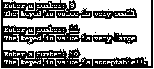
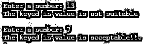
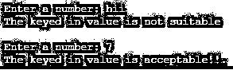

# Python 中的自定义异常

> 原文：<https://www.educba.com/custom-exception-in-python/>


## Python 中的自定义异常简介

Python 有许多内置异常，除了这些内置列表之外，python 还有能力向用户提供自定义异常。这些自定义异常被命名为用户定义的异常。这里，用户定义的异常可以通过使用为其声明的类来构建。这些客户异常是专门为满足用户需求而声明的。所有用户定义的异常都将从 user 类派生。

### 句法

```
class User_Exception1( Exception )  ....class User_Exception2( Exception )  .... . . . . . .  try:Executed on top of suspicious code    except User_Exception1:   This piece will be executed when a user_exception 1 is triggeredexcept User_Exception2:   This piece will be executed when a user_exception 1 is triggered else:   This block is executed when no orther exception is found
```

### 用户定义的异常处理是如何工作的？

用户定义的异常处理流程需要有一个用户定义的类来表示要创建的异常。这个用户定义的异常类需要直接或间接继承异常类。因此，基于继承的类，这形成了一个基于用户的异常。

<small>网页开发、编程语言、软件测试&其他</small>

### 在 Python 中实现自定义异常的示例

以下是一些例子:

#### 示例#1

**代码:**

```
# The user defined exceptions are declared here
class Error(Exception):
  """Base class for other exceptions"""
  pass
class To_small_value_exception(Error):
  """This exception will be raised when the keyed in value is too small"""
  pass
class To_large_value_exception(Error):
   """ This exception will be raised when the keyed in value is too large"""
   pass
Check_value = 10
while True:
 try:
   Input_Number = int(input("Enter a number: "))
   if Input_Number < Check_value:
      raise To_small_value_exception
   elif Input_Number > Check_value:
      raise To_large_value_exception
   break
except To_small_value_exception:
  print("The keyed in value is very small")
  print()
except To_large_value_exception:
  print("The keyed in value is very large")
  print()
print("The keyed in value is acceptable!!.")
```

**输出:**




**解释:**这里使用了两个用户定义的异常。一个用于检查键入的值是否小于校验值，而另一个用户定义的异常用于验证键入的值是否大于校验值。因此，当用户键入输入值时，将验证用户键入的值是否小于检查值，因此，当异常匹配时，将触发 To_small_value_exception。类似地，当键入的值大于检查值时，则触发异常，声明为 _large_value_exception。当两个例外都没有触发时，则打印声明“键入的值是可接受的！！. "印在控制台上。

#### 实施例 2

**代码:**

```
# The user defined exceptions are declared here
class Error(Exception):
  """ Base class for other exceptions """
  pass
class Not_Suitable_value_exception(Error):
  """ This exception will be raised when the keyed in value is not in range """
  pass
while True:
 try:
   Input_Number = int(input("Enter a number: "))
   if Input_Number not in range(1,10):
      raise Not_Suitable_value_exception
   break
  except Not_Suitable_value_exception:
    print("The keyed in value is not suitable")
    print()
print("The keyed in value is acceptable!!.")
```

**输出:**




**说明:**这里使用了一个用户定义的异常。它用于检查给定的值是否在 0 到 10 的范围内。因此，当用户键入输入值时，将验证用户键入的值是否在给定的值范围内，因此，当异常匹配时，将触发 Not _ fitted _ value _ exceptions。当该值没有触发异常时，则声明“键入的值是可接受的！！."印在控制台上。

#### 实施例 3

**代码:**

```
# The user defined exceptions are declared here
class Error(Exception):
  """ Base class for other exceptions """
pass
class Not_Suitable_value_exception(Error):
  """ This exception will be raised when the keyed in value is not integer """
  pass
while True:
 try:
   Input_Number = input("Enter a number: ")
   if not Input_Number.isdigit():
      raise Not_Suitable_value_exception
   break
except Not_Suitable_value_exception:
   print("The keyed in value is not suitable")
   print()
print("The keyed in value is acceptable!!.")
```

**输出:**




**说明:**这里使用了一个用户定义的异常。它用于检查给定的值是否是有效的数字。因此，当用户键入输入值时，将验证用户键入的值是否为数字格式，因此，当异常匹配时，将触发 Not _ fitted _ value _ exceptions。当该值没有触发异常时，则声明“键入的值是可接受的！！."印在控制台上。

#### 实施例 4

**代码:**

```
# The user defined exceptions are declared here
class Error(Exception):
  """ Base class for other exceptions """
pass
class Not_Suitable_value_exception(Error):
  """ This exception will be raised when the keyed in value is not positive """
  pass
while True:
 try:
   Input_Number = int(input("Enter a number: "))
   if Input_Number <= 0:
    raise Not_Suitable_value_exception
   break
except Not_Suitable_value_exception:
  print("The keyed in value is not positive")
  print()
print("The keyed in value is positive!!.")
```

**输出:**


**说明:**这里使用了一个用户定义的异常。它用于检查给定的值是否是有效的数字。因此，当用户键入输入值时，将验证用户键入的值是正值还是负值，通过确保键入的值是否小于零来进行该检查，因此，当异常匹配时，将触发 Not _ fitted _ value _ exceptions。当该值没有触发异常时，则声明“键入的值是可接受的！！."印在控制台上。

### 结论

每种编程语言都有处理特殊情况的必要性。当必须以特定方式处理条件时，或者当必须提出异常时，异常处理过程以重要的方式发挥作用。python 的异常处理设置非常灵活，自定义异常是 python 异常处理设置的主要功能之一。上面讨论的例子精确地展示了如何在 python 编程中处理定制异常。

### 推荐文章

这是 Python 中自定义异常的指南。在这里，我们将讨论 Python 中自定义异常的介绍、语法和示例。您也可以浏览我们的其他相关文章，了解更多信息——

1.  [Python 多重处理](https://www.educba.com/python-multiprocessing/)
2.  [Python Docstring](https://www.educba.com/python-docstring/)
3.  [Python IDE for Windows](https://www.educba.com/python-ide-for-windows/)
4.  [Python 的最佳编译器](https://www.educba.com/best-compiler-for-python/)

 `


`