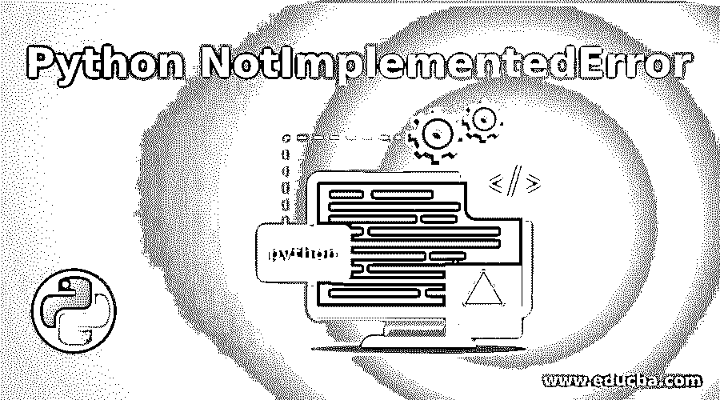
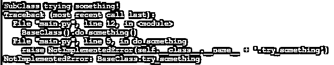

# Python NotImplementedError

> 原文：<https://www.educba.com/python-notimplementederror/>




## Python NotImplementedError 简介

当客户端表征基类时，Python NotImplementedError 异常在运行时发生；当概念技术需要推断的类来废除策略时，或者当创建类来证明应该包含真正的用法时，概念技术应该提出这个异常。这没有有效的语法，因为它是一个异常运行时错误。这不应该被用来表明一个管理者或技术不打算通过任何方式得到支持；考虑到所有因素，要么不明确管理员或策略，要么如果是子类，就将其设置为 None。

异常是在程序执行过程中出现的扰乱程序正常运行的情况。总的来说，当 Python 内容遇到无法适应的情况时，它会引发一个异常。一个例外是一个 Python 对象，它指出了一个错误。当 Python 内容引发异常时，它应该立即处理豁免，否则它将结束并停止。

<small>网页开发、编程语言、软件测试&其他</small>

### NotImplementedError 在 Python 中是如何工作的？

现在我们来看看这些 NotImplementedErrors 或异常是如何在 Python 中工作的。

#### 例子

**代码:**

```
class BaseClass(object): 
    def __init__(self): 
        super(BaseClass, self).__init__() 
    def do_something(self): 
        raise NotImplementedError(self.__class__.__name__ + '.try_something') 

class SubClass(BaseClass): 
    def do_something(self): 
        print (self.__class__.__name__ + ' trying something!')

SubClass().do_something() 
BaseClass().do_something() 
```

**输出:**




**代码解释:**在上面的程序中，我们首先定义了一个抽象类作为我们的基类。在主类中，我们使用 init 函数定义接口，并声明一个名为 self 的索引。一旦在基类中定义了这个接口，一旦我们提供了定义接口的命令，它就准备好被实现了。完成后不久，我们立即引发 NotImplementedError，阻止该接口实现命令。因此，当我们发出“尝试某事”的命令时，它会自动从抽象类中终止。然后我们定义子类，我们再次实现接口，这一次，实现工作了，它产生输出说子类正在尝试一些东西，它引发基类的非实现错误，并要求我们追溯到这个异常。

### Python 中如何避免 NotImplementedError？

在一些情况下，运行时错误可能会发生。无论我们在什么时候试图细读一份文件或获取客户的意见，很可能会发生令人吃惊的事情——记录可能已被移动或删除，客户可能输入了不在正确组织中的信息。优秀的开发人员应该在他们的项目中添加屏蔽，这样像这样的常规情况可以毫不费力地得到处理，一个程序在任何时候遇到一个可以有效预测的问题时都会崩溃，这是非常不好利用的。大多数客户期望项目应该足够强大，能够从这些困难中恢复过来。因此，我们看到了如何在 Python 中防止这些运行时错误或 NotImplementedErrors 的各个方面。有两个函数有助于防止这些运行时错误，它们是“try”和“except”。

#### 例子

**代码:**

```
try:
    salary = int(input("Enter salary: "))
    print("So cool you earn %d amount." % salary)
except ValueError:
    print("Hey, that wasn't a number!") 
```

**输出:**


**代码解释:**在上面的代码中，我们意识到，当我们试图改变客户对一个数字的贡献时，可能会出现错误。万一 info 字符串肯定不是一个数字，这一行将触发一个 value error——这就是我们将它表示为我们将要处理的那种错误的原因。我们可以确定一个逐渐扩大的错误类别——或者甚至完全排除该类别，这将导致协调任何类型的豁免——但这将是一个不切实际的想法。想象一个场景，我们犯了一个完全独特的错误，这是我们没有预料到的。它也会被处理，我们不会看到任何不正常的事情变得很糟糕。我们可能同样需要以各种方式应对各种类型的失误。我们应该不断地尝试选择明确的错误类型，而不是一般的错误类型。因此，不会出现类似 NotImplementedError 或 Value 错误的运行时错误。

### 结论

因此，我的结论是，当运行时在 Python 中出现 NotImplementedErrors 或异常时，它是不可互换的，因此正常的实现是不被接受的。这种异常和错误可以通过 try 和 except 块来处理。在 NotImplementedError 中，基类具有独特的技术，当它们需要确定的类来取代策略时，或者当创建类来表明应该包括真实的用法时，就会出现这种特殊情况。

### 推荐文章

这是 Python NotImplementedError 的指南。在这里，我们还讨论了简介和 notimplementederror 在 python 中的工作原理，以及一个示例和它的代码实现。您也可以看看以下文章，了解更多信息–

1.  [Python 中的快速排序](https://www.educba.com/quick-sort-in-python/)
2.  [Python 计数器](https://www.educba.com/python-counter/)
3.  [Python 并发](https://www.educba.com/python-concurrency/)
4.  [Python 的幂函数](https://www.educba.com/python-power-function/)


