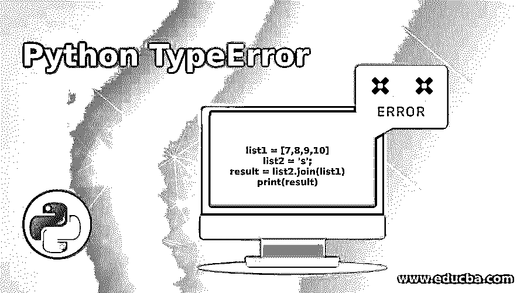
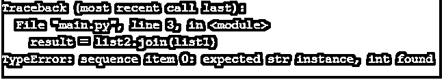
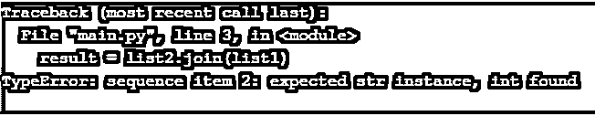
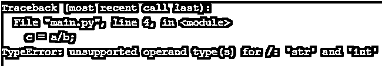

# Python 类型错误

> 原文：<https://www.educba.com/python-typeerror/>




## Python 类型错误简介

TypeError 是 python 生成的一种错误。我们正在尝试对错误类型的对象执行操作。例如，如果我们试图计算一个数的平方根，但是我们传递的是一个列表而不是 int，那么 python 将会生成 TypeError。当我们试图对对象执行操作时，也会生成这种类型的错误，这是不支持的。

### 如何避免 TypeError？

Python 总是检查我们为操作传递的对象的类型，以及特定的对象类型是否支持该操作。Python 会抛出一个 TypeError。我们可以通过在这样的操作之前添加一个额外的步骤或 try-catch 来避免这个错误。假设我们想要连接两个列表。所以在加入操作之前，我们可以检查用户传递的两个列表的类型；如果类型不符合我们的要求，我们可以向用户传递一条消息，指出错误的输入，并告诉他传递正确的输入。

<small>网页开发、编程语言、软件测试&其他</small>

### Python 类型错误的示例

下面是一些例子:

#### 示例#1

**代码:**

```
list1 = [7,8,9,10]
list2 = 's';
result = list2.join(list1)
print(result)
```

**输出:**




正如你在上面的程序中看到的，我们已经创建了一个 list1 和 list2 的列表作为一个字符串变量。现在我们试图将 list1 与 list2 连接起来，但是 python 返回了类型错误。因为 list2 是字符串类型，python 希望 list1 的每个元素都是字符串，但它是一个整数。

#### 实施例 2

**代码:**

```
list1 = ['7','8',9,10]
list2 = 's';
result = list2.join(list1)
print(result)
```

**输出:**




现在在上面，我们已经修改了我们的第一个列表，我们把前两个元素作为一个字符串，但是剩下的两个元素仍然是 int。因此，当我们执行它时，python 仍然生成 TypeError，因为它显示元素索引为 2，即第三个元素仍然是整数。所以现在我们必须把剩下的两个元素也变成整数才能正常工作。

#### 实施例 3

**代码:**

```
list1 = ['7','8',9,10]
list2 = 's';
result = list2.join(str(a) for a in list1)
print(result)
```

**输出:**


在上面的程序中，你可以看到在 join 函数内部，我们已经通过类型转换将 list1 的每个元素转换为一个字符串。它将确保每个元素都是一个字符串；如果不是，那么它将是隐蔽的。这样，我们就可以避免 TypeError。

#### 实施例 4

**代码:**

```
a = 's';
b = 4;
c = a/b;
print(c)
```

**输出:**




在上面的例子中，你可以看到我们已经创建了两个变量。一个保存整数值，另一个保存字符串或字符值。现在，我们尝试在变量之间执行除法，并将结果保存到第三个变量中，并打印结果。但是 python 会抛出 TypeError，因为整数不能被字符串或字符整除，python 需要的是整数值，所以抛出了 TypeError。

现在在这样的情况下，我们知道我们要做除法运算，两个变量都应该是整数，所以在执行这样的运算之前，我们要处理它。

#### 实施例 5

**代码:**

```
a = 's';
b = 4;

if(type(b) != int or type(a) != int):
    print('One of the number is not integer')
else:
    c = a/b;
    print(c) 
```

**输出:**


在这个例子中，我们可以看到，我们已经把 if 条件检查了两个变量的类型；如果有任何变量不是整数，那么我们将向用户传递一条消息，让用户再次输入值。这样，我们可以避免 TypeError。

**代码:**

```
a = 5;
b = 4;

if(type(b) != int or type(a) != int):
    print('One of the number is not integer')
else:
    c = a/b;
    print(c) 
```

**输出:**


这一次我们的程序工作正常。

#### 实施例 6

**代码:**

```
list1 = 's';
list2 = [3, 4, 5, 8, 9];
print(list1 + list2) 
```

**输出:**


在上面的例子中，你可以；我们试图联系两个变量。一个是保存字符串，另一个是保存列表。Python 返回一个类型错误，因为字符串不能连接到列表。Python 需要一个列表，所以它返回一个类型错误。所以为了避免这种情况，我们可以在执行操作之前检查变量的类型。

**代码:**

```
list1 = 's';
list2 = [3, 4, 5, 8, 9];

if(type(list1) != list or type(list2) != list):
    print('One of the values is not list')
else:
    print(list1 + list2) 
```

**输出:**


在这个例子中，我们在接触它们之前检查两个变量的类型；因此，我们可以避免这种类型的错误。

### 推荐文章

这是一个 Python 类型错误的指南。这里我们也讨论一下简介和如何避免类型错误？以及不同的示例及其代码实现。您也可以看看以下文章，了解更多信息–

1.  [Python 常量](https://www.educba.com/python-constants/)
2.  [Python 中的快速排序](https://www.educba.com/quick-sort-in-python/)
3.  [Python 并发](https://www.educba.com/python-concurrency/)
4.  [Python argparse](https://www.educba.com/python-argparse/)


