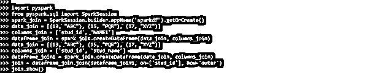

# 多列上的 PySpark 联接

> 原文：<https://www.educba.com/pyspark-join-on-multiple-columns/>


## 多列 PySpark 联接简介

多列上的 PySpark 连接包含连接操作，它将两个或多个数据框中的字段组合在一起。我们通过在不同或相同的列上应用条件来执行各种条件的 PySpark 连接。我们可以使用它来消除数据框结果中的重复列。多列上的连接包含大量的洗牌。

### 概观

使用 join 函数，我们可以将两个数据框的列合并或连接到 PySpark 中。join 中不同类型的参数将允许我们执行不同类型的连接。我们可以使用外连接、内连接、左连接、右连接、左半连接、全连接、反连接和左反连接。在分析学中，PySpark 是一个非常重要的术语；这个开源框架确保了数据的高速处理。它将支持不同类型的语言。

<small>网页开发、编程语言、软件测试&其他</small>

PySpark 是一个非常重要的 python 库，它通过大规模的探索来分析数据。它用于设计创建 ETL 平台的 ML 管道。Pyspark 用于连接多个列，并将像在 SQL 中一样连接函数。根据具体情况，join 函数包括多个列。

### 如何在 PySpark 中使用 Join 多列？

我们必须按照下面的步骤来使用 PySpark 连接多个列。首先，我们在系统中安装 PySpark。

*   在下面的例子中，我们使用 pip 命令在 windows 系统中安装 PySpark，如下所示。

```
pip install pyspark
```


*   安装 PySpark 的模块在这一步，我们登录到 python 的 shell 如下。

```
python
```


*   登录到 python shell 后，我们导入连接多个列所需的包。

```
import pyspark
from pyspark.sql import SparkSession
```


*   在此步骤中导入模块后，我们创建第一个数据框。

**代码:**

```
spark_join = SparkSession.builder.appName ('sparkdf').getOrCreate()
data_join = [(13, "ABC"), (15, "PQR"), (17, "XYZ")]
columns_join = ['stud_id', 'stud_name']
dataframe_join = spark_join.createDataFrame (data_join, columns_join)
dataframe_join.show()
```

**输出:**


*   在创建了第一个数据帧之后，我们现在在这一步中创建第二个数据帧，如下所示。

**代码:**

```
spark_join1 = SparkSession.builder.appName ('sparkdf').getOrCreate()
data_join1 = [(13, "ABC"), (15, "PQR"), (17, "XYZ")]
columns_join1 = ['stud_id', 'stud_name']
dataframe_join1 = spark_join1.createDataFrame (data_join1, columns_join1)
dataframe_join1.show ()
```

**输出:**


*   创建数据框后，我们将连接来自两个不同数据集的两列。

**代码:**

```
import pyspark
from pyspark.sql import SparkSession
spark_join = SparkSession.builder.appName ('sparkdf').getOrCreate()
data_join = [(13, "ABC"), (15, "PQR"), (17, "XYZ")]
columns_join = ['stud_id', 'NAME1']
dataframe_join = spark_join.createDataFrame (data_join, columns_join)
data_join = [(13, "ABC"), (15, "PQR"), (17, "XYZ")]
columns_join = ['stud_id', 'stud_name']
dataframe_join1 = spark_join.createDataFrame (data_join, columns_join)
dataframe_join.join (dataframe_join1, (dataframe_join.stud_id == dataframe_join1.stud_id)
& (dataframe_join.NAME1 == dataframe_join1.stud_name)).show()
```

**输出:**


### PySpark 中多列是如何工作的？

下面是 PySpark 中可用的不同类型的联接。按照 join，我们正在处理数据集。

*   内部连接
*   左外部连接
*   右外部联接
*   完全外部连接
*   交叉连接
*   左半连接
*   左反加入。

内部联接是一种常用的联接，用于链接各种表。它将返回一行的记录，下面的例子显示了内部连接将如何工作，如下所示。

**代码:**

```
import pyspark
from pyspark.sql import SparkSession
spark_join = SparkSession.builder.appName('sparkdf').getOrCreate()
data_join = [( )]
columns_join = ['stud_id', 'NAME1']
dataframe_join = spark_join.createDataFrame(data_join, columns_join)
data_join = [( )]
columns_join = ['stud_id', 'stud_name']
dataframe_join1 = spark_join.createDataFrame (data_join, columns_join)
join = dataframe_join.join(dataframe_join1, on=['stud_id'], how='inner')
join.show ()
```

**输出:**


PySpark 的外部连接将合并左右外部连接的结果。以下示例显示了外部连接在 PySpark 中的工作方式，如下所示。

**代码:**

```
import pyspark
from pyspark.sql import SparkSession
spark_join = SparkSession.builder.appName ('sparkdf').getOrCreate()
data_join = [( )]
columns_join = ['stud_id', 'NAME1']
dataframe_join = spark_join.createDataFrame(data_join, columns_join)
data_join = [( )]
columns_join = ['stud_id', 'stud_name']
dataframe_join1 = spark_join.createDataFrame (data_join, columns_join)
join = dataframe_join.join(dataframe_join1, on=['stud_id'], how='outer')
join.show()
```

**输出:**




### 多列数据框架上的 Pyspark 联接

多列数据框上的 Pyspark 连接用于连接数据框。以下语法显示了如何使用数据框连接多个列，如下所示:

**语法:**

```
join(right, joinExprs, joinType)
```

```
join(right)
```

在上面的第一个语法中，joinExprs，joinType 作为一个参数，我们使用 joinExprs 来提供 join 的条件。在第二个语法中，右边的数据集被认为是默认连接。

在下面的示例中，我们将创建第一个数据集，即 emp 数据集，如下所示。

**代码:**

```
import pyspark
from pyspark.sql import SparkSession
spark_join1 = SparkSession.builder.appName('sparkdf').getOrCreate()
data_join1 = [(21, "BC"), (23, "QR"), (25, "YZ")]
columns_join1 = ['emp_id', 'emp_name']
dataframe_join1 = spark_join1.createDataFrame(data_join, columns_join)
dataframe_join1.show()
```

**输出:**


在下面的例子中，我们为 PySpark 创建第二个数据集，如下所示。这里我们定义了 emp 集合。

**代码:**

```
import pyspark
from pyspark.sql import SparkSession
spark_join2 = SparkSession.builder.appName ('sparkdf').getOrCreate()
data_join2 = [(31, "AC"), (33, "PR"), (35, "XZ")]
columns_join2 = ['emp_id', 'emp_name']
dataframe_join2 = spark_join2.createDataFrame (data_join, columns_join)
dataframe_join2.show()
```

**输出:**


### 例子

以下是不同的例子:

#### 示例#1

在下面的例子中，我们使用了内部连接。

**代码:**

```
import pyspark
from pyspark.sql import SparkSession
spark_join1 = SparkSession.builder.appName('sparkdf').getOrCreate()
data_join1 = [(21, "BC"), (23, "QR"), (25, "YZ")]
columns_join1 = ['emp_id', 'emp_name']
dataframe_join1 = spark_join.createDataFrame(data_join, columns_join1)
data_join1 = [(31, "AC"), (33, "PR"), (35, "XZ")]
columns_join1 = ['emp_id', 'stud_name']
dataframe_join2 = spark_join.createDataFrame(data_join1, columns_join1)
dataframe_join1.join(dataframe_join2, (dataframe_join1.emp_id == dataframe_join2.emp_id)
& (dataframe_join1.emp_name == dataframe_join2.stud_name)).show()
```

**输出:**


#### 实施例 2

在下面的例子中，我们使用了内部左连接。

**代码:**

```
import pyspark
from pyspark.sql import SparkSession
spark_join1 = SparkSession.builder.appName ('sparkdf').getOrCreate()
data_join1 = [(21, "BC"), (23, "QR"), (25, "YZ")]
columns_join1 = ['emp_id', 'emp_name']
dataframe_join1 = spark_join.createDataFrame (data_join, columns_join1)
data_join1 = [(31, "AC"), (33, "PR"), (35, "XZ")]
columns_join1 = ['emp_id', 'stud_name']
dataframe_join2 = spark_join.createDataFrame (data_join, columns_join)
join = dataframe_join1.join (dataframe_join2, on=['emp_name'], how='left')
join.show()
```

**输出:**


### 关键要点

*   在多列的 PySpark 连接中，我们可以通过使用函数名作为 join 来连接多列。此外，我们使用条件操作符来连接多列。
*   我们还使用 OR 操作符连接 PySpark 多个列。我们需要在加入时指定条件。

### 常见问题解答

下面是提到的常见问题:

#### Q1。PySpark 中的多列连接有什么用？

**答:**用于连接两列或多列。我们按照我们使用的条件加入列。

#### Q2。在 PySpark 中，哪个操作符用于连接多个列？

**回答:**我们可以使用 OR 运算符来连接 PySpark 中的多个列。我们使用数据框来连接多个列。

#### Q3。PySpark 中使用的连接类型是什么？

**回答:**我们在 PySpark 中使用的是 inner、left、right outer、left outer、cross join、anti、semi-left join。

### 结论

join 中有不同类型的参数，允许我们在 PySpark 中执行不同类型的连接。Pyspark 多列连接包含连接操作，用于合并两个或多个数据帧中的字段。

### 推荐文章

这是一个多列 PySpark 连接指南。在这里，我们讨论 PySpark 中的介绍和如何连接多个列，以及工作和示例。您也可以看看以下文章，了解更多信息–

1.  [PySpark 写 CSV](https://www.educba.com/pyspark-write-csv/)
2.  [PySpark MLlib](https://www.educba.com/pyspark-mllib/)
3.  [PySpark 数据帧](https://www.educba.com/pyspark-dataframe/)
4.  PySpark fillna


