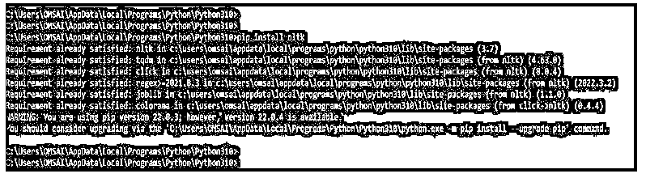
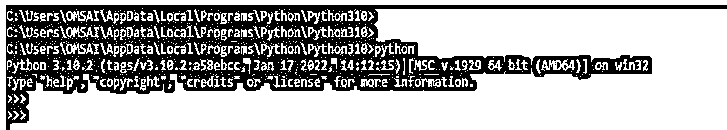
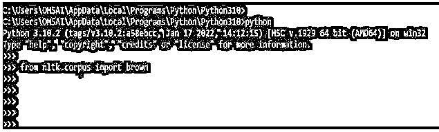

# NLTK 语料库

> 原文：<https://www.educba.com/nltk-corpus/>


## NLTK 语料库介绍

NLTK 语料库包模块包含用于读取各种格式的语料库文件的工具。这些函数可以读取 NLTK 语料库文件和外部语料库文件。此外，每个语料库模块具有一个或多个用于语料库文档阅读的语料库阅读器功能。这些例程需要一个 item 参数来指定应该读取语料库中的哪个文档。如果项目包含文件名，它将被打开。

### 什么是 NLTK 语料库？

*   NLTK 语料库包中的适当文档将被加载到语料库模块的 items 变量中。
*   此外，语料库阅读器方法可以获取条目名称列表，这将返回相关文档的连接。
*   nltk.corpus 包包含一组类阅读器，可以检索各种语料库的内容。
*   每一类语料库阅读器都适合特定的语料库格式。此外，nltk.corpus 包提供了 corpus reader 的实例，用于访问 nltk 数据包中包含的语料库。
*   语料库读者类分析了在构建语料库读者类的新对象时出现的挑战。
*   语料库是语言学中一个庞大的有组织的文本系列。它们在语料库语言学中被用来测试假设，检查出现的情况，并验证语言领域内的语言规则。
*   语料库阅读器的类别被定制来处理特定的语料库格式。此外，nltk.corpus 包产生一组语料库阅读器实例。
*   这是一个非常值得研究的数据集库。在使用 nltk 模块时，NLTK 的所有语料库都有相同的访问规则，但没有什么是神奇的。
*   大多数文件是明文，但有些是 XML，有些是各种格式。我们可以手动或使用模块和 python 来访问它们。先说手动看他们。
*   根据我们的设置，我们的 nltk 数据目录可能隐藏在不同的地方。要找到它，请浏览我们的 python 目录。
*   NLTK 是一个标准 python 包，带有现成的函数和实用程序。这是最流行的计算语言学和自然语言处理库之一。
*   nltk 语料库示例，如 matplotlib–matplotlib . pyplot 中的 py plot 包，使用点符号进行访问。我们需要使用 nltk 特定的函数，这是一个显著的区别。
*   我们可以使用文件 id 函数和点符号获得 nltk 的样本 Gutenberg 语料库数据集的列表。

### 如何使用 NLTK 语料库？

语料库是用同一种语言写的论文的集合。它将是存储在一个目录中的文本文件的集合，经常被其他文本文件目录所包围。在 nltk.data.path 变量中，nltk 已经定义了目录或列表的数据路径。为了让 NLTK 找到我们的自定义语料库，它必须存在于这些路径之一。我们还可以创建一个定制的 nltk 数据目录，并确保它包含在已知路径的 nltk.data.path 列表中。

<small>网页开发、编程语言、软件测试&其他</small>

下面是语料库的阅读器功能，它是根据它们返回的信息的类型命名的。

*   **Word:**Word 函数的返回类型是 str 的列表。
*   **Sents:**Sents 函数的返回类型是 list of(str 的列表)。
*   Paras:Paras 函数的返回类型是 list of (list of (list of str))。
*   **Tagged _ words:**Tagged _ words 函数的返回类型是(str，str)元组的列表。
*   **Tagged _ sents:**Tagged _ sents 函数的返回类型是(list of (str，str))的列表。
*   **Tagged _ paras:**Tagged _ paras 函数的返回类型是 list of (list of (list of (str，str))。
*   **Chunked _ sents:**Chunked _ sents 函数的返回类型是(Tree w/ (str，str) leaves)的列表。
*   **Parsed _ sents:**Parsed _ sents 函数的返回类型是(带有 str 叶子的树)的列表。
*   **Xml:**Xml 函数的返回类型是 Xml 的单元素树。
*   **Raw:** 基本函数的返回类型是语料库的内容。

要使用单词 NLTK 语料库，我们需要遵循如下步骤:

1.使用 pip 命令安装 nltk。

*   第一步是使用 pip 命令安装 NLTK。
*   以下示例显示了如何使用 pip 命令安装 nltk，如下所示。

**代码:**

```
pip install nltk
```

**输出:**




2.安装 pip 命令后，我们使用 python 命令登录 python shell。

**代码:**

```
python
```

**输出:**




3.登录到 python shell 后，在这一步中，我们使用 import 关键字在程序中导入 nltk.corpus 模块。

**代码:**

```
from nltk.corpus import brown
```

**输出:**




4.在下一步中导入模块后，我们按照函数打印列表。

**代码:**

```
print(", ".join(brown.raw ()))
print(", ".join(brown.words ()))
```

**输出:**


在上面的步骤中，我们可以看到它将按照我们在 print 方法中使用的函数打印列表。在上面的例子中，我们使用了 basic 和 words 函数，所以它将按照函数打印数据。

### NLTK 语料库示例

下面提到了不同的例子:

#### 示例#1

下面的例子展示了如下的 NLTK 语料库。在下面的例子中，我们使用 words 函数打印数据，如下所示。

**代码:**

```
from nltk.corpus import indian
for py_text in indian.fileids ():
    print(py_text, indian.words (py_text)[:10])
```

**输出:**


在上面的例子中，第一行我们已经导入了 nltk.corpus 包。使用导入的对象，我们使用了第二行中的循环。最后，在第三行中，我们使用了 words 函数来打印列表。

#### 实施例 2

在下面的例子中，我们使用 basic 函数来打印数据。同样，我们使用 basic 函数来打印输出。

**代码:**

```
from nltk.corpus import indian
for py_text in indian.fileids ():
    print(py_text, indian.raw (py_text)[:10])
```

**输出:**


### 结论

nltk.corpus 包提供了 corpus reader 的实例，用于访问 nltk 数据包中包含的语料库。此外，包模块包含用于读取各种格式的语料库文件的实用程序。这些函数可以读取语料库文件和外部语料库文件。

### 推荐文章

这是 NLTK 语料库的指南。这里我们讨论介绍，例子，以及如何使用 NLTK 语料库。您也可以看看以下文章，了解更多信息–

1.  [Python 用户定义的异常](https://www.educba.com/python-user-defined-exception/)
2.  [Python Reduce](https://www.educba.com/python-reduce/)
3.  [Timsort Python](https://www.educba.com/timsort-python/)
4.  [Python Z 测试](https://www.educba.com/python-z-test/)


