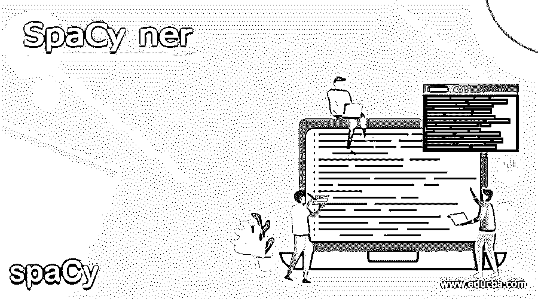
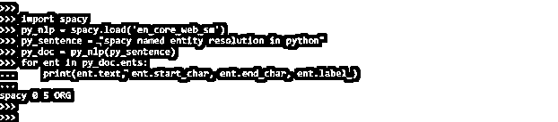
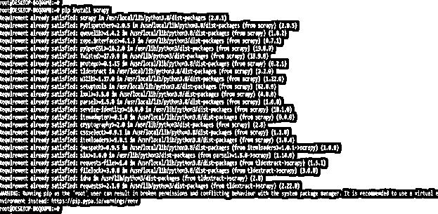
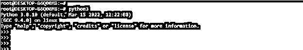
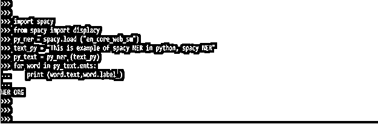
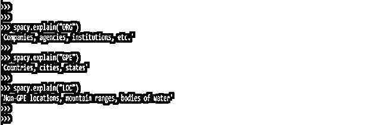
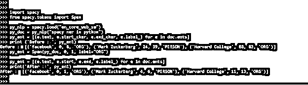
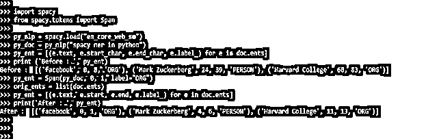
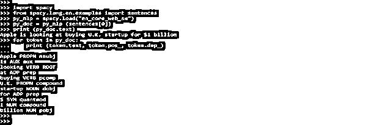

# 空间内

> 原文：<https://www.educba.com/spacy-ner/>




## 空间的定义

空间识别不过是 python 中的命名实体识别。最重要的，或者我们喜欢称之为信息检索的第一阶段是 NER。提取必要的和可用的数据源的实践被称为信息检索。NER 定位非结构化文本中的已识别实体，并将其分类为标准类别，如人名、位置、组织、时间表达式、货币值、百分比、代码等。

### 什么是空间？

*   基于转换识别命名实体的组件。实体识别器寻找不重叠的标记令牌范围。基于转换的技术包含一些传统命名的实体识别任务，但可能不适用于所有跨度识别问题。损失函数尤其针对整个实体的正确性进行了优化。
*   NER 是一种常见的自然语言处理任务，它需要检测文本块中的命名实体(人、地点、组织等)，并将它们归类到一组预先确定的类别中。NER 可以有多种用途，例如，用于识别新闻报道中提到的人、组织和地点。
*   提供简洁的搜索优化功能:而不是搜索完整的材料。
*   正如我们所知，每个数据包含各种各样的单词，其中一些是停用词或口语单词的一部分，并且在一个文本文件中可以有各种各样的单词，它们可以被分成命名的实体。
*   任何书面数据中的命名实体。数据中的人名、地名和事物的专有名称就是对象的例子。
*   下面的例子显示刺儿头 NER 如下。

**代码:**

<small>网页开发、编程语言、软件测试&其他</small>

```
import spacy
py_nlp = spacy.load ('en_core_web_sm')
py_doc = py_nlp (py_sentence)
for ent in py_doc.ents:
    print (ent.text, ent.start_char, ent.end_char, ent.label_)
```




### 使用空间 ner

*   SpaCy 是一个自然语言处理(NLP)包，可用于多种任务。
*   它提供了识别命名实体的内置机制。SpaCy 有一个快速识别统计实体的系统。
*   我们可以很容易地用空间做 NER 的工作。尽管我们经常使用 spaCy 模型，但它对所有类型的文本数据都表现出色。
*   NER 模型的能力高度依赖于它们被训练的数据。NER 有广泛的用途。
*   使用 NER 可以收集文本中的大量命名实体，并可以使用这些数据进行推断。

要使用 spaCy ner，我们需要在系统中安装 scrapy。下面的例子说明了如何在我们的系统中安装 scrapy。我们可以通过使用 pip 命令来安装 scrapy 模块，在下面的例子中，我们已经安装了 scrapy，所以它将显示需求已经得到满足。

```
pip install scrapy
```




*   在这一步安装 scrapy 之后，我们使用 python3 命令登录 python shell。

```
python3
```




*   下面的例子说明了如何使用空间。首先，我们导入了 spaCy 模块。

**代码:**

```
import spacy
from spacy import displacy
py_ner = spacy.load ("en_core_web_sm")
py_text = py_ner (text_py)
for word in py_text.ents:
    print (word.text,word.label_)
```




*   下面的例子显示了我们提供的指定文本的命名实体。

**代码:**

```
spacy.explain ("ORG")
spacy.explain ("GPE")
spacy.explain ("LOC")
```




### 添加空间 ner 方法

*   空间库包括文档级实体注释的特性。但是，这不能直接写入 token.ent 类型属性。
*   添加空间的方法有三种，如下所示。

#### 方法 1

在此方法中，我们将创建一个名为 span 的实体，并将其分配给文档。以下示例显示了添加空间的方法 1。

**代码:**

```
import spacy
from spacy.tokens import Span
py_nlp = spacy.load("en_core_web_sm")
py_doc = py_nlp("spaCy ner in python")
py_ent = [(e.text, e.start_char, e.end_char, e.label_) for e in doc.ents]
print ('Before : ', py_ent)
py_ent = Span (py_doc, 0, 1, label="ORG")
py_ent = [(e.text, e.start, e.end, e.label_) for e in doc.ents]
print('After : ', py_ent)
```




#### 方法 2

在这个方法中，我们创建一个新的 span 实体列表。以下示例显示了 method2 spaCy ner 方法。

**代码:**

```
import spacy
from spacy.tokens import Span
py_nlp = spacy.load("en_core_web_sm")
py_doc = py_nlp("spacy ner in python")
py_ent = [(e.text, e.start_char, e.end_char, e.label_) for e in doc.ents]
print ('Before : ', py_ent)
py_ent = Span(py_doc, 0, 1, label="ORG")
orig_ents = list(doc.ents)
py_ent = [(e.text, e.start, e.end, e.label_) for e in doc.ents]
print('After : ', py_ent)
```




#### 方法 3

在这个方法中，我们如下创建 numpy 数组。

**代码:**

```
import numpy
import spacy
from spacy.attrs import ENT_IOB, ENT_TYPE
py_nlp = spacy.load ("en_core_web_sm")
doc = py_nlp.make_doc ("Python spacy ner, N.A.")
print('Before :', ents) # []
py_head = [ENT_IOB, ENT_TYPE]
py_arr = numpy.zeros ((len(doc), len(py_head)), dtype="uint64")
py_arr[0, 0] = 3
py_arr[0, 1] = doc.vocab.strings ["GPE"]
py_arr[7:, 0] = 3
py_arr[7:, 1] = doc.vocab.strings["GPE"]
doc.from_array (py_head, py_arr)
print('After :', ents)
```


### 空间模型

*   文档返回一系列 Span 对象，这是获取实体注释的最常见机制。实体类型可以通过 ent.label 或作为字符串来访问。
*   我们可以迭代 Span object，它的功能相当于一个令牌序列。我们也可以接收实体的文本形式，作为一个令牌。
*   token.ent_iob 和 token.ent 类型属性也可用于获取标记实体注释。属性 token.ent_iob 指定实体是在标记上开始、继续还是终止。
*   由于提供了单一的优化函数，spaCy 被认为是 Python 中最快的 NLP 框架。
*   识别命名实体并将其链接到其类的过程称为命名实体识别。
*   SpaCy 允许用户更新模型，以包含现有实体的新示例。SpaCy 提供了一个名为“ner”的管道组件，用于查找与实体匹配的令牌范围。
*   下面是空间模型的例子。

**代码:**

```
import spacy
from spacy.lang.en.examples import sentences
py_nlp = spacy.load ("en_core_web_sm")
py_doc = py_nlp (sentences[0])
print (py_doc.text)
for token in py_doc:
    print (token.text, token.pos_, token.dep_)
```




### 结论

SpaCy 允许用户更新模型，以包含现有实体的新示例。SpaCy 提供了一个名为“ner”的管道组件，用于查找与实体匹配的令牌范围。由于提供了单一的优化函数，spaCy 被认为是 Python 中最快的 NLP 框架。

### 推荐文章

这是一本空间指南。在这里，我们讨论定义，什么是空间，空间模型，方法和代码实现的例子。您也可以看看以下文章，了解更多信息–

1.  [Python 中的 ordered dict](https://www.educba.com/ordereddict-in-python/)
2.  [Python 中的二分搜索法](https://www.educba.com/binary-search-in-python/)
3.  [Python 连接列表](https://www.educba.com/python-join-list/)
4.  [Python UUID](https://www.educba.com/python-uuid/)


