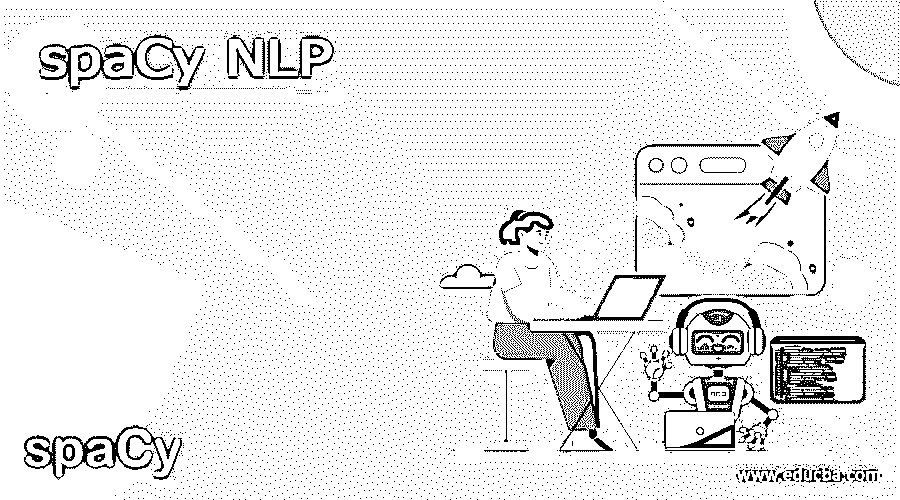
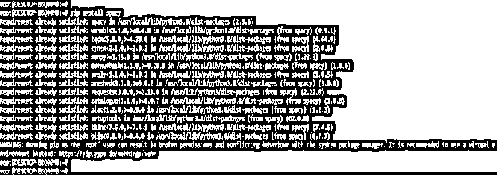
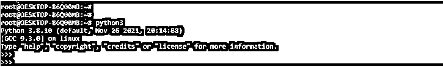
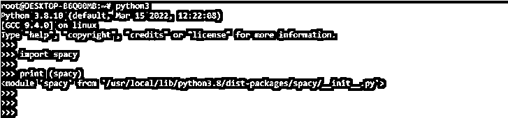
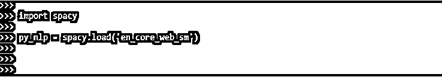
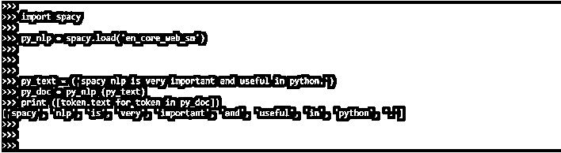
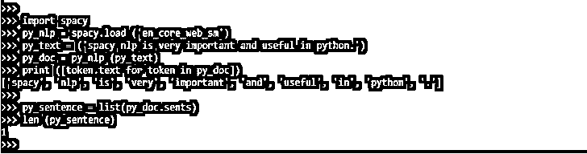
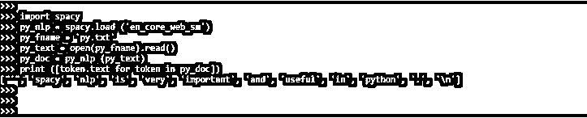
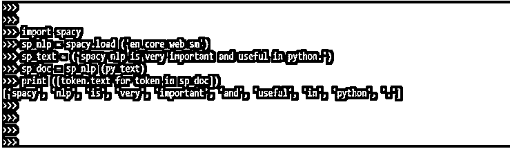
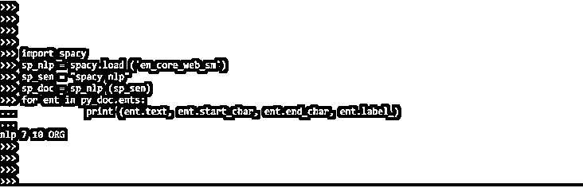

# 空间 NLP

> 原文：<https://www.educba.com/spacy-nlp/>




## 空间自然语言处理的定义

spaCy NLP 在当今可用的各种 NLP 库中脱颖而出。如果我们把空间用于自然语言处理，我们就会确切地知道我们在谈论什么。SpaCy NLP 提供了更多的功能，如易于使用和 NLP 库是最新的。SpaCy 是一个基于 Python 的 NLP 库，有几个特性。它越来越广泛地用于自然语言处理中的数据处理和分析。

### 什么是 spaCy NLP？

*   数据是海量生成的，处理并从中提取见解至关重要。为此，数据必须以计算机可读的格式表示。这是 NLP 可以帮助我们的。
*   NLP 是一种从非结构化文本中提取信息的技术。它有多种应用，包括。
    *   动态总结
    *   命名事物的识别
    *   回应询问的系统
    *   分析情感
*   SpaCy 是一个开源免费的 Python NLP 库。NLP 是一个人工智能子领域，处理计算机-人类语言交互。分析的过程就是理解。

### 创建空间 NLP

*   spaCy 旨在用于信息提取和自然语言处理系统。它被设计用于生产，并且有一个简单易用的 API。
*   分析文本的语义分析和单词结构。整合从文本数据库领域借用的技术，如 WordNet 和 treebanks。
*   为了创建空间 NLP，我们需要遵循以下步骤。

1.在这一步中，我们使用 pip 命令安装 spaCy 包。在下面的例子中，我们已经在我们的系统中安装了 spaCy 包，因此，它将显示需求已经得到满足，然后我们不需要做任何事情。

<small>网页开发、编程语言、软件测试&其他</small>

**代码:**

```
pip install spacy
```

**输出:**




2.安装完所有模块后，我们使用 python3 命令打开 python shell。

**代码:**

```
python3
```

**输出:**




3.在这一步登录到 python shell 之后，我们检查 bs4，请求包已经安装在我们的系统中。

**代码:**

```
import spacy
print (spacy)
```

**输出:**




4.在检查完这一步的所有先决条件后，我们将在代码中加载空间模块。我们正在使用 spacy 加载模块。加载方法。

**代码:**

```
import spacy
py_NLP = spacy.load('en_core_web_sm')
```

**输出:**




5.在下面的例子中加载模块后，我们检查如何读取字符串，如下所示。

**代码:**

```
import spacy
py_NLP = spacy.load ('en_core_web_sm')
py_text = ('spacy NLP is very important and useful in python.')
py_doc = py_NLP (py_text)
print ([token.text for token in py_doc])
```

**输出:**




6.在下面的例子中，我们通过使用空间自然语言处理来检测句子。它将检测我们在输入中使用了多少个句子。它将显示我们在输入中使用的句子总数。

**代码:**

```
import spacy
py_NLP = spacy.load ('en_core_web_sm')
py_text = ('spacy NLP is very important and useful in python.')
py_doc = py_NLP (py_text)
print ([token.text for token in py_doc])
py_sentence = list(py_doc.sents)
len (py_sentence)
```

**输出:**




7.在下面的例子中，我们使用 spaCy NLP 从文本文件中读取内容。我们首先需要为它创建一个文本文件。我们已经创建了一个名为 py.txt 的文本文件。

**代码:**

```
import spacy
py_NLP = spacy.load ('en_core_web_sm')
py_fname = 'py.txt'
py_text = open (py_fname).read()
py_doc = py_NLP (py_text)
print ([token.text for token in py_doc])
```

**输出:**




### 空间自然语言处理模型

*   一旦在文本上被调用，模型就运行准备管道。该模型采用一系列步骤(功能)来“理解”后续处理。
*   Doc 是存储预处理对象的标准。这些看起来是普通的文本字符串，但它们不是。预处理过程中发现的数据存储在 doc 对象中，其中包括“标记”、句子、实体和词性。
*   以下部分包含在 spaCy NLP 模型的预处理流水线中。
    1.  乱涂乱画者
    2.  句法分析程序
    3.  NER
*   令牌化首先出现在管道中，然后是其他流程。这个程序把文本分成记号。单词和标点符号是记号的例子，记号是字符串中具有语义意义的最小元素。管道的其余部分是可适应的。

#### 1.乱涂乱画者

*   每个标记都由标记者赋予一个词性。POS 标签描述了一个标记在一个句子中的语法和语义表现。
*   常见的词类包括名词、代词、形容词、动词、副词等。在英语中，有 36 种被普遍接受的独立词类。

下面的例子展示了 tagger 如何在 spaCy NLP 模型中工作。

**代码:**

```
import spacy
sp_NLP = spacy.load ('en_core_web_sm')
sp_fname = 'py.txt'
sp_text = open (py_fname).read()
sp_doc = sp_NLP (sp_text)
print ([token.text for token in sp_doc])
```

**输出:**


#### 2.句法分析程序

*   句子边界由解析器标记。它还显示了令牌的相互依赖性。这就是所谓的依赖解析。
*   SpaCy 不像人类，不具备“直觉”知道哪些词依赖于他人的能力。
*   然而，它已经被训练成使用大量数据来预测单词依赖性。依存解析文本输出格式是一个很难掌握的挑战。

**代码:**

```
import spacy
sp_NLP = spacy.load ('en_core_web_sm')
sp_text = ('spacy NLP is very important and useful in python.')
sp_doc = sp_NLP (py_text)
print ([token.text for token in sp_doc])
```

**输出:**




#### 3.命名实体识别

*   命名实体是已经给定了名称的“现实世界的物体”，例如一个地点、一个国家、一件商品或一件艺术品。
*   几乎是专有名词。然而，正如我们将看到的，NER 不仅仅关心令牌的位置。
*   以下示例显示了命名实体识别。

**代码:**

```
import spacy
sp_NLP = spacy.load ('en_core_web_sm')
sp_sen = "spacy NLP"
sp_doc = sp_NLP (sp_sen)
for ent in py_doc.ents:
print (ent.text, ent.start_char, ent.end_char, ent.label_)
```

**输出:**




### 结论

SpaCy 是一个开源免费的 Python NLP 库。NLP 是一个人工智能子领域，处理计算机-人类语言交互。SpaCy NLP 在当今可用的各种 NLP 库中脱颖而出。SpaCy 是一个开源免费的 Python NLP 库。

### 推荐文章

这是一个空间自然语言处理的指南。这里我们讨论定义，介绍，如何创建，以及代码实现的例子。您也可以看看以下文章，了解更多信息–

1.  [自然语言处理应用](https://www.educba.com/applications-of-nlp/)
2.  [自然语言处理的深度学习](https://www.educba.com/deep-learning-for-nlp/)
3.  [Python 中的 NLP](https://www.educba.com/nlp-in-python/)
4.  [什么是 NLP？](https://www.educba.com/what-is-nlp/)


