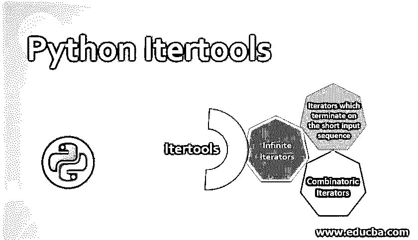
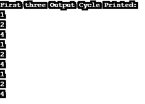
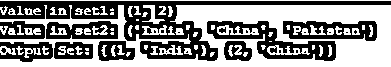
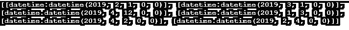

# Python Itertools

> 原文：<https://www.educba.com/python-itertools/>




## Python Itertools 简介

Python Itertools 是有助于实现内存效率的工具，如果单独或组合使用，会非常有用。这里提供的函数非常类似于 SML 和 Haskell 语言的函数。快速的性能和高效的内存处理是这些 Itertools 的两个关键功能，

### 为什么选择 Python itertools？

使用 itertools 的一个关键原因是它能够非常高效地使用内存。基于 iter 的工具在某个特定时间不占用任何大内存，因为要产生的数据在处理之前不会保存在内存中，这将自动降低内存使用能力，并相对减少大型数据集和性能问题等问题。

<small>网页开发、编程语言、软件测试&其他</small>

### Itertools 是如何工作的？

基本上，迭代的概念分为三种类型；它们如下:

1.  **无限迭代器**
2.  **终止于短输入序列的迭代器**
3.  **组合迭代器**

属于这些迭代器的函数或方法将在下面的例子中提到，

#### 1.无限迭代器

列表、元组、字典和集合等迭代器类型不一定需要穷尽，这意味着在某些情况下，它可以无限循环。这些产生无限迭代的方法被称为无限迭代器，

##### a.计数()

count()函数提到一个特定的条目在 iterable 中出现的次数。

**举例:**

```
List = [1,4,2,9,7,8,9,3,1]
print("List Verified:",List)
print("Count of value '9' in the list:",List.count(9))
```

**输出:**


##### b.itertools . cycle()

cycle()函数连续无缝地重复给定的 iterable 集合。

**举例:**

```
import itertools 
Iter_List = [1,2,4]
result = itertools.cycle(Iter_List)
count = 0
print("First three Output Cycle Printed:")
for value in result:
    count = count + 1
    if count < 10:
        print(value)
    else:
        break
```

**输出:**




##### c.itertools.repeat()

Itertools.repeat()用于将给定的值重复 n 次。

**举例:**

```
import itertools 
Iter_List = [1,2,4]
print("Print the above Iter_List 3 times")
result = itertools.repeat(Iter_List,3)
count = 0
for value in result:
    count = count + 1
    if count < 10:
        print(value)
    else:
        break
```

**输出:**


#### 2.终止于短输入序列的迭代器:

这是两个或多个迭代器在特定逻辑上组合成一个迭代器的情况。如果输入迭代器中有一个更小，那么当最短的输入用尽时，迭代器不会中断。

##### a.itertools.chain()

chain()方法用于将两个 iterable 组合成一个 iterable 实体。

**举例:**

```
import itertools
Iter1 = [4,2,4]
Iter2 = [7,1,6,8]
print("Keyed In Input List1:",Iter1)
print("Keyed In Input List2:",Iter2)
Chained_List = list(itertools.chain(Iter1,Iter2))
print("Chained List:",Chained_List)
```

**输出:**


##### b.itertools.compress()

compress()方法用于根据通过一个参数传递的布尔值有选择地选取值。

**举例:**

```
import itertools
Iter1 = ['Istanbul','Karachi','Colombo','Mumbai','Delhi','California']
Iter2 = [0,0,0,1,True,False]
print("Input List",Iter1)
Compressed_List = list(itertools.compress(Iter1,Iter2))
print("Cities in India:",Compressed_List)
```

**输出:**


##### c.itertools.dropwhile()，Itertools.takewhile()

dropwhile()返回第一次条件失败后的 iter 值列表。takewhile()返回条件第一次失败之前的 iter 值列表。

**举例:**

```
import itertools
Iter_values = [1,3,45,2,4,6,78,89,0,1,3,4,555,4]
dropwhile_List = list(itertools.dropwhile(lambda iter: iter < 10,Iter_values))
takewhile_List = list(itertools.takewhile(lambda iter: iter < 10,Iter_values))
print("Values not dropped:",dropwhile_List)
print("Values not taken:",takewhile_List)
```

**输出:**


##### d.itertools . filterfalse()

filterfalse()过滤那些不满足给定条件的迭代器。

**举例:**

```
import itertools
Iter_values = [1,3,45,2,4,6,78,89,0,1,3,4,555,4]
print("Iter Verified:",Iter_values)
filterfalse_List = list(itertools.filterfalse(lambda iter: iter < 10,Iter_values))
print("False values (Iters greater than 10):",filterfalse_List)
```

**输出:**


##### e.itertools.islice()

使用提到的索引从迭代器列表中分割提到的迭代器值范围。

**举例:**

```
import itertools
Iter_values = [1,3,45,2,4,6,78,89,0,1,3,4,555,4]
print("Iter Involved:",Iter_values)
filterfalse_List = list(itertools.islice(Iter_values,2,7))
print("Iter sliced by position:",filterfalse_List)
```

**输出:**


#### 3.组合迭代器

组合迭代器负责执行组合、排列和计算笛卡尔积。四个主要的组合迭代器如下:

##### a.itertools.product()

product()方法用于计算可迭代实体的笛卡尔值。

**举例:**

```
import itertools
Iter_values = [1,3,5]
print("Iter Involved:",Iter_values)
Cartesian_List = list(itertools.product(Iter_values,'2'))
print("Cartesian Output:",Cartesian_List)
```

**输出:**


##### b.itertools.combinations()

combinations()方法用于为给定的 iter 生成所有可能的组合。

**举例:**

```
import itertools
Iter_values = [1,3,5]
print("Iter Involved:",Iter_values)
Cartesian_List = list(itertools.combinations(Iter_values,3))
print("Cartesian Output:",Cartesian_List)
```

**输出:**


##### c.zip()

zip()函数将两个单独的、集合的数据类型项压缩到一个元组中。这意味着两个元素中的第一个项目形成结果元组中的第一个元组项目；类似地，两个元素中的第二个项目形成结果元组中的第二个元组，元组形成继续进行。当数据类型项的长度不同时，长度最小的元素决定了结束元组的长度

**举例:**

```
Set1= (1, 2)
Set2 = ("India", "China", "Pakistan")
print("Value in set1:",Set1)
print("Value in set2:",Set2)
Output_Set = zip(Set1,Set2)
print("Output Set:",set(Output_Set))
```

**输出:**




##### d.地图()

map 函数用于为 iterable 中的每个元素执行上述函数。

**举例:**

```
def myfunc(a, b):
  return a + b
x = map(myfunc, (1,2,3), (4,5,6))
print(list(x))
```

**输出:**


##### e.连续组()

如果你想遇到连续的数字、字母、日期、布尔或几个以前可排序的对象，more_itertools 下的连续组是最好的解决方案。下面提到的例子有一个很大的日期列表，列表中的一些日期非常连续，所以当其中的一些日期连续时，需要将它们传递给 group 函数。为了将这些函数传递到连续的组部分，它们最初被转换成序数，然后在其上隐含一个 comprison 以使它们迭代。然后，我们使用序数日期迭代给定的连续组列表。

**举例:**

```
import datetime
import more_itertools
dates = [ 
    datetime.datetime(2019, 2, 1),
    datetime.datetime(2019, 3, 1),
    datetime.datetime(2019, 4, 12),
    datetime.datetime(2019, 1, 3),
    datetime.datetime(2019, 4, 2),
    datetime.datetime(2019, 2, 4)
]
Actual_dates = []
for iter in dates:
    Actual_dates.append(iter.toordinal())
groups = [list(map(datetime.datetime.fromordinal, group)) 
for group in more_itertools.consecutive_groups(Actual_dates)]
print(groups)
```

**输出:**




### 结论

Itertools 无疑是 python 领域中最强大的工具之一。它们有助于产生一个内存效率和编程逻辑简化的大实例。

### 推荐文章

这是 Python Itertools 的指南。在这里，我们讨论了 Python Itertools 是 Python 领域中最强大的工具，并给出了示例。您也可以看看以下文章，了解更多信息–

1.  [Python 比较字符串](https://www.educba.com/python-compare-strings/)
2.  [Python 返回值](https://www.educba.com/python-return-value/)
3.  [Python 拆分字符串](https://www.educba.com/python-split-string/)
4.  [蟒蛇泡菜](https://www.educba.com/python-pickle/)


