# 带数据库的 Python 项目

> 原文：<https://www.educba.com/python-projects-with-database/>

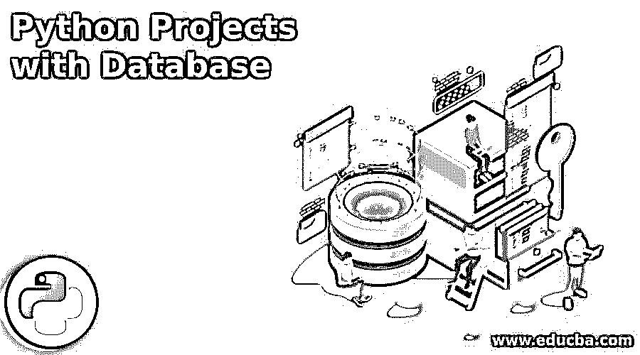

## 数据库 Python 项目简介

以下文章提供了使用数据库的 Python 项目的概要。带有数据库的 Python 项目为全球研究人员提供了实现未来职业目标的绝佳机会。现在很多开发者都在使用 Python 编程，它被广泛应用于科学编程、游戏等各种应用中。我们可以使用 PostgreSQL、MySQL、Oracle、Microsoft Server、Sybase、IBM DB2 Sqlite 等数据库。用 python 开发项目时，用 python。

### 使用数据库的顶级 Python 项目

使用 python 中的任何数据库，我们可以按照我们的逻辑实现任何项目，也可以按照客户的要求实现项目。

<small>网页开发、编程语言、软件测试&其他</small>

下面是 python 的项目，数据库如下:

#### 1.基于数据库的医药商店管理系统的 Python 项目

*   在这个项目中，我们使用了 python 版本。所以我们可以在 python 版和更高版本上运行这个项目。此外，在这个项目中，我们使用 SQLite 数据库连接到项目。
*   我们在 Sqlite 数据库中创建了一个医疗数据库来连接到这个项目。我们使用用户名和密码连接到完整的应用程序。此项目由名为 main . py python 脚本组成
*   我们使用 visual studio 创建了这个。下面是 main.py 文件代码如下。
*   在开发医药商店管理系统项目时，我们使用了 Tkinter、time、Sqlite3、random 和 tempfile 模块。我们已经使用 import 关键字导入了这个模块。
*   在第一张图片下面，我们已经在 visual studio 中创建了一个项目；在第二张图中，我们正在运行这个项目。

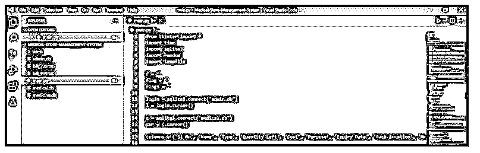

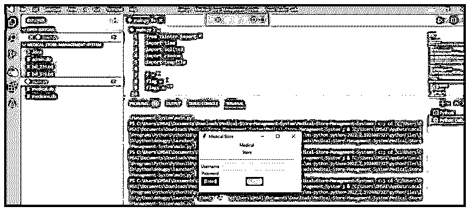

#### 2.基于数据库的学生管理系统的 Python 项目

*   在这个项目中，我们使用了 python 版本。所以我们可以在 python 版和更高版本上运行这个项目。在这个项目中，我们使用了 Sqlite 数据库来连接这个项目。
*   我们在 Sqlite 中创建了一个学生数据库来连接这个项目。该项目由名为 main student . py python 脚本组成
*   我们使用 visual studio 创建了这个。下面是 MainStudent.py 文件代码如下。
*   我们使用操作系统和平台模块来开发学生管理系统项目。我们已经使用 import 关键字导入了这个模块。
*   在第二张图中，我们已经运行了项目。我们已经显示了数据库中存在的用户列表。我们可以看到数据库服务器上有四个学生。

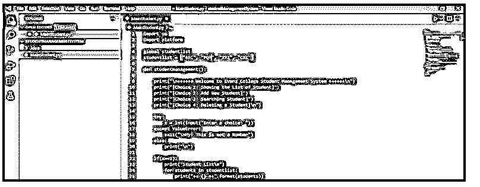

#### 3.银行管理系统的 Python 项目

*   在这个项目中，我们使用了 python 版本。所以我们可以在 python 版和更高版本上运行这个项目。此外，在这个项目中，我们使用了一个数据库来连接到这个项目，MySQL。
*   我们创建了一个 MySQL 数据库 bankdb 数据库来连接这个项目。此项目由名为 Banking-system . py python 脚本组成
*   我们使用 visual studio 创建了这个。下面是 Banking-System.py 文件代码如下。
*   在开发银行管理系统项目时，我们使用了 Tkinter 模块。我们已经使用 import 关键字导入了这个模块。
*   下面，第一个图像显示我们已经在 visual studio 中创建了一个项目；在第二张图中，我们正在运行这个项目。

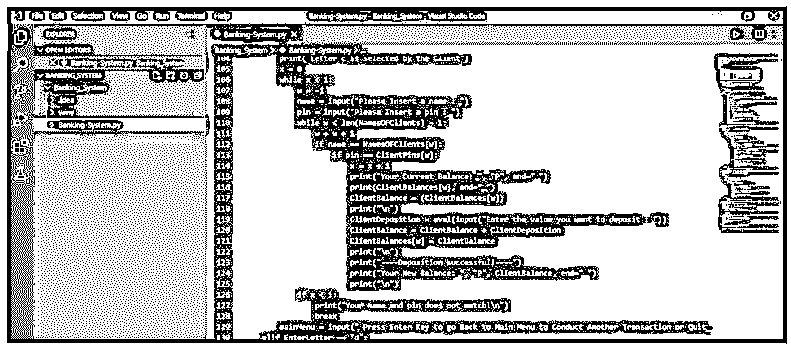

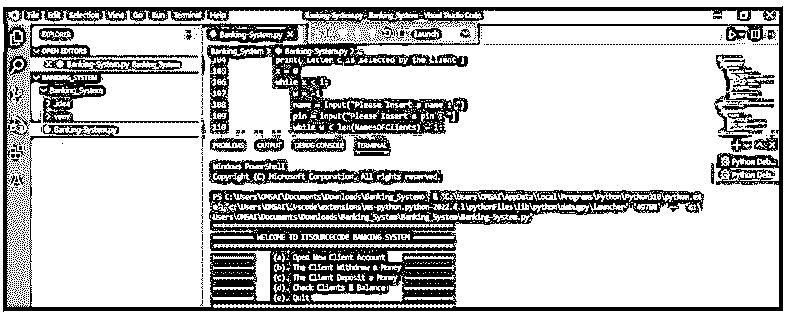

#### 4.基于数据库的员工工资管理系统的 Python 项目

*   在这个项目中，我们使用了 python 版本。所以我们可以在 python 版和更高版本上运行这个项目。此外，在这个项目中，我们使用了一个数据库来连接到这个项目，MySQL。
*   我们在 MySQL 数据库中创建了一个 empdb 数据库来连接这个项目。我们使用用户名和密码连接到完整的应用程序。此项目由名为 Employee-Payment-system . py python 脚本组成
*   我们使用 visual studio 创建了这个。下面是 Employee-Payment-System.py 文件代码如下。
*   在开发员工薪酬管理系统项目时，我们使用了 Tkinter、time、random、os 和 platform 模块。我们已经使用 import 关键字导入了这个模块。
*   下面，第一个图像显示了我们在 visual studio 中创建了一个项目；在第二张图中，我们正在运行这个项目。

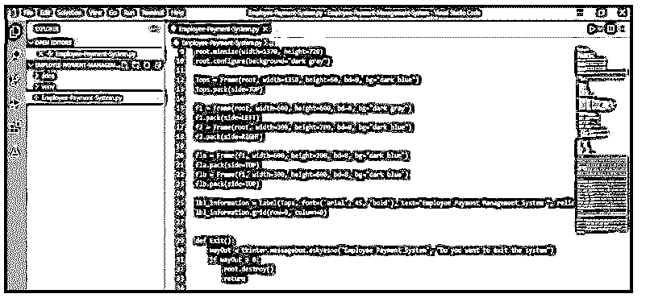

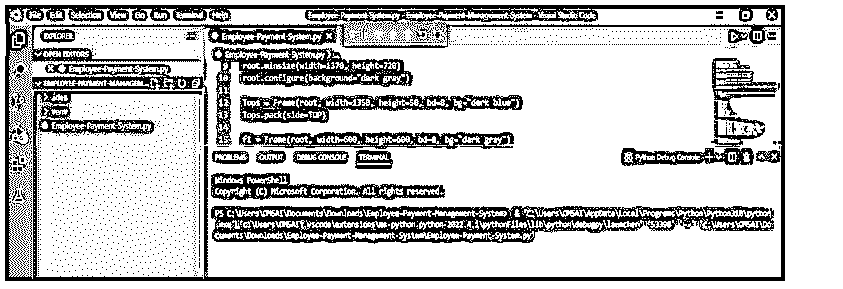

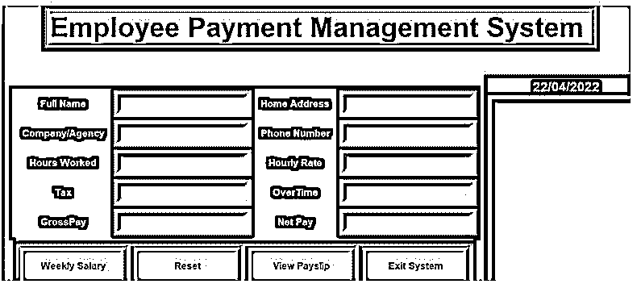

#### 5.数据库休假管理系统的 Python 项目

*   在这个项目中，我们使用了 python 版本。所以我们可以在 python 版和更高版本上运行这个项目。此外，在这个项目中，我们使用了一个数据库来连接到项目 Sqlite。
*   我们已经在 Sqlite 数据库中创建了 leaveDb 数据库来连接到这个项目。此项目由名为 leave-system . py python 脚本组成
*   我们使用 visual studio 创建了这个。下面是如下的 leave-system.py 文件代码。
*   在开发休假管理系统项目时，我们使用了 Tkinter、time、random、Sqlite、os 和 platform 模块。此外，我们已经通过使用 import 关键字导入了这个模块。
*   下面，第一个图像显示了我们在 visual studio 中创建了一个项目；在第二张图中，我们正在运行这个项目。

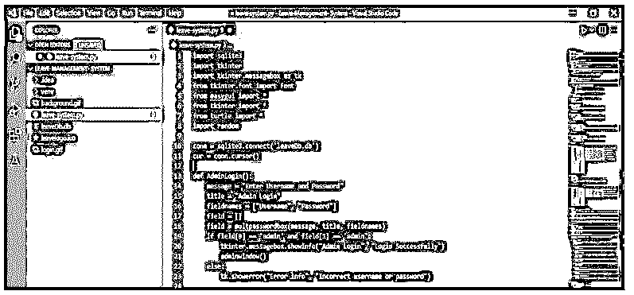

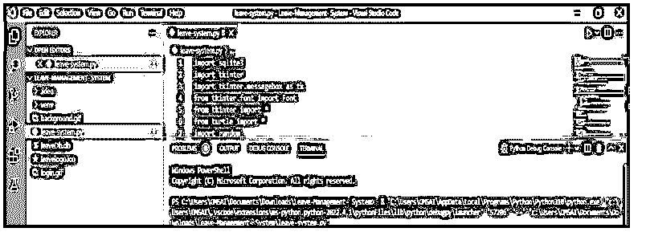

#### 6.基于数据库的高校管理系统的 Python 项目

*   在这个项目中，我们使用了 python 版本。所以我们可以在 python 版和更高版本上运行这个项目。此外，在这个项目中，我们使用了一个数据库来连接到项目 Sqlite。
*   我们在 Sqlite 数据库中创建了一个 collegedb 数据库来连接到这个项目。此项目由名为 college _ Menu.py 脚本组成
*   我们使用 visual studio 创建了这个。下面是 college_Menu.py 文件代码如下。
*   在开发一个学院管理系统项目时，我们使用了 Tkinter、time、random、Sqlite、os 和 platform 模块。我们已经使用 import 关键字导入了这个模块。
*   下面，第一个图像显示了我们在 visual studio 中创建了一个项目；在第二张图中，我们正在运行这个项目。

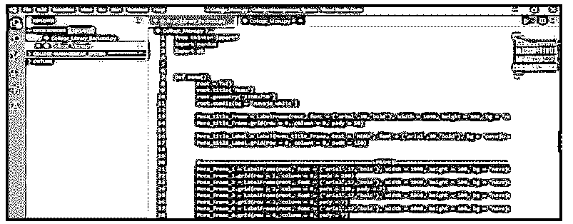

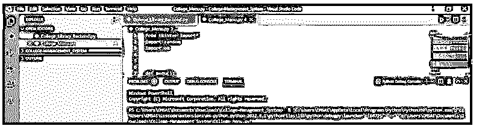

### 结论

在 python 中，我们可以使用 Sqlite、MySQL、PostgreSQL、MSSQL、Oracle、DB2 以及更多 RDBMS 和 NoSQL 数据库来实现项目。SQLite 是 python 中使用的默认数据库。Python 数据库项目为全球研究人员提供了实现未来职业目标的绝佳机会。

### 推荐文章

这是一个使用数据库的 Python 项目指南。这里我们分别讨论数据库入门和顶级 python 项目。您也可以看看以下文章，了解更多信息–

1.  [Python BeautifulSoup](https://www.educba.com/python-beautifulsoup/)
2.  [Python 连接列表](https://www.educba.com/python-join-list/)
3.  [python 中的二分搜索法](https://www.educba.com/binary-search-in-python/)
4.  [JSON 转 CSV Python](https://www.educba.com/json-to-csv-python/)

