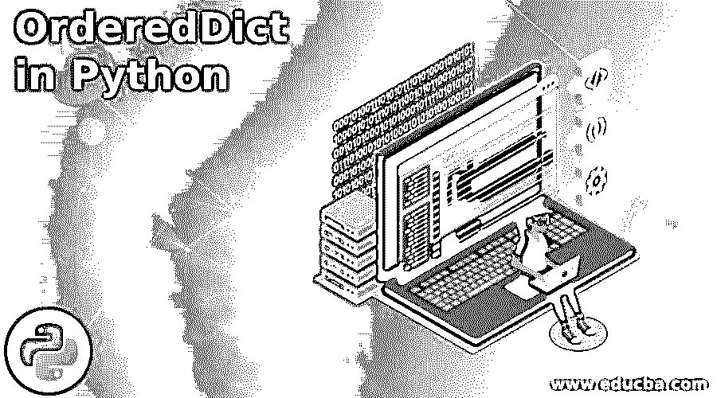
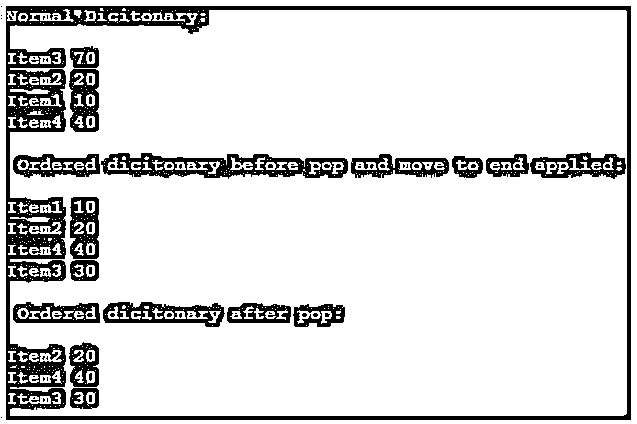

# Python 中的 OrderedDict

> 原文：<https://www.educba.com/ordereddict-in-python/>




## Python 中的 OrderedDict 简介

python 有序字典与 python 中的字典非常相似。两者没有太大区别。OrderedDict 的技术表示也非常类似于 python 字典。但是这里需要注意的关键点是，有序字典是 python 集合中的一个条目。因此，这些集合容器基本上是 python 默认数据类型(如 dict、set 等)的替换数据类型。

这里，OrderedDict 是集合容器字典下的一种数据类型。从功能角度来看，这些有序字典能够记住输入值的顺序。因此，OrderedDict 数据类型很好地实现了值的排列。因此，当添加一个新的键或更改一个现有的键时，顺序将被重新排列，就像新更改的键将作为有序 dict 数据类型中的最后一项。这是有序字典和普通字典的主要区别。

<small>网页开发、编程语言、软件测试&其他</small>

### Python 中 OrderedDict 的语法

下面给出了提到的语法:

```
from collections import OrderedDict
dictionary_variable = OrderedDict()
```

在上面的语法中，首先，从 collections 类导入 Ordered dictionary 类。这是通过 import 语句完成的。这里引用 import 语句从集合的容器中导入 OrderedDict 类。接下来，通过引用 OrderedDict 方法声明一个变量来创建一个字典变量。因此，进行该引用将激活 OrderedDict 数据类型。用户可以向有序字典中插入新条目，从那里开始，字典将保持插入的顺序。重要的是，这里使用的字典变量将作为 OrderedDict()来操作。有序字典的一个关键点是，在 python 版本中，有序字典将消耗大量的能量。这个能量比同一个 2.7 版本的普通词典消耗的能量要大得多。此外，有序 dict 和普通 dict 之间的这种内存差异在 python 2.7 版本中会出现，因为双链接实现列表以特定的顺序存储值，以保持插入的顺序。所以使用这个双向链表会消耗大量的内存。更有趣的 python 普通字典本身确保从 python 3.7 版本开始保持插入顺序。因此，从 python 3.7 版本开始，不再使用 ordered dict 来确保插入的顺序，普通的字典本身将满足这种需要。这是 python 3.7 版本中字典的巨大优势。

### 功能按顺序排列

下面是按顺序排列的函数:

#### 1.popitem(last=True)

pop item 方法用于弹出或移除特定的(键-值)对。因此，pop 条目负责从字典中删除一个条目。因此，当需要从字典中删除一个特定的条目时，可以使用有序字典。pop item 方法有一个名为 last 的参数；最后一个参数有两个值，True 或 False。当最后一个变量被赋值为 True 时，pop 将按照后进先出原则(LIFO)运行。而当 last=False 时，弹出操作将按照 FIFO 原则进行。所以根据 FIFO，当调用 pop 时，第一个插入的项将作为第一个输出的项弹出。

#### 2.move_to_end(key，last=True)

move to end 方法用于将特定的键作为字典中的最后一项移动。因此，当一个键需要移动到最右端或最左端时，可以使用 move to end 方法。移动到末尾的工作方式是，当 last=true 时，所指示的键将被移动到字典的右侧末尾。而当 last=false 被设置时，该键被定位到字典的左端。因此，最后一个参数决定了新插入的键必须放在字典的左端还是右端。像这样的函数为重新排列 OrderedDict 字典带来了很大的灵活性。这是在普通字典上使用 OrderedDict 的主要优点之一。存在的键的位置可以灵活地移动或放置在字典项目中的必要位置。

### Python 中的 OrderedDict 示例

以下是 Python 中 OrderedDict 的示例:

**代码:**

```
from collections import OrderedDict
print("Normal Dicitonary:\n")
Normal_dict = {}
Normal_dict['Item1'] = 10
Normal_dict['Item2'] = 20
Normal_dict['Item3'] = 30
Normal_dict['Item4'] = 40
Normal_dict['Item3'] = 70
for item_key, item_value in Normal_dict.items():
    print(item_key, item_value)
ordered_dict = OrderedDict()
ordered_dict['Item1'] = 10
ordered_dict['Item2'] = 20
ordered_dict['Item3'] = 30
ordered_dict['Item4'] = 40
ordered_dict.move_to_end('Item3')
print("\n Ordered dicitonary before pop and move to end applied:\n")
for item_key, item_value in ordered_dict.items():
    print(item_key, item_value)
ordered_dict.popitem(last=False)
print("\n Ordered dicitonary after pop:\n")
for item_key, item_value in ordered_dict.items():
    print(item_key, item_value)
```

**输出:**




**说明:**

*   在上面的例子中，创建了两个字典。首先，创建一个普通的 python 字典，并在其中插入和显示条目。然后，创建的有序字典首先被应用于移动到结尾功能。因此，应用于第三个条目的 end 函数使得第三个条目成为字典中的最后一个条目。
*   接下来，应用弹出项目方法。这个 pop 项目从字典中删除第一个项目，因为 pop 是用参数 last=false 应用的。此外，从 python 3.7 版本开始，不再使用 OrderedDict 来确保插入的顺序，普通的字典本身将满足这种需要。

### 结论

像 ordered dict 这样的集合在实现 LRU 缓存功能时非常有用。因此，这种功能类似于项目的 LRU 缓存(期望项目的排列保持排列的顺序)是 OrderedDict 功能被广泛应用的主要领域之一。OrderedDict 和其他映射对象的对象之间的相等性测试对排序不敏感，就像普通字典一样。这是有序字典与普通字典的主要区别。

### 推荐文章

这是 Python 中 OrderedDict 的指南。这里我们分别讨论介绍、有序函数和示例。您也可以看看以下文章，了解更多信息–

1.  [Python 中的 Shell 排序](https://www.educba.com/shell-sort-in-python/)
2.  [Python 中的插入排序](https://www.educba.com/insertion-sort-in-python/)
3.  [Python 中的烧瓶](https://www.educba.com/flask-in-python/)
4.  [Python 列表扩展](https://www.educba.com/python-list-extend/)


