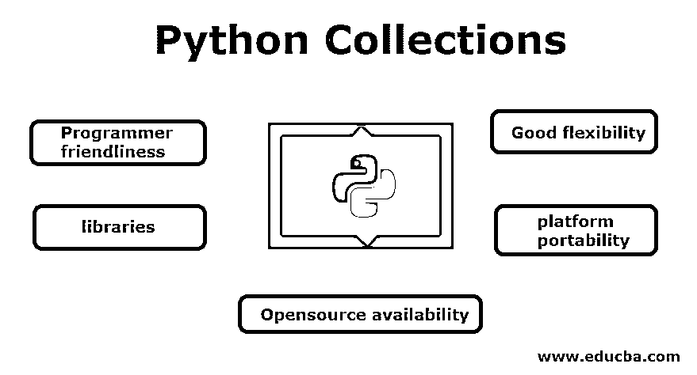

# Python 集合

> 原文：<https://www.educba.com/python-collections/>




## Python 集合简介

在 Python 中，集合是用来存储数据集合的容器，包括列表、集合、元组等。实体是具有[各种集合模块](https://www.educba.com/collection-module-in-python/)的内置组件，如 Counter OrderedDict、ChainMap、enum 等。Python 中引入了 Enum 来增强内置容器的功能，内置容器也有额外的数据结构来存储数据集合，并帮助操作，如添加到字典中的嵌套列表，在插入时保持条目排序，等等。

### 为什么人们会考虑 python？

1.  程序员友好和易于理解
2.  广泛的支持库
3.  良好的灵活性
4.  平台可移植性(跨任何平台扩展的能力)
5.  开源可用性

### Python 集合

集合是 python 中集合模块下的数据类型。它能容纳大量非常有用的容器。这些集合是对象驱动的，因为它们是从一个叫做集合的独立模块中提取的。因此，为了访问这些数据类型，需要对象声明。

<small>网页开发、编程语言、软件测试&其他</small>

下面列出了 python 中的关键集合模块，

#### 1.有序直接

Order dict 非常类似于普通的 dict，除了它对于重新排序操作更有效。有序字典非常严格地保持其插入顺序。有序字典的一些协议如下，

*   当插入与现有键相同的键时，有序字典集合用新键替换现有键
*   删除并重新插入条目会将新条目作为最后一项插入
*   通常的字典是打算在映射操作上非常一流。
*   在算法上，OrderedDict 能够比 Dict 更好地把握循环重排过程。

**字典中使用的关键功能如下**

| **功能** | **描述** |
| Python 字典清除() | 移除所有项目 |
| Python 字典副本() | 返回字典的浅拷贝 |
| Python 字典 fromkeys() | 根据给定的序列创建字典 |
| Python 字典 get() | 求一个键的值 |
| Python 字典项目() | 返回字典的(键，值)对的视图 |
| Python 字典键() | 打印密钥 |
| Python Dictionary popitem() | 移除字典的最后一个元素 |
| Python 字典 setdefault() | 如果键不存在，则插入带值的键 |
| Python 字典 pop() | 移除并返回具有给定键的元素 |
| Python 字典值() | 返回字典中所有值的视图 |
| Python 字典更新() | 更新字典 |

**举例:**

```
from collections import OrderedDict
o=OrderedDict()
p=OrderedDict({'a':1,'b':2})
o['a']=3
o['b']=2
o['c']=1
o.popitem()
print('print the keys :', o.keys())
print('print the Values :', o.values())
print("Value of key a = ", o.get('a'))
print(p) 
```

**输出:**

打印键:odict_keys(['a '，' b'])
打印值:odict_values([3，2])
键 a = 3 的值
OrderedDict([('a '，1)，(' b '，2)])

#### 2.计数器

这是 dict 子类的另一个容器，用于保存容器中所有值的出现次数。

**举例:**

```
from collections import Counter
a=(1,2,3,1) 
b=[1,2,3]
c={1,2,3,1}
d={'1':'anand','2':'kumar','3':'ravi'}
e='anand'
print('Count of a : ',Counter(a))
print('Count of b : ',Counter(b))
print('Count of c : ',Counter(c)) #sets do not allow duplicates
print('Count of d : ',Counter(d)) 
print('Count of e : ',Counter(e)) #counter on string
print('print most common value in a :'a.most_common(1)) 
```

**输出:**

a 的计数({1: 2，2: 1，3:1 })
b 的计数({1: 1，2: 1，3:1 })
c 的计数({1: 1，2: 1，3:1 })
d 的计数({'3': 'ravi '，' 2': 'kumar '，' 1 ':' Anand ' })
e 的计数({'a': 2，' n': 2，' d': 1})
打印最多

**思考要点:**

*   使用字典上的计数器被认为是手动初始化上述键的计数值
*   element()方法用于计数器上的迭代
*   most_common()用于查找具有最多频率的值

#### 3.双端队列

在 python 集合中，[dequee 表示一个双端队列](https://www.educba.com/deque-in-c-plus-plus/)，它允许将值添加到队列的前端和后端。双端队列中允许的操作如下:

*   Append()–将值追加到右侧
*   append left()–将值追加到左侧
*   pop()–删除右端的值
*   pop left()–删除左端的值

**举例:**

```
import collections
a=collections.deque('anand')
b=collections.deque((1,2,2))
c=collections.deque({1,2,3,1})
print('Queue_a',a)
print('Queue_b',b)
print('Queue_c',c)
a.append('#')
a.appendleft('#')
print('After append :',a)
b.pop()
b.popleft()
print('After Removal :'b)
c.clear()
print('After clearing the Queue :',c) 
```

**输出:**

Queue _ a dequee([' a '，' n '，' a '，' n '，' d '])
Queue _ b dequee([1，2，2])
Queue _ c dequee([1，2，3])
在 append 之后:dequee([' # '，' a '，' n '，' a '，' n '，' d '，' #'])

#### 4.命名元组

命名元组[与字典](https://www.educba.com/dictionary-in-python/)非常相关，因为这里的字典到键都是用值标记的。字典和命名元组之间的关键区别在于，这些命名元组允许以键值和迭代的形式访问其元素。对命名元组执行的关键操作如下:

这里可以通过索引访问属性值，而字典不允许这样做。

**举例:**

```
Point = namedtuple('Point', ['x', 'y'])
p = Point(11, y=22) # instantiate with positional or keyword arguments
p[0] + p[1]         # indexable like the plain tuple (11, 22) 
```

**输出:**

Thirty-three

### 结论

Python 是一种拥有大量库的语言，集合就是其中之一，在很大程度上是集合数据类型中的高级菜单。

### 推荐文章

这是 Python 集合的指南。在这里，我们详细讨论了基本概念、不同的 python 集合以及示例。您也可以浏览我们推荐的其他文章，了解更多信息——

1.  [Python 运算符](https://www.educba.com/python-operators/)
2.  [Python 字符串函数](https://www.educba.com/python-string-functions/)
3.  [Python 替代品](https://www.educba.com/python-alternatives/)
4.  [Python 字典键](https://www.educba.com/python-dictionary-keys/)


