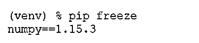
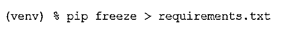

# Python Virtualenv

> 原文：<https://www.educba.com/python-virtualenv/>


## Python Virtualenv 简介

venv 模块的 Python 虚拟环境为开发人员提供了使用独立目录创建轻量级虚拟环境的能力。该目录也可以不同于系统目录，也就是说，它也可以被选择性地隔离。每个 python 虚拟环境都可以有自己的 python 二进制文件，也可以有自己的独立 python 包安装在其站点目录中。如果我们有不同的项目要做，并且需要分别保存它们的依赖关系，那么可以使用 Python 虚拟环境。python virtualenv 使其成为 python 中使用最广泛的特性。

**语法:**

<small>网页开发、编程语言、软件测试&其他</small>

下面提到了创建虚拟环境的语法。

`python3 -m venv /path/to/new/virtual/environment`

此命令不会提供任何输出，但会在后台执行以下操作:

*   它创建一个目标目录。
*   它还创建父目录，即使它们以前不存在
*   它将一个 python 环境文件放在目录中。该文件是–py venv . CFG
*   它还创建了一个包含 python 二进制文件的子目录。

### 为什么我们需要 Python 中的虚拟环境？

考虑这样一个场景，您正在处理两个不同的项目，其中一个使用 Django 1.9，另一个需要 Django1.10

在这种情况下，虚拟环境在维护多个项目的依赖性方面非常有效。也可以通过 windows 调用其他命令:

`c:\>c:\Python35\python -m venv c:\path\to\myenv`

`c:\>python -m venv c:\path\to\myenv`

### 虚拟环境创建是如何工作的？

在这里，我们讨论了不同的参数传递的虚拟环境创建工作。

#### 位置参数

在调用函数时传递这些参数是特定于顺序的。

*   ENV_DIR: 它是一个位置参数，在我们工作的环境中创建目录。

#### 可选参数

这些参数也可以跳过。简而言之，顾名思义，这些都不是必须的。

*   **-h 或–help:**该可选参数在虚拟环境创建和退出期间显示帮助消息。
*   **–system-site-packages:**此可选参数提供对正在创建的虚拟环境的 site-packages 目录的访问。
*   **–符号链接:**这个可选参数更喜欢使用符号链接，而不是使用副本。
*   **–copies:**这个可选参数更喜欢使用副本，而不是使用符号链接。

**举例:**

让我们举一个例子来理解在创建 python 虚拟 env 时创建 env 目录:

```
## Python program to understand how virtual env works in python
def create(self, env_dir):
## Function to create a virtualized python directory
##Target directory is the env_dir
env_dir = os.path.abspath(env_dir)
context = self.ensure_directories(env_dir)
self.create_configuration(context)
self.setup_python(context)
self.setup_scripts(context)
self.post_setup(context) 
```

最终，这个程序将不提供任何输出，而是在后端运行几个进程。

*   **确保目录(env_dir):** 这个函数最终会创建所有需要的目录。这个函数一被调用就返回一个上下文对象
*   这些目录以前也可能存在
*   **create _ configuration(context):**该函数将创建一个配置文件。好听的名字叫 pyvenv.cfg
*   **setup_python(context):** 对于驻留在环境中的 python 可执行文件，此函数创建符号链接的副本
*   **setup_scripts(context):** 每个虚拟环境都需要一个激活脚本，这就是该函数创建的内容。
*   **post_setup(context):** 它提出了一个占位符方法来预安装软件包。

### 我们如何管理 Python virtualenv？

复制相同工作的最简单的方法是在我们项目的根目录中包含一个需求文件。

#### 例子

让我们举个例子来详细理解这一点:

**代码:**

`(venv) % pip freeze
numpy==1.15.3`

**输出:**




为了实现同样的功能，我们运行了 pip freeze:

*   这确实提供了所有已安装的第三方软件包及其版本号的列表
*   该命令的输出，即所有已安装的第三方软件包及其版本号的列表，被写入一个名为–requirements . txt 的文件中
*   此外，我们可以利用相同的命令来重写需求文件，无论何时我们安装一个新的包或者更新这个包

**代码:**

`(venv) % pip freeze > requirements.txt`

**输出:**




现在，如果我们共享这个项目，并尝试在另一个虚拟环境中运行它，那么我们将能够轻松地做同样的事情。

### 我们如何复制 Python Virtualenv？

通常，我们倾向于排除 venv/文件夹，这就是为什么我们将 requirements.txt 文件作为在其他虚拟环境中复制项目代码的主要依赖项。

要运行在一台机器上创建的项目，

*   我们需要做的就是在项目根目录中创建一个虚拟 env。

`python3 -m venv venv/`

*   然后，我们需要使用下面的命令在活动的虚拟环境中安装项目依赖项:

`pip install -r requirements.txt`

这创建了项目环境的一个副本，最终使我们也在另一个虚拟环境上运行项目。

#### 激活虚拟环境

为了激活您在中创建的用于管理多个项目的多个虚拟环境，您只需使用“激活”命令。

`mypython\Scripts\activate`

#### 停用虚拟环境

为了停用您在中为管理多个项目而创建的多个虚拟环境，您只需使用“停用”命令。

`deactivate`

配置多个 python 环境非常有用，可以测试多个库，或者处理您正在处理的不同项目的多个依赖关系。这使得它成为 python 中使用最广泛的特性。

### 结论

*   虚拟 env 是安装在您的机器上的原始 python 版本的简单副本，具有继承现有 Python 库/包的选项。
*   此外，您可以根据需要安装不同版本的相同库/包的变体库。
*   当涉及到共享系统时，它非常有用。因为它为每个用户提供了创建他们自己的虚拟环境的能力
*   使用一个名为 virtualenv 的模块来创建隔离的 python 虚拟 env。它实际上创建了一个文件夹，其中包含启动该操作所需的所有必要目录。

### 推荐文章

这是 Python Virtualenv 的指南。在这里，我们讨论 python virtualenv 的介绍，以及为什么我们需要 python 中的虚拟环境以及编程示例。您也可以看看以下文章，了解更多信息–

1.  [Python 并发](https://www.educba.com/python-concurrency/)
2.  [Python argparse](https://www.educba.com/python-argparse/)
3.  [Python 唯一列表](https://www.educba.com/python-unique-list/)
4.  [Python 计数器](https://www.educba.com/python-counter/)


