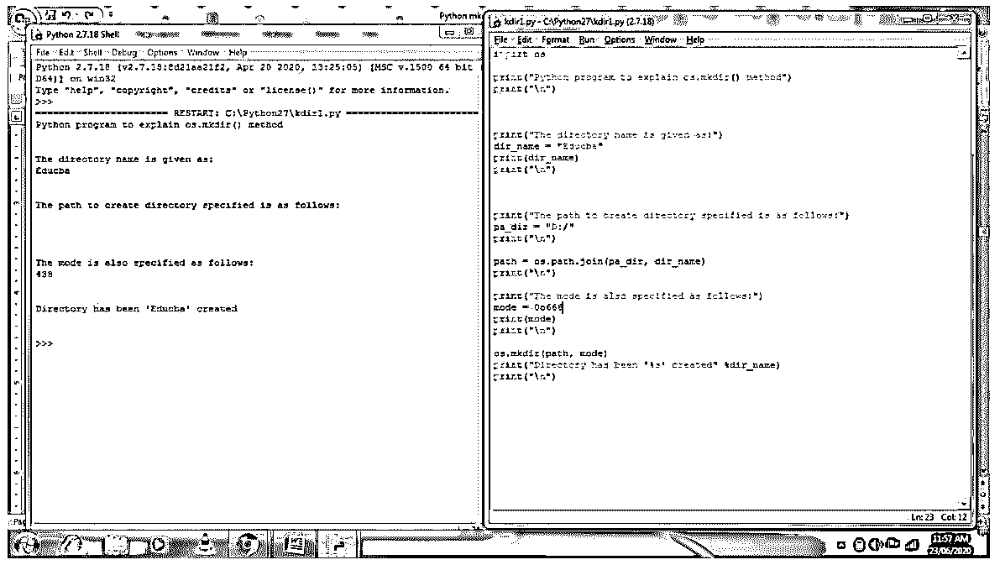
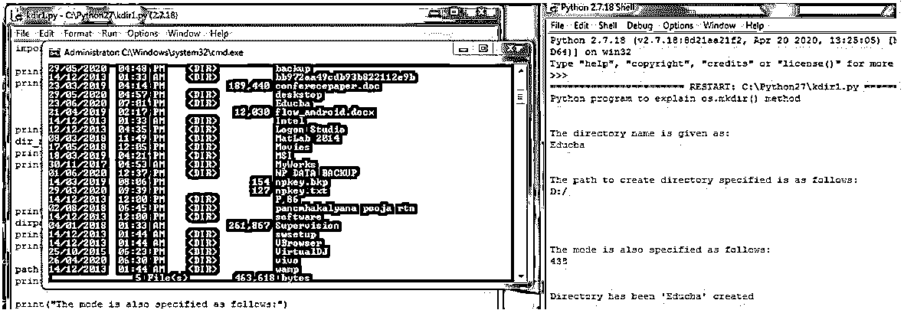
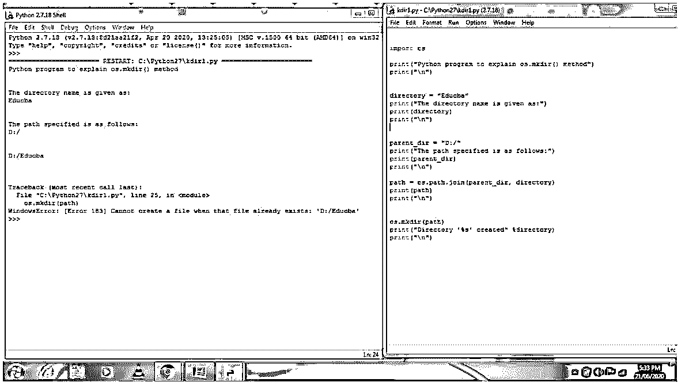
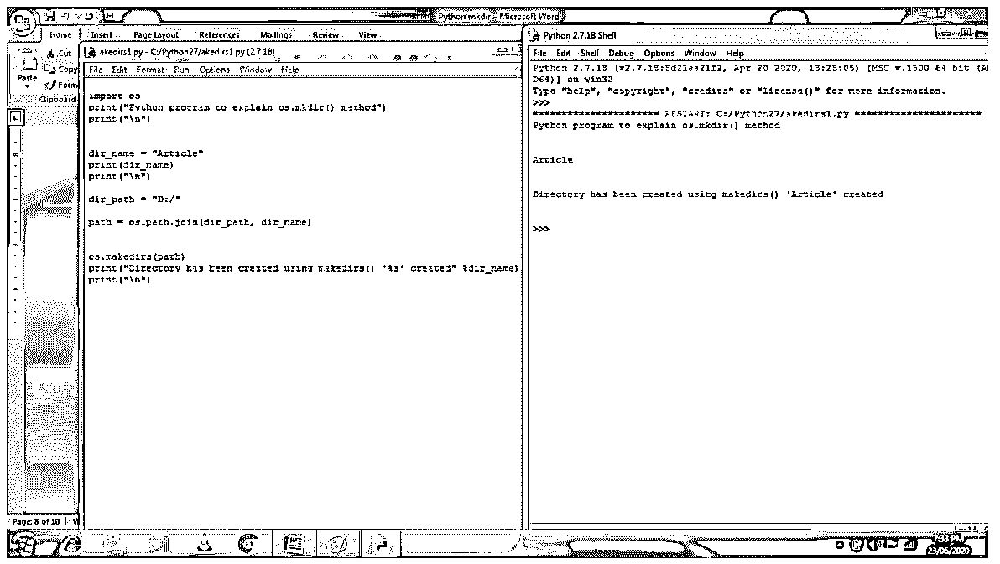

# Python mkdir

> 原文：<https://www.educba.com/python-mkdir/>


## Python mkdir 简介

在本文中，我们将看到 Python mkdir，它用于创建或制作一个新目录。这个 mkdir 是许多不同脚本语言中的命令，如 PHP、Unix 等。而在像 DOS 这样的老版本中，OS/2 也使用这样的命令，但是在这些 OS 中 mkdir 被 md 代替了。在 Python 中，我们可以使用 mkdir 创建一个目录，mkdir 是 Python 中的一个方法，由 OS 模块提供，用于与操作系统交互。在 Python 中，它可以被声明或定义为 os.mkdir()方法来创建目录，我们指定一个数值模式 path 作为它的参数。

### 在 Python 中使用 mkdir 的示例

os.mkdir()方法，由 os 模块获得，用于与操作系统交互，提供了一种使用 OS 相关功能的方法。在这个操作系统模块中有不同的功能，并且获得的任何错误都由 OSError 引起，例如不正确的或不可访问的文件名和路径。在 Python 中，os.mkdir()函数用于创建名为 path 的新目录以及指定的模式。当我们试图创建一个已经存在的目录时，这个函数会产生一个错误，称为 FileExistsError。

<small>网页开发、编程语言、软件测试&其他</small>

**mkdir()函数的语法:**

```
os.mkdir(path, mode =0o777, *, dir_fd = none)
```

**参数:**

*   **path:** 该参数用于指定文件系统路径，该路径可以是代表类路径对象的字符串或字节对象。
*   **mode:** 也是可选参数，在创建目录时用整数值表示，如果不指定该参数，则取默认值 0o777。
*   ***:** 用于表示以下参数及其名称为仅关键字参数。
*   **dir_fd:** 这也是一个可选参数，用作文件描述符，引用目录，默认值为 none。

这个函数 os.mkdir()不返回任何值，这意味着它不能返回任何值。

#### 示例#1

mkdir()函数的例子。

**代码:**

```
import os
os.mkdir('sample')
print('The directory is created.')
```

**输出:**


在上面的程序中，我们可以看到使用 Python 中 OS 模块的 mkdir()函数创建目录的简单代码。在上面的代码中，我们可以看到我们已经创建了一个名为“sample”的目录，一旦完成，我们就打印出该目录已创建。

#### 实施例 2

现在让我们详细看看如何在创建目录时指定路径和模式来创建目录。我们还将看到如何在命令提示符下交叉检查目录的创建。让我们看看下面的例子目录的创建。

**代码:**

```
import os
print("Python program to explain os.mkdir() method")
print("\n")
print("The directory name is given as:")
dir_name = "Educba"
print(dir_name)
print("\n")
print("The path to create directory specified is as follows:")
pa_dir = "D:/"
print("\n")
path = os.path.join(pa_dir, dir_name)
print("\n")
print("The mode is also specified as follows:")
mode = 0o666
print(mode)
print("\n")
os.mkdir(path, mode)
print("Directory has been '%s' created" %dir_name)
print("\n")
```

**输出:**







在上面的程序中，我们可以看到我们正在创建目录，一个指定路径，另一个指定模式。在上面的输出屏幕截图中，我们可以看到程序和程序广告的输出，以确认目录是否已创建。我们可以在命令提示符中看到它以及创建日期和时间。

#### 实施例 3

在 Python 中，这个 mkdir()函数在使用时可能会引发一个名为 FileExistsError 的错误。

上面的程序，如果我们试图再次执行，或者如果我们试图创建一个已经在驱动器中的目录，那么它将给出错误，它可以显示为下面的输出。

**输出:**




在上面的程序中，我们试图创建一个已经创建的相同目录，但它会给出一个错误，因为输出中已经存在一个文件。因此，可以通过使用 OSError 和 try 和 except 块来处理此类错误。

在本文中，我们看到了使用操作系统在 Python 中创建目录。mkdir()函数，其中我们将目录路径作为参数传递，以指定目录必须位于的位置，mode 是可选参数，它指定创建目录时使用的文件权限。在 Python 中，有另一个称为 makedirs()的函数，它类似于 mkdir，用于创建目录，但它用于创建递归目录，这要求所有中间级目录也包含叶目录。

#### 实施例 4

现在让我们演示如何声明或使用 Python makedirs()方法以及下面的语法和示例。

**语法:**

```
makedirs(path [,mode])
```

在上述语法中，参数可以详细说明如下:

*   **路径:**用于指定递归创建目录的路径。
*   **模式:**该参数给目录指定文件权限的模式。

这个函数也不会返回任何值，因为函数 mkdir()也不会返回任何值。

**代码:**

```
import os
print("Python program to explain os.mkdir() method")
print("\n")
dir_name = "Article"
print(dir_name)
print("\n")
dir_path = "D:/"
path = os.path.join(dir_path, dir_name)
os.makedirs(path)
print("Directory has been created using makedirs() '%s' created" %dir_name)
print("\n")
```

**输出:**




在上面的程序中，我们可以看到目录文章也被创建了。

### 结论

在本文中，我们得出结论，mkdir()函数用于在 Python 中创建目录，它由 OS 模块提供，并声明为 os.mkdir()方法，用于在 Python 中创建目录。我们还看到了本文中的示例和语法，其中我们看到了如何指定用于指定要创建的目录的位置的路径。在本文中，我们还看到了另一个类似于 mkdir()函数的函数，用于使用 makedirs()创建递归目录。

### 推荐文章

这是 Python mkdir 的指南。在这里，我们讨论 Python mkdir 的介绍以及 mkdir 的编程示例。您也可以看看以下文章，了解更多信息–

1.  [Python BeautifulSoup](https://www.educba.com/python-beautifulsoup/)
2.  [Python 中的队列](https://www.educba.com/queue-in-python/)
3.  [Python 逆向列表](https://www.educba.com/python-reverse-list/)
4.  [Python 字符串操作](https://www.educba.com/python-string-operations/)


