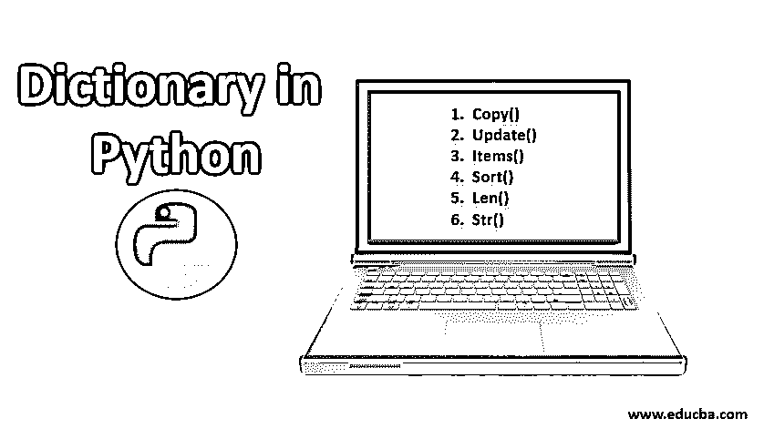
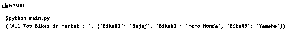
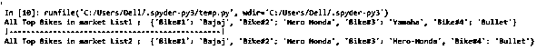
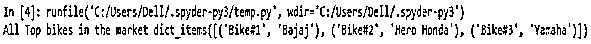
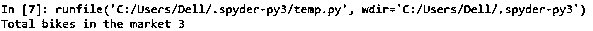
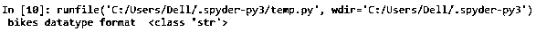
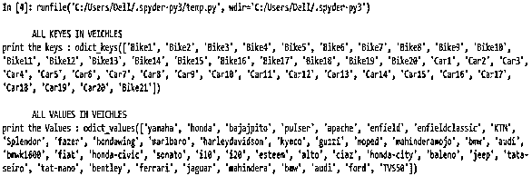
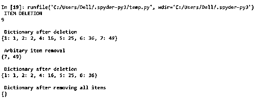
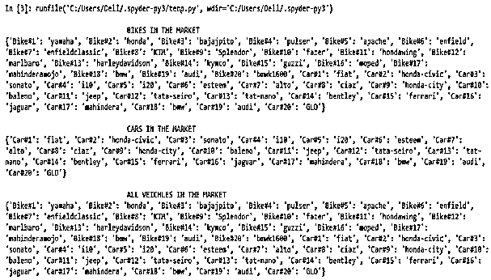

# Python 中的字典

> 原文：<https://www.educba.com/dictionary-in-python/>




## Python 中的字典介绍

Python 有许多数据结构，其中之一是字典，这是一个无序的、有索引的条目集合，其中的条目以键值对的形式存储。并且键是唯一的，而值是可以改变的，当键已知时，字典为更快的检索而优化，值可以是任何类型，但是键是不可变的，只能是字符串，数字或元组字典写在花括号内。

**语法:** `{ Key : Value }`

<small>网页开发、编程语言、软件测试&其他</small>

**举例:**

{ 'A ':'苹果'，' B ':'球'，' c ':'猫'，' d ':'狗'，' e ':'大象'

f ':'frog '，' g':'gel '，' h':'head '，' i':'impala '，' j':'jug' }

如上所述，字典用大括号括起来，并带有与之相关联的键、值格式。在我们上面的例子中，“A”作为键，“Apple”是与之相关的值。在这种情况下，主键的概念被严格维护。这意味着像附加的不仅仅是一次的等价键不能被赋值。

### Python 字典中的方法

下表显示了 Python 中字典的方法:

| **方法** | **描述** | **语法** |
| 复制() | 整个词典将被复制到新词典中 | dict.copy() |
| 更新() | 帮助更新现有的字典项目 | 字典更新(字典 2) |
| 项目() | 用于显示字典的条目 | dict.items() |
| 排序() | 允许对字典项目进行排序 | dict.sort() |
| len() | 用于确定字典中条目的总数 | len(字典) |
| Str() | 将字典转换成可打印的字符串格式 | Str(字典) |

下面是给出的方法:

#### 1.复制()

为了将一个字典复制到另一个字典，使用了 copy 方法，因此一个字典的键-值对将被复制到另一个字典。对具有现有内容的字典使用这一过程使得所有活动的字典对与新的字典对一起被放回原处。所以这所有的项都将被复制，并成为新声明的字典项的一个组成部分。在下面的例子中，我们可以注意到字典 Bikes 的组件被复制到一个新提到的变量 Vehicles 中，由于它的赋值，这个变量本身被转换成一个字典。

**代码:**

```
Bikes = {'Bike#1':'Bajaj','Bike#2':'Hero Honda', 'Bike#3':'Yamaha' }
Vehicles = Bikes.copy()
print("All Top Bikes in market : ", Vehicles)
```

**输出:**




#### 2.更新()

更新的过程定义了两种方法；一种是向现有字典添加新元素，或者更新现有字典的键-值对。因此，当添加一个新条目时，它会被追加到词典的末尾。类似地，当现有的字典组件被更新时，组件的位置不会有任何变化；只有更新会应用于受影响的物件。下面描述了相同的例子。在下面的示例中，字典中添加了一个名为 Bike#4 的新元素，其值为 Yamaha。在下一个实例中，修改现有的项目 Bike#3，从而将 Hero Honda 的当前值更改为 Hero-Honda。如输出快照中所示，更改仅应用于相应的项目，并且不存在任何位置更改。

**代码:**

```
Bikes={'Bike#1':'Bajaj','Bike#2':'Hero Honda','Bike#3':'Yamaha' }
Bikes.update({'Bike#4' : 'Bullet'})
print("All Top Bikes in market List1 : ", Bikes)
print("!------------------------------------------------!")
Bikes.update( {'Bike#3' : 'Hero-Honda'})
print("All Top Bikes in market List2 : ", Bikes) 
```

**输出:**




#### 3.项目()

items 方法用于显示 python 字典中的所有元素(元组)。因此，当一个字典项被应用到一个 items 方法时，与该字典相关联的所有键和值都将被显示。在下面的例子中，dictionary Bikes 被应用于 items()方法，这使得如下所示的每辆自行车的名称及其关键字都被显示在控制台中。

**代码:**

```
Bikes={'Bike#1':'Bajaj','Bike#2':'Hero Honda','Bike#3':'Yamaha' }
print('All Top bikes in the market',Bikes.items()) 
```

**输出:**


#### 4.排序()

可以使用 sort()方法对字典的元素进行排序。该方法相应地对字典中的每个元素进行排序。

**代码:**

```
Bikes={'Bike#1':'Bajaj','Bike#2':'Hero Honda','Bike#3':'Yamaha' }
Bike_sorted = Bikes.items()
print('All Top bikes in the market',Bike_sorted) 
```

**输出:**




#### 5.len()

len()方法用于确定给定字典组件中的计数元素。因此将显示相应字典中键-值对的总数。此外，这充当包装器方法，因此这意味着字典项将被包装到长度方法中。

**代码:**

```
Bikes={'Bike#1':'Bajaj','Bike#2':'Hero Honda','Bike#3':'Yamaha' }
print('Total bikes in the market',len(Bikes)) 
```

**输出:**




#### 6.str()

str()方法用于将字典转换成字符串格式。这更像是一种类型转换方法。因此，类型转换意味着将一种数据类型的组件转换为不同的数据类型值。这再次暗示了一个包装器过程，其中受影响的字典组件将被包装到 str()方法中。下面的例子清楚地显示了生成的字典组件已经被转化为字符串组件。因此，这意味着所有的项目，相应的键和值将被视为字符串的组成部分。

**代码:**

```
Bikes = {'Bike#1' : 'Bajaj','Bike#2' : 'Hero Honda','Bike#3' : 'Yamaha' }
Bikes_str = str(Bikes)
print(' bikes datatype format ',type(Bikes_str)) 
```

**输出:**




### Python 有序字典

Orderdict 非常类似于 python 编程中的普通字典数据类型；除此之外，有序字典对于重组操作更有效。在这里，插入的顺序被非常严格地保持着。有序字典最重要的协议如下:

*   将现有的键元素插入到有序字典中会用新的键项替换现有的键。
*   有序字典中的任何删除和重新插入意味着被删除的项目将作为新的和最后的项目被托管到字典中。
*   从算法上来说，OrderedDict 能够比普通的字典更好地捕捉间歇性的洗牌行为。

### Python 字典中的函数

字典中使用的关键功能如下:

| **功能** | **描述** |
| Python 字典清除() | 移除所有项目 |
| Python 字典副本() | 返回字典的浅拷贝 |
| Python 字典 fromkeys() | 根据给定的序列创建字典 |
| Python 字典 get() | 求一个键的值 |
| Python 字典项目() | 返回字典的(键，值)对的视图 |
| Python 字典键() | 打印密钥 |
| Python Dictionary popitem() | 移除字典的最后一个元素 |
| Python 字典 setdefault() | 如果键不存在，则插入带值的键 |
| Python 字典 pop() | 移除并返回具有给定键的元素 |
| Python 字典值() | 返回字典中所有值的视图 |
| Python 字典更新() | 更新字典 |

**代码:**

```
from collections import OrderedDict
Veichles_ordered_dict=OrderedDict({'Bike1':'yamaha','Bike2':'honda','Bike3':'bajajpito','Bike4':'pulser','Bike5':'apache','Bike6':'enfield','Bike7':'enfieldclassic','Bike8':'KTM','Bike9':'Splendor','Bike10':'fazer','Bike11':'hondawing','Bike12':'marlbaro','Bike13':'harleydavidson','Bike14':'kymco','Bike15':'guzzi','Bike16':'moped','Bike17':'mahinderamojo','Bike18':'bmw','Bike19':'audi','Bike20':'bmwk1600','Car1':'fiat','Car2':'honda-civic','Car3':'sonato','Car4':'i10','Car5':'i20','Car6':'esteem','Car7':'alto','Car8':'ciaz','Car9':'honda-city','Car10':'baleno','Car11':'jeep','Car12':'tata-seiro','Car13':'tat-nano','Car14':'bentley','Car15':'ferrari','Car16':'jaguar','Car17':'mahindera','Car18':'bmw','Car19':'audi','Car20':'GLO'})
Veichles_ordered_dict['Bike21']= 'TVS50'
Veichles_ordered_dict['Car20']= 'ford'

print(" ")
print("       ALL KEYES IN VEICHLES       ")
print('print the keys :', Veichles_ordered_dict.keys())
print(" ")
print("       ALL VALUES IN VEICHLES       ")
print('print the Values :', Veichles_ordered_dict.values()) 
```

**输出:**




### 在 Python 字典中实现的示例

下面是一些正确实现的示例。

#### 示例#1

**代码:**

```
# dicitonary creation
dict_1 = {1:1, 2:2, 3:9, 4:16, 5:25 , 6:36 , 7:49}  

# item deleteion
print( " ITEM DELETION ")
print(dict_1.pop(3))  
print(" ")
print(" Dictionary after deletion " )
# Output: {1: 1, 2: 4, 4: 16, 5: 25}
print(dict_1)

print(" ")
print(" Arbitary item removal " )
# arbitary item removal
print(dict_1.popitem())

print(" ")
print(" Dictionary after deletion " )
print(dict_1)

print(" ")
print(" Dictionary after removing all items " )
# remove all items
dict_1.clear()
# Output: {}
print(dict_1) 
```

**输出:**




**对上面代码**的解释:上面的例子涉及使用字典项的异常和索引删除来创建字典的过程。删除过程是通过 popitem()方法实现的。最初，基于指数隐含 pop 接下来，隐含了一个未定义的 pop，它删除了字典中的最后一个元素；最后，使用 clear 方法清理整个字典。

#### 实施例 2

**代码:**

```
Vechiles = {}
#Variable declaration
Bike_keys=['Bike#1','Bike#2','Bike#3','Bike#4','Bike#5','Bike#6','Bike#7','Bike#8','Bike#9','Bike#10','Bike#11','Bike#12','Bike#13','Bike#14','Bike#15','Bike#16','Bike#17','Bike#18','Bike#19','Bike#20']
Bike_values = ['yamaha','honda','bajajpito','pulser','apache','enfield','enfieldclassic','KTM','Splendor','fazer','hondawing','marlbaro'
,'harleydavidson','kymco','guzzi','moped','mahinderamojo','bmw','audi','bmwk1600']
`Car_keys=['Car#1','Car#2','Car#3','Car#4','Car#5','Car#6','Car#7','Car#8','Car#9','Car#10',
'Car#11','Car#12','Car#13','Car#14','Car#15','Car#16','Car#17','Car#18','Car#19','Car#20']
Car_values=['fiat','honda-civic','sonato','i10','i20','esteem','alto','ciaz','honda-city','baleno','jeep','tata-seiro'
,'tat-nano','bentley','ferrari','jaguar','mahindera','bmw','audi','GLO']
# Casting and Zipping Keys with values
Bikes=dict(zip(Bike_keys,Bike_values))
Cars=dict(zip(Car_keys,Car_values))
Bikes.update(Cars)
Vechiles =  Bikes.copy()
#Print Section
print(" ")
print("           BIKES IN THE MARKET     ")
print(Bikes)
print(" ")
print("         CARS IN THE MARKET  ")
print(Cars)
print(" ")
print("              ALL VEICHLES IN THE MARKET    ")
print(Vechiles)
```

**输出:**




**对上面代码**的解释:在上面的例子中，使用一种不寻常的方法来转换和合并两个不同的实体，从而创建字典。该程序将值收集到两个不同的列表中。第一个列表充当字典自行车的关键项目；第二个列表充当 dict Bikes 的值。然后将两个单独的列表合并成一个字典条目。对不同的车钥匙和值列表重复上述过程。在代码的后续部分，这些单独的字典(从一个单独的列表压缩而来)被连接在一起。update()方法用于实现这个连接过程。要连接的字典作为一个条目更新到另一个字典元素中，这将产生一个全新的字典，它是上面给出的两个字典条目的组合。

### 结论

在市场上的所有标准编程语言中，集合数据类型占据着优越的地位。在这种情况下，python 的字典组件为 python 中复杂的数据处理提供了很大的空间。这些字典条目中的各种方法提供了对数据实体执行的大量技术实例。

### 推荐文章

这是 Python 中的字典指南。这里我们讨论用 Python 实现字典的 6 种方法、关键函数和 2 个例子。您也可以浏览我们的其他相关文章，了解更多信息-

1.  [Python Break 语句](https://www.educba.com/break-statement-in-python/)
2.  [Python IDE for Windows](https://www.educba.com/python-ide-for-windows/)
3.  [Linux 上的 Python IDE](https://www.educba.com/python-ide-on-linux/)
4.  [Python 字典键](https://www.educba.com/python-dictionary-keys/)


