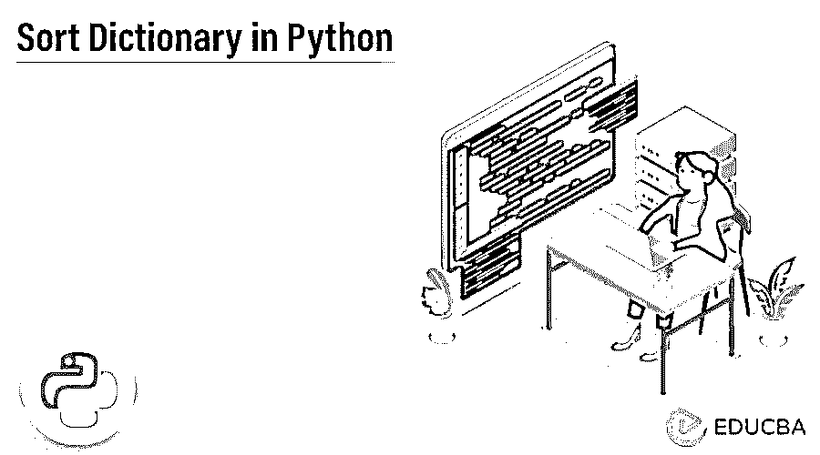
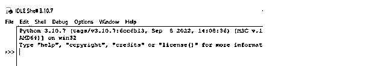
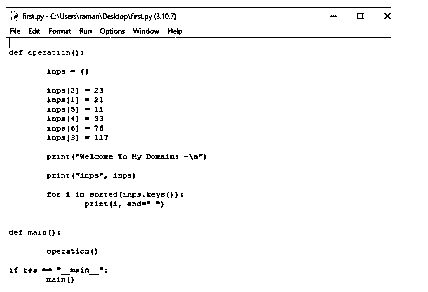
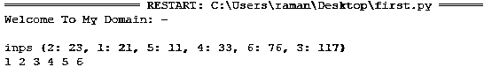
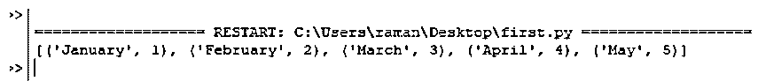

# Python 中的排序字典

> 原文：<https://www.educba.com/sort-dictionary-in-python/>

## Python 中的排序字典介绍

下面的文章提供了 Python 中排序字典的概要。dictionary 是 python 的实现之一，它使用哈希表这种传统上无序的数据结构来影响 python dictionary，后者以紧凑模式执行数据收集顺序，如插入、删除和其他从保持插入顺序的模块集合中选择的顺序。字典排序顺序就像一组键值对。它接受有序和无序的数据集合。




### 关键要点

*   sorted()函数用于对键和值进行排序。
*   在字典中查找值或键。
*   理解 Python 的元组排序。
*   使用 Lambda 函数和关键参数。
*   使用功能键()和值()对字典进行排序。

### Python 中的排序字典是什么？

对 dictionary python 进行排序，python 主要提供内置的键和值函数集，该函数返回排序后的列表，如接受循环的键和值。循环可以是接受缺省和定制参数的迭代，也可以使用升序键对字典进行排序。使用 python 的数据结构的性能比包含一次排序的大型数据集和查找更多数据更重要。将数据添加到字典有助于保存数据，直到使用包括列表和字典在内的数据结构和元组对数据进行排序。

<small>网页开发、编程语言、软件测试&其他</small>

### Python 中字典如何排序？

python 语言的 sorted()方法可用于通过使用键和值对数据字典进行排序。可以使用 python 中 sorted()函数的算法的键和自定义排序顺序对其进行排序。使用 object、key 和 reverse order 是执行和接受 sorted()函数的三组参数和自变量。包含遵循无序集合的数据结构的数据字典。

必须与 sorted()函数一起使用，通过使用具有序列顺序的值来执行数据字典。获取维护用于创建 lambda 函数的方法 item()的值。第一组顺序使用 key_value.iterkeys()函数按字母顺序排列键，紧接着是按字母顺序排列的排序键组，更有效地迭代这些项，如称为 key_value.iteritems()的方法，包括 lambda(k，v)，其中 k 和 v 表示键和值。

### 在 Python 中对数据字典进行排序的步骤

下面给出了在 python 中对数据字典进行排序的步骤:

1.安装 python 后，打开空闲或命令界面。这里我用的是 IDLE。




2.然后粘贴或创建下面的代码，并将其保存为。py 扩展名。

**代码:**

```
def operation():
	inps = {}
	inps[2] = 23
	inps[1] = 21
	inps[5] = 11
	inps[4] = 33
	inps[6] = 76
	inps[3] = 117
	print("Welcome To My Domain: -\n")
	print("inps", inps)
	for i in sorted(inps.keys()):
		print(i, end=" ")
def main():
	operation()
if __name__ == "__main__":
	main()
```

**输出:**




3.执行后，它有以下结果。




上述步骤用于创建用户输入并将其分配到功能中。

### Python 中的排序字典是如何工作的？

python 数据搜索在时间段及其可靠性方面更加复杂，列表遵循 O(n)格式的顺序集合。它提供了内置的键函数，包括 key()和 values()，用于对字典中的值进行排序。之后，每个值都是可迭代的，包括可以按键排序的参数。以便能够以默认方式使用升序对其进行排序。有 n 种排序算法，其中包括数据字典，它按照升序和降序排序，就像反转参数一样。此外，包含用于获取数据库字符串字段的值的字典包括数字或整数字段。因为许多字符串项被标记在不同的字段中以服务于字典键。

### Python 中的排序字典值和键

通过使用键和值格式，它首先计算字母顺序以及键和其他默认函数，如 iterkeys()。然后，在用户输入之后，相关联的值被映射到每组键以对其进行排序。字母顺序将使用排序函数以及默认参数，如键和值，然后它被称为排序(键值)函数。

下一组操作用于按字母顺序对键和值进行排序，因此称为 key=lambda(iteritems()，k，v)。v，k))。该表达式用于在循环的帮助下执行操作，该循环可以迭代每组键和值。

**举例:**

**代码:**

```
inps = {1: "Siva", 2: "Raman", 4: "Sivaraman", 1: "Arun"}
dict(sorted(inps.items()))
dict(sorted(inps.items(), reskey=lambda item: item[1]))
```

在上面的例子中，我们对键和值都执行了排序操作。

### Python 中的函数排序字典

因为第一组值通过使用 sorted()方法提供了数据字典，该方法可以从字典键和值中获取数据。通过使用 items()方法，我们可以获得对现有方法集执行操作的返回值。为了构造 lambda 函数，数据字典值 item()方法有助于执行排序操作。

**举例:**

**代码:**

```
inps = {'January': 1, 'February': 2, 'March': 3, 'April': 4, 'May': 5}
res = sorted(inps.items(), key=lambda x:x[1])
print(res)
```

**输出:**




从上面的例子中，我们可以使用 sorted()和 item()这样的附加方法按照升序列出值。

### 因素

参数是括号中列出的函数中的一种变量，称为参数。当调用一个函数时，提供给参数的新的一组值可以作为主参数以及可选的关键字 only 参数进行迭代。需要一个键函数来执行操作，传递布尔、字符串、数值等变量。

**举例:**

**代码:**

```
import operator
x = {"January":2, "March": 3, "April": 4, "May": 43, "February":73}
res= sorted(x.items(), key=operator.itemgetter(1))
outs=dict(res)
print(outs)
```

**输出:**


在上面的例子中，我们使用操作类来导入包。我们曾经将参数作为键和值传递，然后使用 sorted()函数对键和值进行排序和检索。

### 常见问题解答

下面是提到的常见问题:

#### Q1。什么是 python 排序字典？

**答案:**

Python 中的字典是一个大型结构，默认情况下是无序的。为了使搜索更容易，您可能偶尔需要按关键字或值对字典进行排序。

#### Q2。python 排序字典是如何工作的？

**答案:**

通过使用 sorted()函数，它传递可迭代的主参数，两个可选的仅关键字参数是一个键函数和一个反向布尔值。

#### Q3。python 中按值排序字典的类型有哪些？

**答案:**

*   使用 for 循环
*   通过使用λ函数
*   使用 dictionary.items()方法

### 结论

python 函数通过使用默认方法进行了检查，并通过使用字典视图理解列表和字典的排序过程来揭示。它可以通过使用键和值或者重建字典的嵌套属性来排序，这是执行操作的最佳数据结构之一。

### 推荐文章

这是一个用 Python 对字典进行排序的指南。在这里，我们将讨论简介、python 中对数据字典进行排序的步骤以及 Python 中的 value & key。您也可以看看以下文章，了解更多信息–

1.  [Python SQL 数据库](https://www.educba.com/python-sql-database/)
2.  [Python SQL 注入](https://www.educba.com/python-sql-injection/)
3.  [Python 3 产量](https://www.educba.com/python-3-yield/)
4.  [Python 3 网络服务器](https://www.educba.com/python-3-webserver/)


