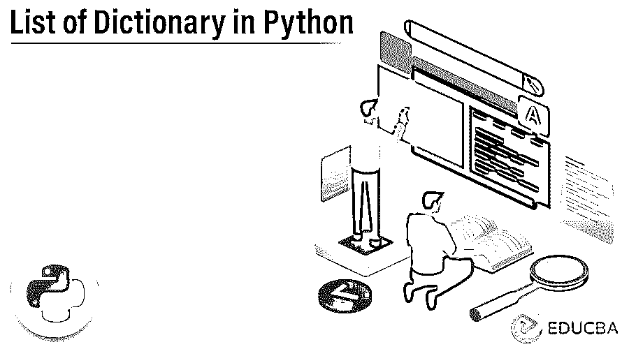
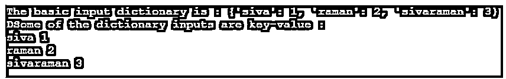

# Python 中的字典列表

> 原文：<https://www.educba.com/list-of-dictionary-in-python/>




## Python 中的字典列表介绍

Python 中的字典列表功能用于创建和检索数据。它表示数据字典包含在元素列表中。它有一个单独的索引和键，用于在字典列表中创建数据。它还将通过使用索引来访问所有元素，以获取数据，如 dict.keys()和其他默认方法，并使用循环条件迭代数据。

### 关键要点

*   它有默认的方法来插入和检索 python 字典上的所有键和值。
*   它主要存在于元素列表中。
*   它是搜索和处理数据的有效方法之一。
*   该列表包含另一个列表，也包含另一个字典。
*   它涵盖了有序和无序数据集。

### Python 中的字典列表是什么意思？

字典列表有助于表明数据字典是用于包含键和值对的元素列表的。它有每一组数据段，每一组数据段都有一个单独的关键字和元素，所以格式是“关键字”:元素它将有 n 个条目。它有一个列表，也包含另一个列表，就像同一字典可以包含另一个字典一样。它还可以包含列表，反之亦然，python 列表的元素没有在 python 字典中列出。Python 列表是在 python 字典中创建键和值的基本步骤。Append 也可以在每个 set 元素的 dictionary 对象上实现。

<small>网页开发、编程语言、软件测试&其他</small>

### 如何用 Python 创建字典列表？

当我们想要首先创建字典列表时，我们可以在 python 列表上设置元素，该元素可以是任何数据集类型的对象。使用一些 html UI 组件，如 iframe 和其他默认选项并不是为了创建一个单独的字典，我们只是不断修改相同的字典数据集和将被映射到字典列表的其他引用。我们可以在同一个映射集合中添加一个嵌套的数据列表和值，就像应该使用 append()方法映射键-值对一样。

**创建字典列表的步骤:**

1.安装 python 后，导航到 python IDLE。

2.粘贴下面的代码。

**代码:**

```
data = [{1: 'siva', 2: 'raman',
         3: 'sivaraman', 4: 'arun'}]
print(data[0][1])
print(data[0][2])
print(data[0][3])
print(data[0][4])
```

3.我们得到以下输出结果。


### 如何在 Python 中访问多字典的键列表？

它有 n 种默认方法来访问字典中的键列表数据。用于访问 python 字典中的键的一些默认方法如下:

#### **1。使用 in 运算符**

 **这是默认的方法之一，可以用来获取所有可能的键和值。in 操作符是使用最广泛的，对于大多数任务，强烈推荐使用它。

****例如:****

**代码:**

```
x = {"siva" : 1, "raman" : 2, "sivaraman" : 3}
print ("The basic input dictionary is : " + str(x))
print ("DSome of the dictionary inputs are key-value : ")
for i in x :
	print(i, x[i])
```

**输出:**




在上面的例子中，我们使用了一个操作符来访问字典列表中的键。

#### **2。列表理解**

 **这种方法是第二种默认方法，也类似于上面的方法，但一些逻辑认为它从一个数据字典列表绑定到另一个数据字典列表。它还将数据作为一个键-值对技术来处理，一个列表是相等的，并且将作为字典列表中的大多数元组键和值来返回字典对。

****例如:****

**代码:**

```
x = {"Siva" : 1, "rama" : 2, "Sivaraman" : 3}
print ("Welcome To My Domain : " + str(x))
print ("The key results are : ")
print([(k, x[k]) for k in x])
```

**输出:**


上面的例子创建了存储输入字典的变量，对于 keys()函数同样在输入字典中获取所有键的列表。通过使用循环条件来迭代关键数据并遍历它们。

#### **3。拆包操作条件**

 **它有一种特殊的序列，如*运算符，用于处理和访问具有可迭代对象条件的数据。因为有了数据字典，所以对键进行迭代以生成具有 iteral 格式的列表。通过使用解包操作符，它遵循了一组特定的条件。

****例如:****

**代码:**

```
inps = {1: 'Siva', 2: 'Raman', 3: 'Sivaraman'}
print([*inps])
```

**输出:**


在上面的例子中，我们在传递输入时使用了键值对格式。其中，关键字是一组唯一的标识符，值是字符串格式。

### Python 中的字典列表示例

下面是提到的例子:

**代码:**

```
inps = {'1': 'january', '2': 'february',
		'3': 'march', '4': 'april'}
keys = ["1", "2", "3"]
resvalue = []
for i in keys:
	resvalue.append(inps[i])
print(resvalue)
```

**输出:**


*   在上面的例子中，我们使用了键值对格式的数据列表。
*   通过使用 key()和 values()方法，我们可以分别拆分键和值，但是这里我们不能使用这种方法，因为这是了解数据字典列表中有多少组键和值的默认方法。
*   我们可以在方括号中输入带有一组唯一标识符的键。
*   此外，我们使用 append()方法在从 for 循环中获取迭代值后追加键。
*   最后在屏幕上打印结果。

### 常见问题解答

下面是提到的常见问题:

#### Q1。用 python 定义字典列表。

**答案:**

它会提出建议，并将信息包含在字典中以列出组件。这证明字典是元素列表之一。

#### Q2。python 字典列表的语法是什么？

**答案:**

[{‘key1’:element1,’key2’:’element2’,….’keyn’:’elementn’}] is one of the basic syntaxes to list out the dictionary.

#### Q3。如何访问字典列表中的键值对？

**答案:**

通过使用索引，我们可以访问 python 中的每个字典列表。通过使用一个键，我们知道字典中特定键:值对。

### 结论

在 python 中，字典列表是使用列表概念存储和检索数据的特性。通过使用关键字:值对格式，生成关键字，并且它具有唯一的一组标识符，用于在基于索引的生成的帮助下从字典中访问关键字。

### 推荐文章

这是一个用 Python 编写的字典列表指南。这里我们讨论一下入门，如何用 python 创建字典列表？还有例子。您也可以看看以下文章，了解更多信息–

1.  [Python SQL 数据库](https://www.educba.com/python-sql-database/)
2.  [Python SQL 注入](https://www.educba.com/python-sql-injection/)
3.  [Python 3 产量](https://www.educba.com/python-3-yield/)
4.  [Python 3 网络服务器](https://www.educba.com/python-3-webserver/)


******