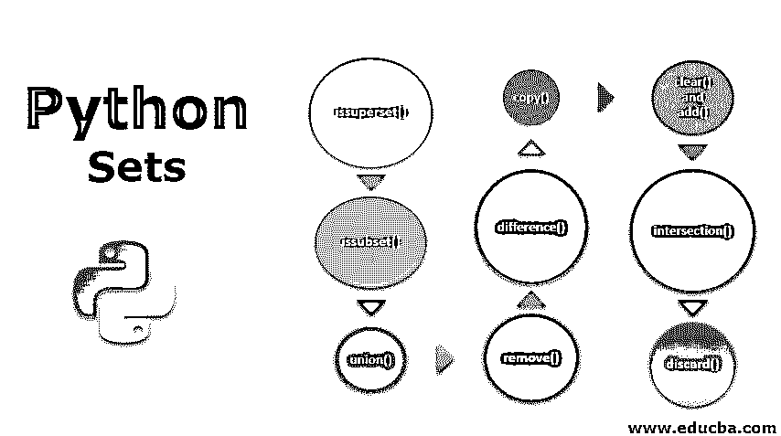
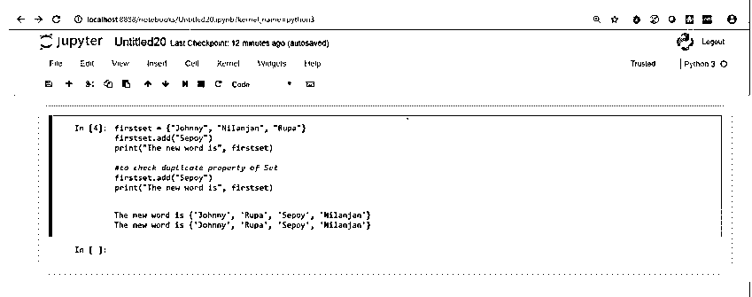
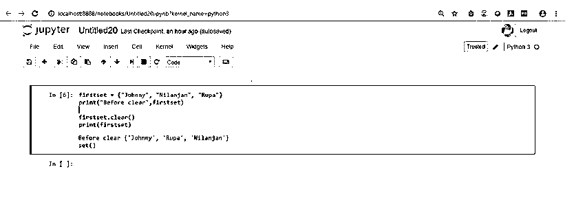
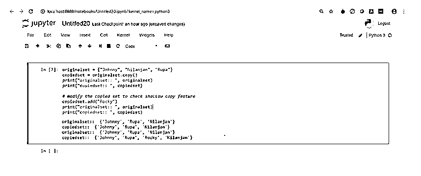
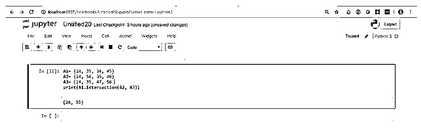
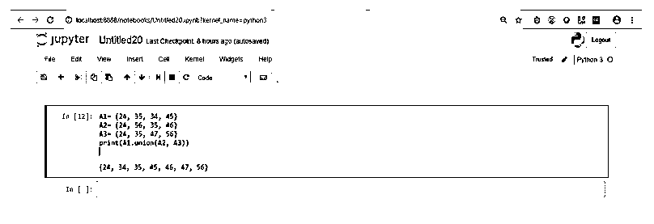
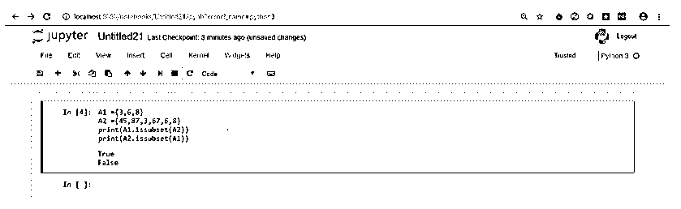
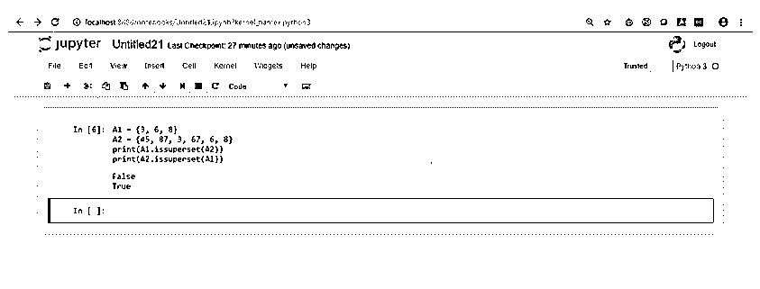
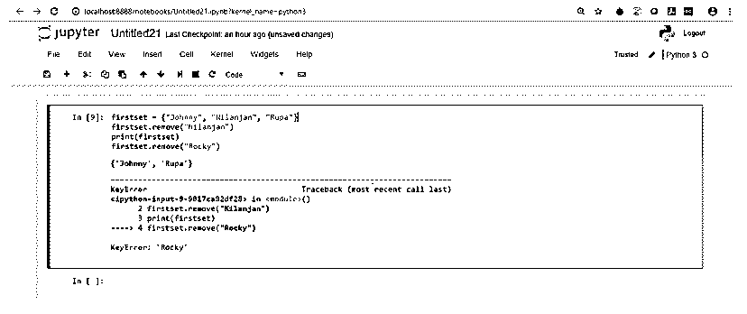
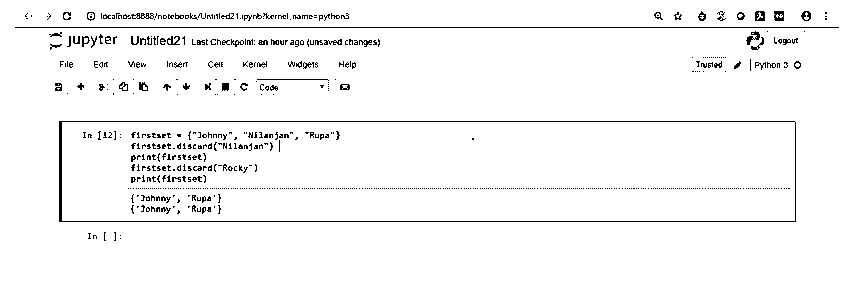

# Python 集合

> 原文：<https://www.educba.com/python-sets/>




## Python 集合简介

数学表达式集是指一组按特定顺序排列的数据和元素，用花括号括起来的元素表示。Python 是一种面向对象的编程语言，用于基于 web 的应用程序开发过程，其中一个集合只能有独特的值，而不能有任何重复项。该语法包含一个集合名，该集合名被分配给一组数据或元素，这些数据或元素被括在大括号中，并由分隔符(即逗号)分隔。

**语法:**

<small>网页开发、编程语言、软件测试&其他</small>

和普通 python 一样，语法通常很简单。python 集的语法如下:

```
firstset = {"Johnny", "Nilanjan", "Rupa"}
print(firstset)
```

这里，第一个集合是存储集合的变量名。花括号{}表示集合，因为我们要添加字符串值，所以需要双/单引号。逗号分隔集合中的值。现在，既然我们已经通过 Python 中的一个例子看到了集合的语法，那么现在让我们讨论一下 Python 集合中使用的不同方法。

### Python 集合中的不同方法

让我们来看一下作为 set 的内置 Python 的不同方法。

#### 1.添加()

顾名思义，它用于在集合中添加一个新元素，这意味着您正在将集合中的元素数增加 1。这里，需要记住的关于集合的一个非常重要的知识是，元素只有在集合中不存在时才会被添加。add 方法也不返回任何值。让我们做一个例子。

**代码:**

```
firstset = {"Johnny", "Nilanjan", "Rupa"}
firstset.add("Sepoy")
print("The new word is",firstset)
#to check duplicate property of Set
firstset.add("Sepoy")
print("The new word is",firstset)
```

下面的截图是代码在 Jupyter 笔记本上运行时的输出。




如果您在第一次使用 add()函数时看到输出，它添加元素，集合的大小增加 1，如我们执行第一个 print 语句时所示，但是第二次使用 add()方法添加完全相同的元素(sepoy)时，就像第一次执行 print 语句时一样，我们看到相同的元素显示出来，而集合的大小没有增加，这意味着集合没有任何重复值。

#### 2.清除()

顾名思义，它从集合中移除所有元素。它既不接受任何参数，也不返回值。我们只需要调用 clear 方法并执行它。让我们看一个例子:

**代码:**

```
firstset = {"Johnny", "Nilanjan", "Rupa"}
print("Before clear",firstset)
firstset.clear()
print("After clear",firstset)
```

让我们看看在 jupyter 笔记本中执行相同代码后的输出。




所以，上面的截图显示，在我们执行 clear 方法之前，这个列表是用元素打印的，然后当我们执行 clear()方法时，所有的元素都被删除了，我们只剩下一个空集。

#### 3.复制()

此方法用于创建集合的浅表副本。术语“浅拷贝”是指如果在集合中添加新元素或从集合中删除元素，原始集合不会改变。这是使用复制功能的基本优势。我们将通过一个例子来理解浅层拷贝的概念。

**代码:**

```
originalset = {"Johnny", "Nilanjan", "Rupa"}
copiedset = originalset.copy()
print("originalset:: ",originalset)
print("copiedset:: ",copiedset)
# modify the copiedset to check shallow copy feature
copiedset.add("Rocky")
print("originalset:: ",originalset)
print("copiedset:: ",copiedset)
```

现在让我们检查 Jupyter 笔记本中的输出。




正如你所看到的，当我们在复制的集合中添加一个新的元素时，复制的集合被修改了，但是原始的集合仍然保持不变。

#### 4.差异()

这是一个非常重要的功能插件。这个函数返回两个集合之差的集合。请记住，这里的差异并不意味着减法，因为在这里，它是两个集合中的元素数量之间的差异，而不是元素的值。例如，在这里，集合 A1–集合 A2 意味着它返回一个集合，其中的元素存在于 A1 而不存在于 A2，反之亦然。下面将借助一个例子对此进行说明。

**代码:**

```
A1= {24, 35, 34, 45}
A2= {24, 56, 35, 46}
print(A1.difference(A2))
print(A2.difference(A1))
```

现在让我们看看下面截图中提供的输出。


现在，在上面的截图中，如果你仔细看，第一个和第二个结果是有区别的。第一个结果显示了 A 中的元素而不是 B 中的元素，而在第二个结果中，它显示了 B 中的元素而不是 A 中的元素。

#### 5.交集()

与之前方法的内置设置有很大不同。在这种情况下，只有在两个集合或多个集合(在多于两个集合的情况下)中公共的元素以集合的形式返回。现在让我们看一个例子。

**代码:**

```
A1= {24, 35, 34, 45}
A2= {24, 56, 35, 46}
A3= {24, 35, 47, 56}
print(A1.intersection(A2, A3))
```




正如你所看到的，这三个集合只有两个相同的元素，分别是 24 和 35。因此，在执行代码时，它返回一个只包含 24 和 35 的集合。

#### 6.联合()

它是一个函数，返回一个集合，其中包含原始集合的所有元素以及指定的集合。因为它返回一个集合，所以所有的条目只有一个外观。如果两个集合包含相同的值，那么该项目将只出现一次。

**代码:**

```
A1= {24, 35, 34, 45}
A2= {24, 56, 35, 46}
A3= {24, 35, 47, 56}
print(A1.union(A2, A3))
```




在上面的截图中，您可以看到代码在执行时的输出。如果仔细观察，您会发现 A1 的所有值和其他两个集合的所有唯一值。

#### 7\. issubset()

该函数返回真或假的布尔值。如果一个集合中的所有元素都出现在另一个集合中，则返回 true，否则返回 false。我们将看到一个相同的例子来更好地理解。

**代码:**

```
A1 ={3,6,8}
A2 ={45,87,3,67,6,8}
print(A1.issubset(A2))
print(A2.issubset(A1))
```




如果看到上面的输出截图，可以看到 A2 拥有 A1 的所有元素，但是 A1 没有 A2 的所有元素。因此 A1 是 A2 的子集。

#### 8.issuperset()

该函数返回真或假的布尔值。如果一个集合包含另一个集合的所有元素，则该集合可以称为另一个集合的超集。函数返回的值为真，否则为假。我们将看到一个相同的例子来更好地理解。

**代码:**

```
A1 = {3, 6, 8}
A2 = {45, 87, 3, 67, 6, 8}
print(A1.issuperset(A2))
print(A2.issuperset(A1))
```




从输出截图中可以看到，第二个集合 A2 包含了集合 A1 的所有元素。因此它是 A1 的超集。相对于 A2 而言，A1 的情况并非如此；因此它返回 false。

#### 9.移除()

此函数用于从集合中删除元素。要移除的元素作为参数传递。如果该元素存在于集合中，则该函数移除该元素；否则，它将返回一个错误。我们将执行一个示例来检查这一点。

**代码:**

```
firstset = {"Johnny", "Nilanjan", "Rupa"}
firstset.remove("Nilanjan")
print(firstset)
# to check error
firstset.remove("Rocky")
```




如果您看到上面的屏幕截图，当执行代码时，它会删除元素“Nilanjan ”,因为它存在于集合中，但是当我们尝试删除“Rocky”时，它会给我们一个错误，因为“Rocky”不在集合中。

#### 10.丢弃()

这个内置方法也用于从集合中移除元素，但是它不同于我们前面讨论的 remove 方法。如果该元素存在于集合中，它将删除该元素，但如果它存在，它不会返回错误，通常只是打印集合。我们将看到一个这样的例子

**代码:**

```
firstset = {"Johnny", "Nilanjan", "Rupa"}
firstset.discard("Nilanjan")
print(firstset)
firstset.discard("Rocky")
print(firstset)
```




如果我们看到上面的截图，我们可以看到，即使“Rocky”不在集合中，我们也没有看到显示错误，这与 remove 方法显示错误的情况不同。

### 结论

在本文中，我们讨论了 python 中集合的概念以及可以在集合中使用或应用的不同函数。如前所述，集合在 python 中很重要，内置方法用于操作集合和对集合执行操作。

### 推荐文章

这是 Python 集合的指南。这里我们讨论 Python 集合的介绍、Python 集合中的不同方法以及语法。您也可以浏览我们推荐的其他文章，了解更多信息——

1.  [Python 中的字符串数组](https://www.educba.com/string-array-in-python/)
2.  [Python 是什么](https://www.educba.com/what-is-python/)
3.  [Python 是脚本语言吗？](https://www.educba.com/python-scripting-language/)
4.  [Python 特性](https://www.educba.com/python-features/)


