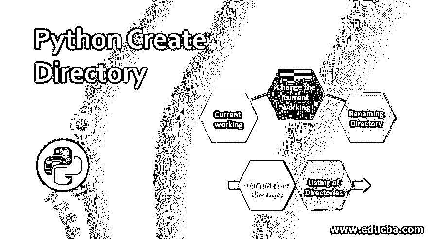

# Python 创建目录

> 原文：<https://www.educba.com/python-create-directory/>




## Python 创建目录简介

通常，目录是一个文件夹或容器，其中有一组文件和其他目录，称为子目录。类似于 Python 中的其他编程语言，目录也意味着存储文件或子目录，这反过来提供了 os 模块，该模块属于 Python 的标准实用程序模块，具有用于创建目录的各种方法。在 Python 中，为了创建目录，Python os 模块提供了一个名为 mkdir()或 makedirs()的函数。在 os 模块中，如果没有正确定义所有的函数，那么它会引发一个错误，该错误是在没有正确的文件名以及在这些函数中写入路径或参数时引起的。

### 如何用 Python 创建一个目录并给出例子

本文基于如何在 Python 中处理目录。通常，读写文件不需要任何类型的模块，但创建或处理目录需要 os 模块；为此，您需要将操作系统模块导入到程序中。这样做是因为:

<small>网页开发、编程语言、软件测试&其他</small>

`import os`

现在让我们看看如何用 Python 创建一个新目录。为了创建新目录，Python 提供了 mkdir()方法。当目录已经存在并再次创建时，该函数也会抛出错误 FileExistsError。

**语法:**

```
 mkdir(path) 
```

路径:您需要提供创建目录的地址或路径。

#### 示例#1

**代码:**

```
 import os
os.mkdir("/home/Educba articles Directory")
print("Directory is created") 
```

**输出:**


上面的例子在当前工作目录下创建了新的目录，命名为“Educba articles Directory”。假设上面的目录已经存在，那么它会抛出一个错误 FileExistsError，所以为了捕捉这些错误，我们可以使用 try 和 except 块。这可以通过以下方式完成:

#### 实施例 2

**代码:**

```
 import os
dir = "Educba articles Directory"
try:
os.mkdir(dir)
print ("Directory is created")
except FileExistsError:
print ("Directory already exists") 
```

**输出:**


在上面的程序中，目录“Educba articles Directory”在程序之前已经被创建了，所以它会被写成目录已经存在而不是抛出错误 FileExistsError。

现在让我们看看如何通过指定路径来创建目录，这意味着必须在哪里创建目录。

#### 实施例 3

**代码:**

```
 import os
dirpath = "/home/Educba articles"
os.mkdir(dirpath)
print ("Directory is created") 
```

**输出:**


如果不存在任何这样的路径，它会给出以下输出:


上面的例子在文件夹“Python”中创建了目录，这个文件夹在目录“Educba article”中，这个目录是当前的工作目录。但是如果我们要在当前工作目录下创建上面的目录而“Educba article”目录下没有“Python”文件夹，那么就会抛出一个错误 FileNotFoundError。

### Python 创建目录的函数

os 模块中有一些功能可以应用于目录，并可以获取与所创建的目录相关的不同详细信息。让我们看看哪些是有效的:

#### 1.当前工作目录

当前工作目录是保存程序的目录。假设你想知道任何 Python 程序的当前工作目录是什么，那么我们可以通过使用 os 模块的 getcwd()函数来实现。

**代码:**

```
 import os
curworkdir =os. getcwd()
print ("The current working directory is", curworkdir) 
```

**输出:**


#### 2.更改当前工作目录

这是操作系统模块的另一个功能，当我们想把当前的工作目录更改为其他目录时使用。这可以使用 chdir()函数来完成。

**语法:**

chdir(路径位置)

**代码:**

```
 import os
os.chdir('E : \ \Educba article')
curworkdir = os.getcwd()
print (curworkdir) 
```

#### 3.重命名目录

创建目录后，还可以重命名目录。为此，我们可以使用函数 os。rename()，我们必须传递 director 的正确路径，它必须被重命名。

**语法:**

```
 rename(old_dir_name, new_dir_name) 
```

**代码:**

```
 import os
olddir = os.path.join("E:\ \Educba article\ Python")
newdir = os.path.join ("E:\ \Educba article\Python2")
if os.path.exists(olddir):
os.rename(olddir, newdir)
print("The directory is renamed", format(olddir, newdir) 
```

#### 4.删除目录

因为我们可以创建目录，所以我们也可以用相同的过程删除目录，但是我们对这个 rmdir()使用了不同的函数；为此，我们需要传递我们想要删除或移除的目录的路径。

**语法:**

```
 rmdir(dir_name) 
```

**代码:**

```
 import os
dirrm = os.path.join ("E:\ \Educba article\Python2")
if os.path.exists(dirrm)
os.rmdir(dirrm)
print(dirrm + "Directory has been deleted") 
```

**输出:**

Python2 目录已被删除。

#### 5.目录列表

假设如果我们需要某个特定位置的目录列表，那么我们可以使用函数 listdir()获得该位置的目录列表。在这种情况下，我们需要传递位置，然后它将返回我们在该位置的目录列表。

**语法:**

```
 listdir(specific_location) 
```

**代码:**

```
 import os
print ("The lists of directories in the above-mentioned location are:")
print(os.listdir("/home")) 
```

**输出:**


### 结论

在本文中，我们看到了如何用 Python 创建目录。目录是一种文件夹，我们可以在其中存储文件，甚至其他目录。在 Python 中，创建目录很简单；它有许多不同的功能，可以应用于目录，如创建，获取当前工作目录，获取目录中的目录列表，重命名目录，删除目录等。这些都有独立的内置函数，如 mkdir()、getcwd()、listdir()、rename(olddir、newdir)、rmdir()等，都在 os 模块下，使用这些函数之前需要导入这些模块。

### 推荐文章

这是一个 Python 创建目录的指南。这里我们用例子和函数讨论如何用 Python 创建一个目录。您也可以看看以下文章，了解更多信息–

1.  [Python 默认参数](https://www.educba.com/python-default-arguments/)
2.  [Python 变量作用域](https://www.educba.com/python-variable-scope/)
3.  [Python 中的缩进](https://www.educba.com/indentation-in-python/)
4.  [Python 中的文件处理](https://www.educba.com/file-handling-in-python/)


