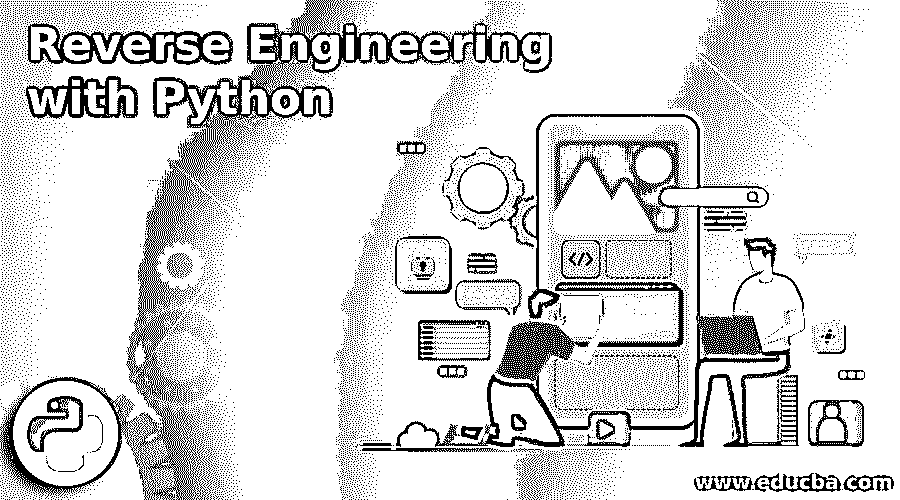

# 使用 Python 进行逆向工程

> 原文：<https://www.educba.com/reverse-engineering-with-python/>

## Python 逆向工程简介

Python 是一种高级语言。虽然你们中的许多人可能认为它是一种编程语言，但它不是。它是一种脚本语言。它与机器代码或机器语言相去甚远。那是什么让 python 这么有趣呢？如果你有过 pentesting 的经验，或者与许多网络安全专家或恶意软件分析人员交谈过，他们总是建议将 python 作为开发恶意软件或漏洞的主要语言。

虽然有些人可能更喜欢 C、C++或 Perl，但我个人会选择 python。原因是它不仅是编写程序的有用工具，而且也是破解程序的有用工具。

<small>网页开发、编程语言、软件测试&其他</small>

### 什么是逆向工程？

逆向工程是一个非常宽泛的概念。人们不能用简单的语法来定义它。逆向工程的正确概念是将代码分解成更简单的部分，理解它，根据我们自己的目的修改和增强它，然后重新组装它以适应我们的需要。为了简单一点，让我给你举几个极其常见的例子。

让我们以安卓手机为例。制造商创建一个库存 Rom 并出售给他们的消费者。但是大多数时候，它包含了很多臃肿的软件，因此变得滞后。所以，像 XDA 和 androidcentral 这样的网站上有人逆向工程进入 ROM，增强它，使它防延迟。一个实际的例子是 CyanogenMod Rom。

但这只是一个让你明白它是什么的例子。逆向工程也有同样的概念，但是它比仅仅修改一个 ROM 要复杂得多。

### 编译和 Python

如果你有 python 的经验，那么你就知道当你写一个 python 脚本的时候，可能是一个病毒，payload，[木马](https://www.educba.com/viruses-function/ "Viruses and Trojans: We Live in Your Wires")或者其他什么文件，它只会在安装了 Python 的电脑上运行。所以，假设我编写了一个优秀的电脑木马，可以绕过任何反病毒，我开始在 windows 系统中部署它，但如果 windows 系统没有安装 python 解释器，那么它就无法工作。因此，需要将编写的 python 脚本的每个文件编译成可执行文件，然后将其部署在 windows 系统中。

### 对 Windows 可执行文件进行反向工程

现在你知道我们需要编译 python 脚本来在 windows 中运行；您还必须知道需要一个编译器，将 python 脚本转换成可执行文件。是的，有。它的名字叫 Py2exe。Py2exe 是一个简单的安装程序，可以将 python 脚本转换成独立的 windows 程序。现在，还有另一个工具可以将用 python 编写的 Windows 可执行文件转换回 python 脚本。它的名字是 Pyinstaller Exe Rebuilder。

Pyinstaller exe rebuilder 是一个工具，用于重新编译/反向工程 Pyinstaller 生成的可执行文件，而无需访问源代码。当您启动 EXE 时，它在内存中是未打包的。这包括。pyc 文件(转换成字节码的 python 代码)。基本上，pyinstaller 和 py2exe 之类的工具所做的是将库和依赖项打包在一起，这样你就可以运行“独立”的 exe，而不必下载它们或者用 python 解释器准备机器。

还有另一个工具包，可以让你非常接近源代码。名字是 PyRetic，代表逆向工程混淆的 Python 字节码。这个工具包允许您将内存中的对象带回源代码，而无需直接访问磁盘上的字节码。如果磁盘上的应用程序 pyc 以多种方式之一被混淆，这可能是有用的。

### 艰难的逆向工程

现在，当你至少掌握了 python 的基础知识时，上面的部分就很容易理解并实际操作了。但情况并非总是如此。有时候，你在 [python](https://www.educba.com/software-development/courses/python-certification-course/ "Python Training Course Bundle") 脚本中没有任何文档或注释，有太多的文件需要你自己去理解。现在有一本关于这方面的很棒的书，但我不会太专注于此。

这本书的名字是“有效地使用遗留代码”。这本书独立于 python 或任何其他语言，它会给你一个用几乎任何语言进行逆向工程的想法。当试图理解一段代码时，重点是你想理解它的原因。

无论您是想对代码进行逆向工程来修改它还是移植它，这两种方法都是完全不同的。因此，用电池和脚手架测试来检测遗留代码，以及跟踪/记录是漫长而艰难的理解和安全而负责任地修改的关键路径。

### 逆向工程工具

现在有另一种方法使它变得简单一点，你可以按照上面的步骤去做。有一个网站叫做 [Epydoc](http://epydoc.sourceforge.net/ "Epydoc") 。在这个站点上，我将检查代码并为它创建一些文档。结果不会像原始文档一样好，但至少会让您知道它是如何工作的。通过这样做，您可以开始编写自己的文档，在部分编写完文档后，您可以再次从站点为剩余部分生成剩余的部分文档。

您甚至可以使用 IDE 工具来分析代码。这通常会使代码自动完成，但更重要的是，在这种情况下，只需按住 ctrl 键单击一个变量就可以看到它来自哪里。当你想理解其他人的代码时，这真的加快了速度。

还有，你需要学习一个调试器。在代码中复杂的部分，你将不得不在调试器中一步一步地查看代码实际上做了什么。Pythons pdb 可以工作，但是许多 IDE 集成了调试器，这使得调试更加容易。Logilab 的 PyReverse 和 Andy Bulka 的 PyNSource 对 UML 图的生成也很有帮助。

有一个从给定的源代码输入中产生 UML 类模型的过程。这样，您可以将代码库的快照转换成 UML 类，并进一步形成一个[类图](https://www.educba.com/class-diagram/)。将代码内容引入可视化 UML 模型有助于程序员或软件工程师审查实现，识别潜在的错误或缺陷，并寻找可能的改进。

除此之外，开发人员可能会将代码库反转为 UML 类，并用它们构建一个模型，就像反转一个通用集合框架，并通过扩展通用框架来开发自己的框架。在这一章中，我们将经历 Python 的即时反转。

### 对象和引物

要完全理解 Python 的内部工作原理，首先应该熟悉 Python 如何编译和执行代码。当用 Python 编译代码时，结果是一个代码对象。一个代码对象是不可变的，它包含了解释器运行代码的所有信息。字节代码指令表示为一个单字节操作码值，需要时后跟参数。使用代码对象的其他属性之一的索引来引用数据。

**一个字节代码串是这样的:**

***\ x64 \ x02 \ x64 \ x08 \ x66 \ x02**\ T3】*

Python 字节码对一堆项目进行操作。更大胆的扩展是尝试将字节码反编译成可读的 Python 源代码，包括对象和函数名。Python 代码可以通过利用 marshal 模块以二进制形式分发。该模块提供了使用存储和加载函数来序列化和反序列化代码对象的能力。

最常见的二进制格式是编译的 Python 文件(。pyc ),它包含一个幻数、一个时间戳和一个序列化对象。Python 解释器通常将这种文件类型作为编译对象的缓存，以避免多次解析源代码。这些技术依赖于访问字节码和类型信息的容易程度。

使用代码对象的字节码，可以修改甚至完全替换代码逻辑。提取类型信息可以帮助程序设计理解和识别功能和对象目的。

应用程序字节码的混淆和强化将永远是实现者和试图破坏它的人之间的竞赛。为了防止字节码检索，合乎逻辑的第一步是走向运行时翻译解决方案。

代码对象的属性可以以任何签名的、加密的或其他混淆的格式存储，该格式在运行时被去混淆或翻译并用于实例化新对象。人们甚至可以改变解释器中变量名查找的方式，以混淆命名信息。开发人员可以通过在实际名称的查找和源代码中的名称之间添加一个转换层来进一步减少反向尝试。

### 结论

现在，在读完所有这些之后，你可能会觉得有必要去尝试一些工具。所以，这里有一些工具可以帮助你逆向工程你的 python 代码:

1.  派美

2.  Sulley

3.  Carrera 系列

4.  派姆

5.  IDAPython

6.  ImmDbg

所有这些都是很棒的代码，但真正让它们出众的是它们一起使用的时候。请记住，这绝不是一个完整的列表，只是我使用最多的列表，并认为这些列表显示了 python 的灵活性如何使逆向工程这样复杂的任务变得易于管理。

### 推荐文章

这里有一些文章可以帮助你获得更多关于 Python 逆向工程的细节，所以只要浏览一下链接就可以了。

1.  [Python 面试问题](https://www.educba.com/python-interview-questions/)
2.  用于 Web 开发的 Python 和 Django
3.  [使用 Python 的好处和局限性](https://www.educba.com/benefits-and-limitations-of-using-python/)
4.  [逆向工程工具](https://www.educba.com/reverse-engineering-tools/)

