# 无服务器 Python

> 原文：<https://www.educba.com/serverless-python/>


## 无服务器 Python 简介

一个叫做无服务器的框架使得在一个独立于服务器的环境中部署应用变得更加容易。这种服务通常是使用编程语言创建的，而 Python 通常是生成这种基于 web 的程序的首选。随着插件社区的不断增长和一系列特性的提供，众多的云供应商与 AWS Lambda 一起，无服务器框架是一个非常领先的公司。对于 Python 开发人员来说，无服务器框架是一个很好的起点。无服务器系统使实时处理需求和服务器的动态分配成为可能。

这篇文章将提供如何创建一个无服务器 Python 函数的指导，以及关于 Python 和无服务器的指南。

<small>网页开发、编程语言、软件测试&其他</small>

### 无服务器 Python 要求

在称为无服务器的部署架构中，部署者并不明确提供服务器。相反，代码是为响应开发人员定义的事件而执行的，比如当一个新行被添加到一个文件中，或者一个 HTTP POST 请求被发送到一个 API。

开发无服务器 Python 函数的方法很简单，需要节点和 NPM。

要运行，我们需要:

必须首先建立项目。通过键入 npm install -g serverless 首先安装节点和 NPM。编写和部署函数是第二步。让我们创建“hello world”的功能等价物:事件、上下文、定义处理程序“消息”:应该返回“hello pals”。

**第一步:**

在第一步中设置项目。首先安装 NPM 和节点:

**代码:**

```
npm install -g serverless
```

**输出:**

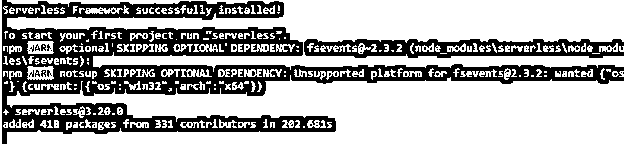


**第二步:**

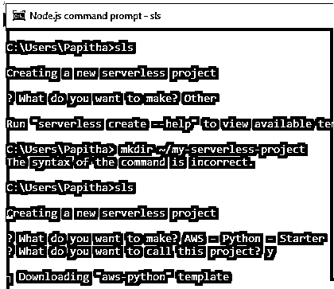


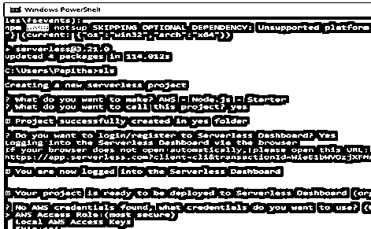


第三步:让我们用 sls 创建一个新项目。代码应如下所示:

**代码:**

```
mkdir ~/my-serverless-project
cd ~/my-serverless-project
sls create -n my-serverless-project -t aws-python3
```

My-serverless-project 是我们在这里建立的目录的名称，sls create 用于创建项目。使用选项-t aws-python3，我们额外添加了一个模板。Serverless 中包含的几个模板在 serverless.yml 中提供了许多特定的逻辑默认值。

**第四步:部署功能**

**代码:**

```
def handler(event, context):
    return {"message": "hi buddies"}
```

使用无服务器 CLI，我们可以为我们的 lambda 层设计一个模板，我们称之为 Lambda 层。handler.py 文件实质上包含了将在 AWS Lambda 上执行的程序。yml 文件提供了服务部署所需的所有设置以及 Lambda 函数或级别的定义。

**代码:**

```
service: layer-numpy
frameworkVersion: '2'
provider:
name: aws
runtime: python3.8
lambdaHashingVersion: 20201221
plugins:
- serverless-python-requirements
```

### 无服务器 Python 函数

Python 是一种高级编程语言，通过其丰富的包库支持应用程序和机器学习模型的创建。构建无服务器 Python 应用程序允许您以复杂的估算方式利用 Python 的分发功能。

**第一步:安装需要**

**代码:**

```
$npm install --save serverless-package-python-functions
```

对于打包，Python Lambda 只在它们需要的需求下起作用；使用无服务器框架插件。如果我们有一个函数，将信息添加到无服务器，以便无服务器框架知道它。将无服务器中的功能部分替换为以下内容。

**代码:**

```
functions:
  hello:
  handler: hello.handler
```

要进行部署，请发出以下命令:

```
sls   deploy
```

创建新的无服务器项目:放弃以下凭据。

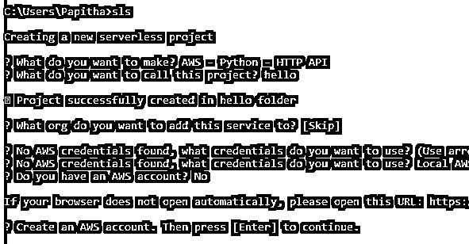


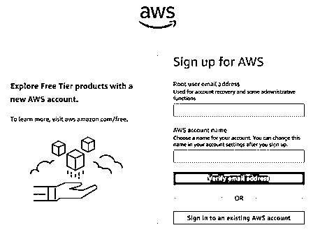


### 无服务器 Python 示例

什么时候使用无服务器才有意义？

就像在使用 Web App 后端、计划任务、数据处理、物联网的时候。

**第一步:**

该过程从无服务器开始，包括启动新项目、选择项目类型(Node.js、Python 或其他)、为项目命名，以及选择是否希望激活其他无服务器功能(需要无服务器帐户)。初始流程将在完成后生成。

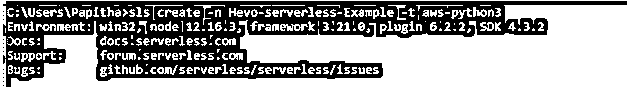


**第二步:**

正如上一节所讨论的。下一步是生成 yml。下面是由该过程生成的一个开放的无服务器文件作为示例:

**代码:**

```
service: app
provider:
  name: aws
  runtime: python 4.2
 functions:
  hello:
    handler: handler.hello
```

考虑文件中服务的名称；我们可以更改它，以符合为函数选择的命名规则。我们将默认使用创建项目时给它起的名字。此外，Python 运行时允许我们查看 AWS Lambda 提供者信息。一旦我们的 Lambda 层被部署，找到相关的 ARN 是很重要的，因为它将在我们的 Lambda 函数的定义中被用作参考。

**第三步:**

直接部署到 AWS Lambda 和无服务器测试。无服务器使用无服务器。yml 文件直接部署到 Lambda 的要求。

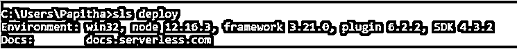


在有效实现后，可以使用以下命令调用部署的方法:

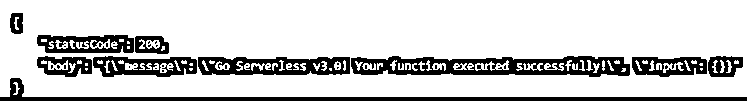


将巨大的依赖性合并到 Lambda 层中是管理事物的另一种方法。通过简单的方法将图层选项添加到设置中。Lambda 选项通过 AWS 控制台选择。

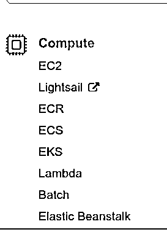


**步骤 5:** 要配置步骤事件，我们必须创建一个框架。

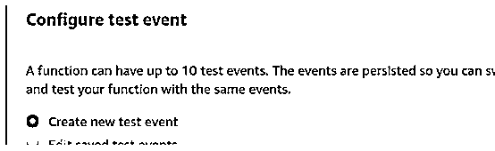


**第六步:测试**

此外，测试是一个有效的 HTTP 功能。然而，要做到这一点，必须向 AWS Lambda 控制台添加一个 API 网关触发器。

单击 Lambda 函数属性页的设计器部分中的添加触发器以添加触发器。出现提示时，从列表中选择 API 网关。尽管在这个简单的例子中可能已经手动设置了触发器，但是 serverless.yml 规范可能更好。

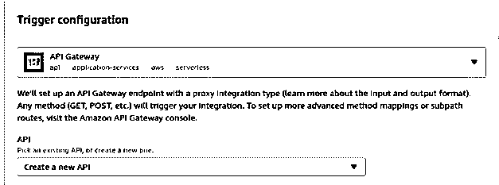


以上是针对我们使用任何 PostgreSQL 的时候。但是 Lambda 函数不想触发它。下面的截图显示了 lambda 文档调用函数。

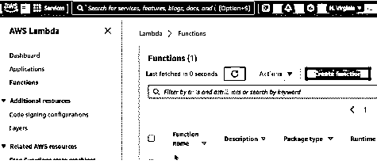


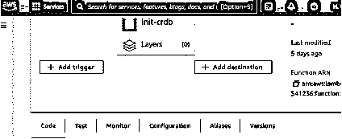


**注意:**开发人员和企业正在构建和部署应用程序，以迎接无服务器云架构带来的机遇。Python 是创建这些应用程序的首选语言，因为它是用户友好的，并且具有庞大的库支持结构。通过构建无服务器 Python 应用程序，可以更容易地利用无服务器架构的优势。

### 结论

与 web 框架如何管理典型的 web 开发活动类似，无服务器的库和平台努力提供可重复的代码来执行耗时或重复的操作。到目前为止，我们已经向大家简要介绍了无服务器框架，并演示了如何利用它来创建无服务器 Python 应用程序。

### 推荐文章

这是无服务器 Python 的指南。这里我们已经讨论了介绍、功能、需求和代码实现的例子。您也可以浏览我们推荐的其他文章，了解更多信息——

1.  [Python 中的选择排序](https://www.educba.com/selection-sort-in-python/)
2.  [Python 复制文件](https://www.educba.com/python-copy-file/)
3.  [Python 非运算符](https://www.educba.com/python-not-operator/)
4.  [Python Itertools](https://www.educba.com/python-itertools/)


