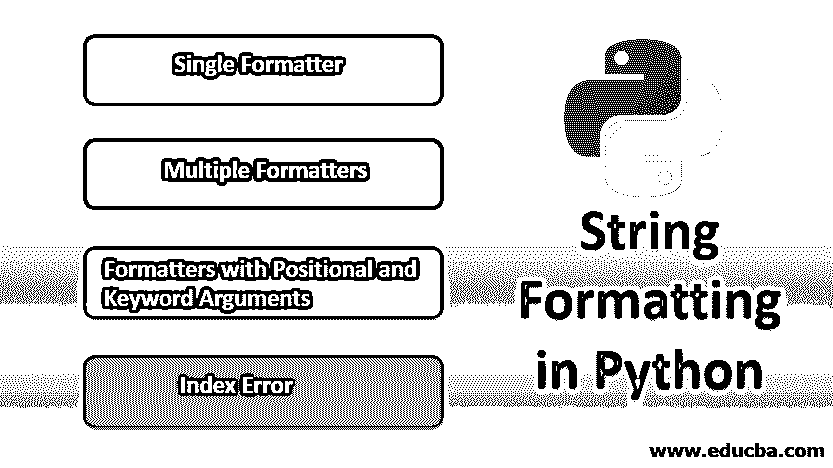
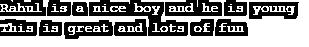
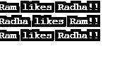
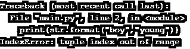

# Python 中的字符串格式

> 原文：<https://www.educba.com/string-formatting-in-python/>

## Python 中的字符串格式简介

字符串格式化可以定义为用于格式化程序中作为输入存在或提供的字符串的方法，该方法在执行时格式化字符。该函数用于声明、访问和更新字符串变量的格式化。在 Python 中，这个函数是通过一个特定的方法来实现的，这个方法可以使用语法“{string variable}”来实现。格式(值)'。这里，“值”代表任何格式的数据，如数字、字符或浮点。python 编程中应用的字符串格式类型有单格式化程序、多格式化程序、带有位置和关键字参数的格式化程序以及索引错误。

### Python 中如何格式化字符串？

这是本文的重要部分。在 python 中格式化字符串并不难，因为我们可以使用 [Python3 中的 format 方法来格式化](https://www.educba.com/python-3-commands/)。我们将看看这个函数的语法。

<small>网页开发、编程语言、软件测试&其他</small>

**语法:**

`{string variable}.format(value)`

所以，我们可以用任何字符串，数字字符，甚至其他变量来代替这个值。此方法返回格式化字符串。

在 python 中有几种方法可以进行字符串格式化。我们将一个一个地调查这件事。

#### 1.单一格式化程序

这意味着我们在 format 函数中只传递一个参数，它将值放在占位符位置。花括号表示占位符位置。因为我们在 format 函数中只传递一个参数，所以它是一个单独的格式化程序。为了更好地理解，我们将[使用 Jupyter notebook](https://www.educba.com/what-is-juypter-notebook/) 来查看输出。

**代码:**

`#program to demonstrate single Formatter in Python3
#format option for value stored in a variable
str = "Rahul is a nice {}"
print(str.format("boy"))
#format option for simple string
print("Who is inside my {}".format("house"))`

所以，如果我们看代码，我们使用了两种情况；在第一种情况下，我们将字符串赋给一个变量，而在第二种情况下，我们直接对字符串使用 format 函数。

**输出:**

正如您在这两种情况下所看到的，占位符被 format 函数作为参数传递的值所替换。

#### 2.多重格式化程序

在这种情况下，format 方法将有多个参数。当我们希望在现有字符串中进行多个变量替换时，会使用这种格式。如果我们替换多个变量，我们将不得不在字符串中放置额外的占位符。值将按顺序替换占位符。例如，如果我们想要替换一个字符串中的两个值，我们必须在 format 函数中放置两个占位符并传递两个参数。让我们看一个例子的代码。

**代码:**

`#program to demonstrate Multiple Formatter in Python3
#format option for value stored in a variable
str = "Rahul is a nice {} and he is {}"
print(str.format("boy","young"))
#format option for simple string
print("This is {} and lots of {}".format("great","fun"))`

上述守则有两种情况；在第一种情况下，我们将字符串分配给变量，而在第二种情况下，我们直接对字符串使用 format 函数。

**输出:**

如您所见，在这两种情况下，我们都将占位符替换为通过 format 函数作为参数传递的值。这些值是按顺序替换的，记住这一点非常重要。

#### 3.具有位置和关键字参数的格式化程序

这是一种使用字符串格式化程序进行格式化的有趣方式。我们必须理解，格式函数中的值有元组，这意味着可以使用从零开始的索引号单独调用它们。这些索引号可以在原始字符串的占位符中传递，并将在占位符中被替换。为了更好地理解，我们将使用一个示例代码。让我们看看代码。

**代码:**

`# formatters with positional key arguments.
# Positional arguments placed in order
print("{0} likes {1}!!".format("Ram","Radha"))
# Reverse the index numbers
print("{1} likes {0}!!".format("Ram","Radha"))
# Keyword arguments along with index
print("{name} likes {0}!!".format("Radha",name ="Ram"))`

如果你看上面的代码，我们可以看到我们已经使用了三种情况；在前两种情况下，我们在占位符中使用了索引号。前两种情况的唯一区别是索引号的顺序相反。然而，在第三种情况下，我们使用了一个关键字，这意味着一个变量，我们在 format 函数中为其赋值。我们不仅使用了一个索引，所以索引为零，因为第一个占位符被 format 函数中传递的变量值所替代。

**输出:**

屏幕截图输出向我们展示了可以使用这种字符串格式的不同情况。

#### 4.索引错误

讨论这一点很重要，因为我们应该记住，当字符串中传递的占位符数量与 format 函数中的参数数量不匹配时，我们会得到索引错误。例如，如果 format 方法中的两个参数有三个占位符，我们将会得到一个索引错误。

**代码:**

`str = "Rahul is a nice {} and he is {},{}"
print(str.format("boy","young"))`

如您所见，我们有一个额外的占位符。

**输出:**

正如您所看到的，我们得到了一个索引错误，消息是“元组索引超出范围”

### 推荐文章

这是 Python 中字符串格式化的指南。在这里，我们分别讨论了基本概念和如何用代码实现在 python 中格式化字符串。您也可以阅读以下文章，了解更多信息——

1.  [Python 的不同编辑器](https://www.educba.com/python-editors/)
2.  [Python 中的斐波那契数列](https://www.educba.com/fibonacci-series-in-python/)
3.  [Python 中的反数](https://www.educba.com/reverse-number-in-python/)
4.  [Python 中的析构函数](https://www.educba.com/destructor-in-python/)

