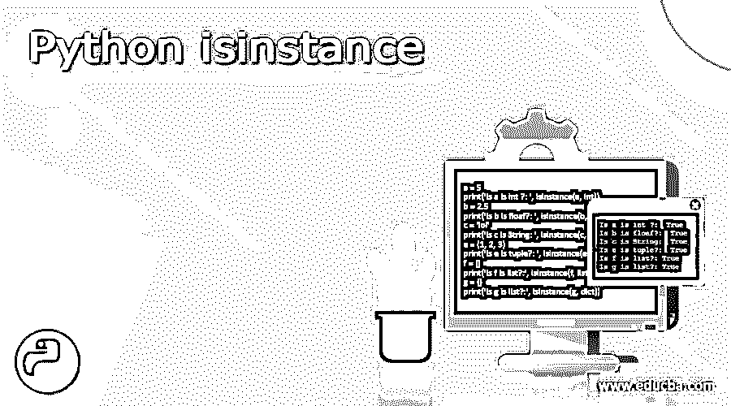
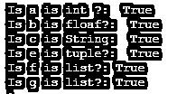

# Python 是一个实例

> 原文：<https://www.educba.com/python-isinstance/>

## Python isinstance 简介

此函数检查对象是类的实例还是类的实例。该功能允许您根据子类检查对象。这个函数总是返回一个布尔值。我们传递给同一类型的 isinstance 方法的对象，则 isinstance 方法将为 true 否则，它将返回 false。假设我们有一个数字 25，我们想检查它是否是整数类型；然后，我们可以使用 isinstance 函数，in 它将返回 true，因为 25 是 int。

**语法:**

<small>网页开发、编程语言、软件测试&其他</small>

`isinstance(object, classinfo)`

### Python 实例的例子

python isinstance 的示例如下:

#### 示例#1

**代码:**

`lst = [1,2,3,'a'] print(isinstance(lst, list))`

**输出:**

我们已经创建了一个列表，并将其存储在变量 lst 中。我们将 lst 作为 isinstance 函数中的对象，将对象类型作为列表。它们匹配，isinstance 返回 true。

`print(isinstance(lst, tuple))`

**输出:**

在上面的例子中，这一次，我们将对象类型作为元组传递，isinstance 返回 false，因为 lst 不是元组类型。Isinstance 方法可用于检查具有多种数据类型的变量。

#### 实施例 2

**代码:**

`lst = [1,2,3,'a'] dist = {'A':[1,2,3], 'B':['a','b','c']}
print(isinstance(dist, tuple))`

**输出:**

我们做了一本字典，它由两套组成。现在，如果我把这个字典传递给 isinstance，用 tuple 类检查，它会返回 false。我们知道，字典是一种远程对象类型。

`lst = [1,2,3,'a'] dist = {'A':[1,2,3], 'B':['a','b','c']}
print(isinstance(dist, (tuple, dict)))`

**输出:**

这一次，我们将 tuple 和 dict 都传递到了 object type 中，isinstance 将返回 true。Isinstance 函数在我们使用不同的类和编写更多的函数程序时非常有用，因为我们不会经常使用这个方法。

#### 实施例 3

**代码:**

`class test1:
a = 1
class test2:
b = 2
t1 = test1()
t2 = test2()
print(isinstance(t1, test1))`

**输出:**

在上面的程序中，我们创建了两个类 test1 和 test2，并创建了两个变量 a 和 b，值分别为 1 和 2。t1 是类 test1 的实例，t2 是类 test2 的实例。现在我们检查对象类型为 test1 的 t1 对象。Isinstance 将为 true，因为它属于同一个实例。

#### 实施例 4

**代码:**

`a = 5
print('Is a is int ?: ', isinstance(a, int))
b = 2.5
print('Is b is floaf?: ', isinstance(b, float))
c = 'lol'
print('Is c is String: ', isinstance(c, str))
e = (1, 2, 3)
print('Is e is tuple?: ', isinstance(e, tuple))
f = [] print('Is f is list?:', isinstance(f, list))
g = {}
print('Is g is list?:', isinstance(g, dict))`

**输出:**

在上面的示例中，我们创建了不同数据类型的变量，并且检查了 isinstance 方法中的每个变量，生成了以下输出。

#### 实施例 5

**代码:**

`def multiplication(p1,p2):
if isinstance(p1,(int)) and isinstance(p2, (int)):
return f'Params Ok! Result: {p1*p2}'
else:
return 'Params must be type of (int)'
print(multiplication(2,'f'))`

**输出:**

在上面的程序中，我们创建了一个乘法方法，它采用两个参数 p1 和 p2。然后我们使用 isinstance 方法 2 检查两个参数是否都是 int 类型。如果任何参数不是整数类型，那么 isinstance 将返回 false，我们将显示一条错误消息。我们已经使用 print 函数调用了该方法并传递了 1 个整数，第二个参数作为字符和函数已经如预期的那样返回了一个错误消息。

现在我们将两个参数都作为一个整数传递，这次我们得到两个数字的乘积。

**代码:**

`def multiplication(p1,p2):
if isinstance(p1,(int)) and isinstance(p2, (int)):
return f'Params Ok! Result: {p1*p2}'
else:
return 'Params must be type of (int)'
print(multiplication(2,3))`

**输出:**

### isinstance 和 Type 函数之间的差异

这两个函数的目的都是检查参数的数据类型，但是对于不同的用例，实现是不同的。Type 函数将返回对象的数据类型，而 isinstance 将根据我们传递的对象和数据类型返回值。

假设你只是想知道参数的数据类型，那么 type 函数是个不错的选择，而如果我们想检查 pass 的数据类型是否与第二个参数的数据类型相同，那么就推荐 isinstance 函数。它将返回一个布尔值。

### 结论

Isinstance 方法在 python 程序中对于函数式编程是一个非常有用的功能，因为很多时候，我们需要检查对象是否是类的实例，这个函数返回布尔输出。我们传递给同一类型的 isinstance 方法的对象，则 isinstance 方法将为 true 否则，它将返回 false。

### 推荐文章

这是 Python isinstance 的指南。这里我们讨论 isinstance 和 type 函数的介绍和区别，以及不同的例子和代码实现。您也可以看看以下文章，了解更多信息–

1.  [Python 中的抽象类](https://www.educba.com/abstract-class-in-python/)
2.  [Python 中的指针](https://www.educba.com/pointers-in-python/)
3.  [Python 拆分字符串](https://www.educba.com/python-split-string/)
4.  [Python 压缩函数](https://www.educba.com/python-zip-function/)

