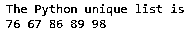
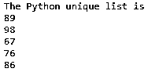
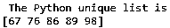
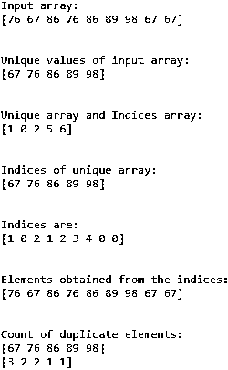

# Python 唯一列表

> 原文：<https://www.educba.com/python-unique-list/>


## Python 唯一列表简介

在 Python 编程语言中，列表被定义为一组按某种顺序排列的元素，这也允许重复的数字从给定的列表中获得唯一的数字或元素。我们引入了独特的列表。Python 的唯一列表是包含唯一元素的列表，与顺序无关。有几种方法可以从给定的列表中获得唯一的列表。让我们看看下面的例子，看看唯一列表包含什么。

**举例:**

<small>网页开发、编程语言、软件测试&其他</small>

*   考虑给定的输入列表 A = [76，67，86，76，86，89，98，67，67]
*   输出:A = [76，67，86，89，98]

从上面的例子中，我们可以看到在给定的列表 A 中有元素或数字有重复的元素，所以为了得到一个唯一的列表，它给出了没有重复元素的输出。

### Python 中获取唯一列表的方法有哪些？

以下是方法:

#### 方法 1——使用遍历

在这个方法中，列表中的项目被单独遍历。则添加项目，或者如果项目不在唯一列表中，则可以将项目附加到唯一列表中。这可以通过简单的 for 循环和 if 语句来完成。下面是这个方法的代码。

**代码:**

```
def python_unique(list_1):
    unique_list = []
for n in list_1:
    if n not in unique_list:
        unique_list.append(n)
for n in unique_list:
    print n,
list_1 = [76, 67, 86, 76, 86, 89, 98, 67, 67]
print("The Python unique list is")
python_unique(list_1)
```

**输出:**




#### 方法 2–使用 set()属性

set()，它具有不同元素的可迭代参数。使用此属性检查唯一项，并将这些唯一项追加到要设置的列表中。list 和 set 的主要区别在于，list 允许我们插入重复的元素，但是 set 没有重复的元素，因为元素只被插入一次，即使它被多次插入。

**语法:**

```
set(Iterable elements)
```

**代码:**

```
def python_unique(list_2):
    set_list = set (list_2)
unique_list2 = ( list (set_list))
for n in unique_list2:
    print n
list_2 = [76, 67, 86, 76, 86, 89, 98, 67, 67]
print("The Python unique list is")
python_unique(list_2)
```

**输出:**




#### 方法 3——使用 Python 库 numpy

在 python 中，我们有非常强大的库，使我们的工作很容易完成。首先导入 numpy 库。然后使用 a=numpy.array()将给定列表转换为数组，并使用 numpy.unique(a)函数从给定列表中返回元素的唯一列表。

**代码:**

```
import numpy as nump
def python_unique (list_3):
    n = nump.array(list_3)
print( nump.unique (n) )
list_3 = [76, 67, 86, 76, 86, 89, 98, 67, 67]
print(" The Python unique list is")
python_unique(list_3)
```

**输出:**




### Python 中的 Unique 函数是如何工作的？

从上面的方法中，我们使用了 numpy.unique()函数。在 Python 中，unique()函数是从给定列表或值数组中返回唯一值的函数。

这可以通过以下方式完成:

**语法:**

```
Numpy.unique( arr, return_index, return_inverse, return_counts)
```

**说明:**

*   **arr:** 包含元素的输入数组。
*   **retur_index:** 如果为真，则返回输入数组元素的索引。
*   **return_inverse:** 如果为 true，则返回用于获取唯一列表或数组的唯一数组元素的索引，作为新的输入数组
*   **return_count:** 返回输入数组中唯一数组元素重复出现的次数。

让我们借助下面提到的例子来看看这个函数是如何工作的:

#### 示例#1

**代码:**

```
import numpy as nump
a = nump.array([76,67,86,76,86,89,98,67,67]
print 'Input array:'
print a
print '\n'
print 'Unique values of input array:'
u = nump.unique(a)
print u
print '\n'
print 'Unique array and Indices array:'
u,indices = nump.unique(a, return_index = True)
print indices
print '\n'
print 'Indices of unique array:'
u,indices = nump.unique(a,return_inverse = True)
print u
print '\n'
print 'Indices are:'
print indices
print '\n'
print 'Elements obtained from the indices:'
print u[indices]
print '\n'
print 'Count of duplicate elements:'
u,indices = nump.unique(a,return_counts = True)
print u
print indices
```

**输出:**




#### 实施例 2

正如我们所知，Python 与数据科学一起使用，有助于从庞大的数据集中获得一些独特的分析值。为了在 python 中做到这一点，我们使用 Pandas 包，它具有 unique()函数来从给定的数据集中获取惟一的值，这是一个 CSV 文件。

**代码:**

```
import pandas as ps
data_set = ps.read_csv( "articles.csv")
unique_arr = data_set["Python"].unique()
print (unique_arr)
```

**说明:**从例子来看，先导入熊猫，使用 unique 函数。阅读 articles.csv 文件，从该文件中需要打印唯一的单词“Python”。

### 结论

在 Python 编程语言中，有几种方法可以从给定的列表、元素数组、数据集等中获取唯一值。唯一值是通过遍历列表中的每个元素并将其与输入数组进行比较，然后在唯一列表中只追加唯一值来获得的。在 set()中不允许重复元素的元素列表或数组上使用 set()属性也可以获得唯一值。可以从 python 包或库(如 numpy 和 Pandas)中获得唯一数据，这些包或库具有 Unique()函数，可以从给定的数据集中获得唯一数据的输出。

### 推荐文章

这是 Python 唯一列表的指南。在这里，我们讨论 Python 惟一列表的介绍，以及获得惟一列表的不同方法和相应的示例，以便更好地理解。您也可以浏览我们的其他相关文章，了解更多信息——

1.  [Python 设置方法](https://www.educba.com/python-set-methods/)
2.  [Python 生成器](https://www.educba.com/python-generators/)
3.  [Python 字符串连接](https://www.educba.com/python-string-join/)
4.  [Python 读取 CSV 文件](https://www.educba.com/python-read-csv-file/)


